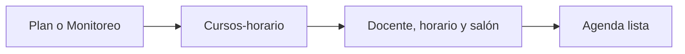

# Unidades

> Reúne los cursos-horario que recibirán un enlace y una ficha QR.

**Etiqueta visible en la aplicación:** Agenda

## Objetivo

Consolidar una agenda completa y consistente antes de generar enlaces.

## Antes de empezar

Carga la programación desde Monitoreo o desde el cálculo de muestra y verifica sus campos clave.

## Mapa de la pantalla

## Elementos de la pantalla

| Elemento | Para qué sirve | Qué cambia o produce |
|---|---|---|
| Plan o Monitoreo | Aporta la programación de origen. | Reemplaza o actualiza el conjunto esperado de aplicaciones. |
| Cursos-horario | Definen la unidad de cada ficha. | Crea una fila identificable por cada unidad que recibirá QR. |
| Docente, horario y salón | Contextualizan la aplicación. | Imprime referencias para entregar y usar la ficha correcta. |
| Agenda lista | Habilita la generación de enlaces. | Autoriza crear enlaces sólo para unidades completas y únicas. |

## Cómo se usa

1. Carga o actualiza la agenda desde la fuente disponible.
2. Revisa identificador, curso, horario, docente, salón y muestra esperada.
3. Corrige duplicados o vacíos antes de continuar con Enlaces.

## Resultado y siguiente paso

La agenda queda lista para generar un enlace único por curso-horario.

## Estados, alertas y límites

- Cada curso-horario necesita un identificador estable y único.
- Los datos ausentes reaparecerán como faltantes en la auditoría de fichas.
- Actualizar la fuente puede cambiar el conjunto que debe enlazarse.

## Cómo interpretar lo que ves

Cada fila representa una ficha futura. El identificador distingue la unidad; curso, horario, docente y salón permiten reconocerla durante la entrega. El conteo de agenda es también el número esperado de enlaces y fichas. Un duplicado puede producir dos QR para una misma aplicación; un identificador vacío impide que Kobo devuelva el curso-horario correcto.

## Ejemplo guiado

**Situación inicial.** La agenda contiene 25 cursos-horario y uno fue trasladado de aula.

**Acciones.** Actualiza desde la fuente, confirma que sigan existiendo 25 identificadores únicos y localiza el curso modificado. Revisa que horario, docente, salón y muestra esperada correspondan a la nueva programación.

**Resultado observable.** La tabla conserva 25 filas únicas, el curso muestra el aula nueva y Agenda lista habilita la creación de 25 enlaces.

## Si algo no coincide

Si el total aumenta a 26, busca un identificador duplicado antes de enlazar. Si falta docente o salón, corrige la fuente y vuelve a cargar; no completes sólo la ficha impresa. Si una actualización elimina una unidad, confirma primero que el cambio sea deliberado porque su enlace y su ficha dejarán de formar parte del paquete.

## Ubicación en la jerarquía

- Padre: [[Plan]].
