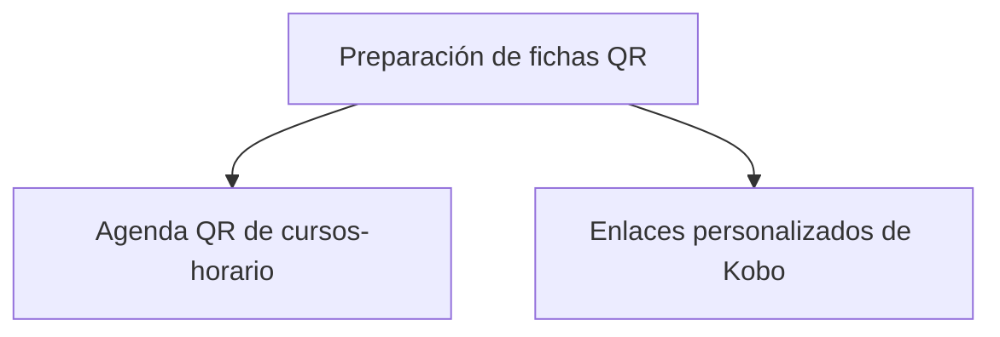

# Plan

> Construye la agenda y los enlaces personalizados que alimentarán cada ficha.

**Etiqueta visible en la aplicación:** Preparación

## Propósito de la sección

Preparación establece el universo de fichas y construye su identidad digital. La agenda define una fila por curso-horario; los enlaces combinan esa identidad con el formulario Kobo. Ambas piezas deben cerrarse juntas: una agenda completa sin URL no puede producir fichas utilizables.

## Antes de recorrerla

Reúne la programación vigente, identificadores únicos y el enlace base del formulario publicado. Verifica el nombre del campo que recibirá collectorID. Si la agenda procede de Monitoreo, confirma que estás usando el mismo conjunto que se operará.

## Mapa de preparación

## Guía de destinos

| Destino | Cuándo entrar | Qué hacer allí | Qué deja listo |
|---|---|---|---|
| [[Unidades]] | Al cargar o actualizar programación | Revisar identificadores, horarios, docentes y salones | El universo esperado de fichas |
| [[Vinculación]] | Con la agenda sin duplicados | Generar, inspeccionar y escanear URLs personalizadas | Un enlace y QR por unidad |

## Recorrido recomendado

Empieza por Agenda y resuelve vacíos o duplicados. Continúa con enlaces y prueba un identificador completo en Kobo. Si una URL revela un error en el identificador, corrige la agenda antes de regenerar el conjunto; no ajustes cada enlace manualmente.

## Cómo interpretar el avance

Compara tres conteos: filas de agenda, enlaces generados y QR. Deben coincidir. La existencia del código no demuestra acceso; la prueba debe abrir el formulario y mostrar el collectorID esperado.

## Resultado

Cada curso-horario queda contextualizado y enlazado, listo para pasar a revisión visual y auditoría total.

## Ubicación en la jerarquía

- Padre: [[Recopiladores]].
