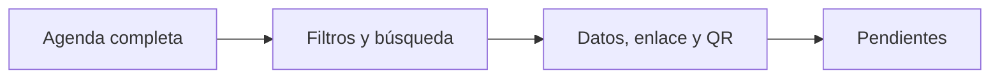

# Canales

> Examina el conjunto de fichas y señala faltantes de datos, enlaces o códigos QR.

**Etiqueta visible en la aplicación:** Lista

## Objetivo

Cerrar brechas antes de generar el PDF final.

## Antes de empezar

Genera los enlaces de todos los cursos-horario incluidos en la agenda.

## Mapa de la pantalla

## Elementos de la pantalla

| Elemento | Para qué sirve | Qué cambia o produce |
|---|---|---|
| Agenda completa | Define el universo esperado. | Fija el denominador del control de completitud. |
| Filtros y búsqueda | Ayudan a localizar una ficha. | Cambian la vista sin retirar unidades del universo. |
| Datos, enlace y QR | Son los controles mínimos. | Determinan si cada fila puede pasar a producción. |
| Pendientes | Concentran los casos que deben corregirse. | Mantienen bloqueado el paquete mientras falte un control indispensable. |

## Cómo se usa

1. Filtra o busca cursos-horario para revisar su estado.
2. Atiende primero los casos sin enlace, QR o datos indispensables.
3. Repite la auditoría hasta que el conjunto esperado quede completo.

## Resultado y siguiente paso

La lista queda lista para producir un PDF sin omisiones conocidas.

## Estados, alertas y límites

- Un estado completo confirma presencia de datos, no disponibilidad futura de Kobo.
- Los filtros cambian la vista, no el universo de la agenda.
- No generes el paquete mientras permanezcan casos indispensables incompletos.

## Cómo interpretar lo que ves

El porcentaje de completitud se lee sobre toda la agenda, no sobre las filas filtradas. Una ficha completa reúne datos contextuales, URL y QR; que el código exista no demuestra que abra el formulario. Usa Pendientes para priorizar ausencias, pero vuelve a la vista total antes de cerrar. El número de fichas completas debe igualar el universo esperado.

## Ejemplo guiado

**Situación inicial.** La agenda tiene 25 unidades; la auditoría muestra 23 completas, una sin enlace y otra sin salón.

**Acciones.** Filtra Pendientes, abre la unidad sin enlace y vuelve a Preparación para generarlo. Corrige el salón en la fuente de agenda, actualiza y ejecuta nuevamente la auditoría.

**Resultado observable.** El resumen cambia a 25 de 25, el filtro Pendientes queda vacío y cada fila conserva datos, enlace y QR.

## Si algo no coincide

Si el filtro queda vacío pero el resumen sigue en 23, limpia todos los filtros y revisa el universo. Si una corrección no se refleja, confirma que actualizaste la fuente y la agenda vigentes. Si todos los campos existen pero una URL falla, la ficha sigue incompleta: corrige acceso o formulario antes de producir el PDF.

## Ubicación en la jerarquía

- Padre: [[Materiales]].
