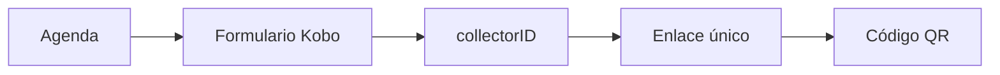

# Vinculación

> Genera o importa un enlace Kobo único para cada curso-horario y prepara su código QR.

**Etiqueta visible en la aplicación:** Enlaces

## Objetivo

Vincular cada aplicación con el identificador que permitirá reconocerla durante el monitoreo.

## Antes de empezar

Completa la agenda y utiliza un formulario Kobo cuyo parámetro collectorID esté verificado.

## Mapa de la pantalla

## Elementos de la pantalla

| Elemento | Para qué sirve | Qué cambia o produce |
|---|---|---|
| Agenda | Aporta el identificador de curso-horario. | Define el valor que debe viajar dentro de cada URL. |
| Formulario Kobo | Proporciona el enlace base. | Fija el formulario que se abrirá al escanear. |
| collectorID | Inserta d[collectorID]={curso_horario}. | Precarga el identificador verificado de la unidad. |
| Enlace único | Relaciona formulario y curso-horario. | Produce una URL distinta por fila de agenda. |
| Código QR | Representa el enlace en la ficha. | Convierte esa URL en un código escaneable. |

## Cómo se usa

1. Selecciona o registra el formulario Kobo que se utilizará.
2. Genera los enlaces o importa los ya preparados y verifica un caso completo.
3. Comprueba que cada URL incluya d[collectorID] con el identificador correcto y que su QR pueda leerse.

## Resultado y siguiente paso

Cada curso-horario queda enlazado y listo para producir su ficha.

## Estados, alertas y límites

- El nombre del parámetro debe coincidir con el campo verificado del formulario; una discrepancia rompe la identificación.
- Un enlace válido debe corresponder exactamente a un curso-horario.
- Generar el QR no confirma que el formulario Kobo esté publicado o accesible.

## Cómo interpretar lo que ves

El enlace base identifica el formulario; el parámetro collectorID identifica la unidad. Dos QR pueden verse distintos y aun así apuntar al valor equivocado, por eso la comprobación debe leer la URL completa y el formulario abierto. La cantidad de enlaces válidos debe igualar las filas de agenda. Un QR generado confirma codificación gráfica, no acceso ni publicación en Kobo.

## Ejemplo guiado

**Situación inicial.** La agenda tiene el curso-horario CH-025 y el formulario Kobo ya está publicado.

**Acciones.** Genera la URL, verifica que contenga d[collectorID]=CH-025 y escanea el QR. En el formulario abierto, confirma que collectorID aparezca precargado como CH-025 y no como la unidad anterior.

**Resultado observable.** La fila muestra enlace y QR válidos; el escaneo abre el formulario correcto con CH-025. El conteo de enlaces completos coincide con el de agenda.

## Si algo no coincide

Si Kobo abre pero no precarga el valor, revisa el nombre exacto del campo y del parámetro. Si dos filas comparten URL, regenera desde identificadores únicos. Si el QR no abre, prueba primero el enlace textual y después contraste o tamaño; así distingues un problema de destino de uno de lectura.

## Ubicación en la jerarquía

- Padre: [[Plan]].
