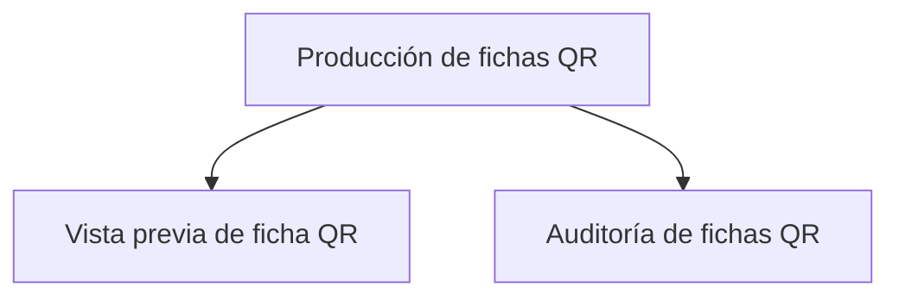

# Materiales

> Permite revisar una ficha individual y auditar el conjunto antes de imprimir.

**Etiqueta visible en la aplicación:** Fichas

## Propósito de la sección

Producción comprueba que el diseño funcione en una ficha y que esa calidad se extienda a todo el universo. La vista previa permite revisar correspondencia, composición y lectura; la auditoría localiza omisiones en cada fila. Ninguna de las dos sustituye a la otra.

## Antes de recorrerla

La agenda debe tener enlaces y QR. Elige una unidad representativa con todos los datos y prepara un dispositivo para escanear. Conoce el número esperado de fichas porque será el denominador de la auditoría.

## Mapa de producción

## Guía de destinos

| Destino | Cuándo entrar | Qué hacer allí | Qué deja listo |
|---|---|---|---|
| [[Vista previa]] | Al probar diseño y funcionamiento | Cotejar textos, abrir URL, escanear y revisar impresión | Un patrón de ficha validado |
| [[Canales]] | Después de validar el patrón | Revisar completitud de todas las unidades | Un conjunto sin pendientes conocidos |

## Recorrido recomendado

Prueba primero una ficha completa; así detectas problemas comunes de enlace o diseño. Después audita el conjunto y regresa a Preparación para corregir la fuente de cada incidencia. Repite el control hasta que el denominador completo esté cubierto.

## Cómo interpretar el avance

Una ficha correcta demuestra el patrón, no la cobertura. Un resumen completo demuestra presencia de datos, no lectura física. La combinación aceptable es patrón escaneable más cero pendientes sobre toda la agenda.

## Resultado

Queda un conjunto coherente y comprobado que puede pasar al diálogo de impresión sin omisiones conocidas.

## Ubicación en la jerarquía

- Padre: [[Recopiladores]].
