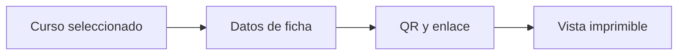

# Vista previa

> Muestra una ficha imprimible con los datos y el QR de un curso-horario.

**Etiqueta visible en la aplicación:** Vista previa

## Objetivo

Validar contenido, legibilidad y correspondencia antes de producir el paquete completo.

## Antes de empezar

Completa la agenda y genera el enlace del curso-horario que deseas revisar.

## Mapa de la pantalla

## Elementos de la pantalla

| Elemento | Para qué sirve | Qué cambia o produce |
|---|---|---|
| Curso seleccionado | Elige la unidad que se inspeccionará. | Cambia todos los datos y el QR de la ficha visible. |
| Datos de ficha | Muestran curso, horario, docente y contexto. | Permiten cotejar la pieza con la fila de agenda. |
| QR y enlace | Permiten verificar destino e identificación. | Abren el formulario con el collectorID de esa unidad. |
| Vista imprimible | Anticipa el resultado en papel. | Expone cortes, escalado y legibilidad antes de generar el paquete. |

## Cómo se usa

1. Selecciona un curso-horario representativo.
2. Revisa todos los textos y compara el enlace con el identificador de la agenda.
3. Escanea el QR y corrige cualquier problema antes de pasar a la lista completa.

## Resultado y siguiente paso

Una ficha queda validada visual y funcionalmente; después audita todas las demás.

## Estados, alertas y límites

- La vista previa representa una ficha, no demuestra que el conjunto esté completo.
- La lectura del QR depende también de contraste, tamaño e impresión final.
- Los datos se corrigen en su fuente o en la preparación, no sobre la vista impresa.

## Cómo interpretar lo que ves

La vista reúne dos controles: correspondencia de contenido y funcionamiento del QR. Curso, horario, docente y salón deben pertenecer a la misma fila que el collectorID del enlace. El diseño puede verse equilibrado en pantalla y fallar al imprimir si el QR queda pequeño o un texto se corta. Esta revisión valida una ficha representativa, no la cobertura del conjunto.

## Ejemplo guiado

**Situación inicial.** Se inspecciona CH-025, programado el lunes a las 10:00 en aula 204.

**Acciones.** Selecciona CH-025 y compara los cuatro datos con la agenda. Abre el enlace y escanea el QR desde otra pantalla; luego activa la vista imprimible al tamaño previsto.

**Resultado observable.** Texto y collectorID corresponden a CH-025, Kobo abre correctamente y el QR conserva un borde limpio y tamaño legible sin cortar información.

## Si algo no coincide

Si los textos pertenecen a otra unidad, vuelve a Agenda; si el texto es correcto pero collectorID no, regenera el enlace. Si sólo falla el escaneo impreso, ajusta escala, contraste o tamaño y repite la prueba física. No edites el texto sobre la impresión porque la fuente seguiría incorrecta.

## Ubicación en la jerarquía

- Padre: [[Materiales]].
