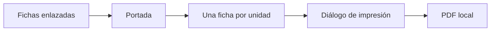

# Paquetes

> Prepara una portada y una ficha por curso-horario para guardarlas como PDF desde el navegador.

**Etiqueta visible en la aplicación:** PDF final

## Objetivo

Producir un paquete imprimible con el conjunto auditado de fichas.

## Antes de empezar

Resuelve los pendientes de la lista y confirma que todos los enlaces y QR sean correctos.

## Mapa de la pantalla

## Elementos de la pantalla

| Elemento | Para qué sirve | Qué cambia o produce |
|---|---|---|
| Fichas enlazadas | Aportan el conjunto listo. | Define cuántas páginas de ficha deben producirse. |
| Portada | Identifica el paquete. | Añade estudio y referencia para distinguir la entrega. |
| Una ficha por unidad | Separa cada curso-horario. | Inserta un salto que evita mezclar dos unidades en una página. |
| Diálogo de impresión | Usa window.print(). | Aplica papel, escala, orientación y márgenes del sistema. |
| PDF local | Se guarda mediante la opción del navegador. | Crea el archivo en la ubicación que el usuario elige. |

## Cómo se usa

1. Revisa el número de fichas que integrarán el paquete.
2. Abre la impresión y comprueba portada, saltos de página, escala y orientación.
3. Selecciona Guardar como PDF en el diálogo del sistema y vuelve a inspeccionar el archivo resultante.

## Resultado y siguiente paso

Obtienes un PDF local listo para distribuir o imprimir. Continúa con el retorno a Monitoreo.

## Estados, alertas y límites

- La aplicación usa la impresión del navegador; no genera un PDF nativo en el backend.
- La configuración del diálogo puede alterar márgenes, escala y paginación.
- Conserva una ficha por curso-horario y verifica físicamente la legibilidad de los QR.

## Cómo interpretar lo que ves

El conteo de fichas enlazadas define el mínimo de páginas útiles, además de la portada. La vista previa del navegador es la señal para detectar páginas partidas, escala reducida y márgenes inesperados. Guardar como PDF es una acción local del sistema: la aplicación no registra automáticamente el archivo como publicación ni controla la configuración elegida.

## Ejemplo guiado

**Situación inicial.** La auditoría aprobó 25 fichas y se necesita un PDF A4 para impresión.

**Acciones.** Abre imprimir, selecciona A4, orientación y escala 100 %. Recorre la portada, la primera, una intermedia y la última ficha; confirma que cada unidad ocupa su página y escanea un QR desde la vista.

**Resultado observable.** El PDF contiene portada más 25 fichas, no corta textos ni códigos y mantiene un QR legible por unidad.

## Si algo no coincide

Si hay menos fichas, vuelve a la auditoría y compara el universo. Si dos unidades comparten página, revisa escala y saltos antes de guardar. Si el PDF guardado difiere de la vista previa, vuelve a abrir el diálogo y comprueba papel, márgenes y encabezados del sistema; no distribuyas el archivo sin inspeccionarlo.

## Ubicación en la jerarquía

- Padre: [[Entrega]].
