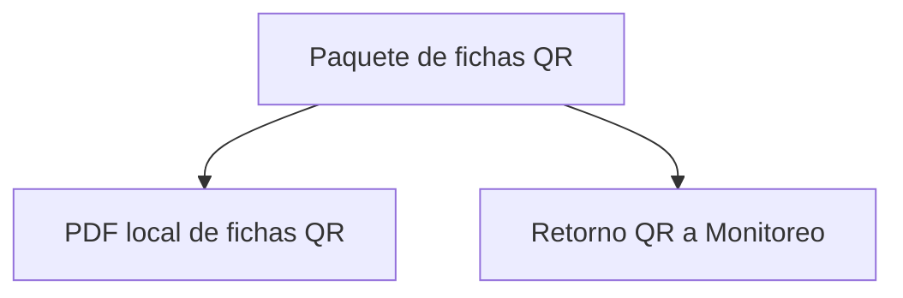

# Entrega

> Genera el PDF local y devuelve a Monitoreo el manifiesto de enlaces y metadatos.

**Etiqueta visible en la aplicación:** Paquete

## Propósito de la sección

Paquete cierra dos salidas distintas: el PDF que se imprime o distribuye y el manifiesto que devuelve identidad y enlaces a Monitoreo. El primero es un artefacto local; el segundo actualiza el seguimiento. Producir uno no implica haber completado el otro.

## Antes de recorrerla

Comprueba que la auditoría no tenga pendientes, anota el número esperado de fichas y decide papel, orientación y escala. Para el retorno, conserva el manifiesto completo, no sólo las filas visibles en la tabla.

## Mapa del paquete

## Guía de destinos

| Destino | Cuándo entrar | Qué hacer allí | Qué deja listo |
|---|---|---|---|
| [[Paquetes]] | Al preparar material imprimible | Configurar impresión, guardar e inspeccionar páginas | Un PDF local legible |
| [[Monitoreo]] | Al reintegrar enlaces al seguimiento | Revisar manifiesto, respaldar y guardar | Agenda de Monitoreo enlazada |

## Recorrido recomendado

Genera e inspecciona primero el PDF para confirmar el conjunto que será entregado. Después revisa el manifiesto completo y envíalo a Monitoreo. Contrasta allí una fila inicial, otra final y el conteo total.

## Cómo interpretar el avance

Guardar PDF no publica ni registra el archivo automáticamente. Guardar manifiesto no sincroniza respuestas ni marca aplicaciones completadas. El cierre exige artefacto legible y retorno íntegro, cada uno con su propia señal.

## Resultado

Campo recibe fichas utilizables y Monitoreo recibe los mismos identificadores y enlaces para seguir su aplicación.

## Ubicación en la jerarquía

- Padre: [[Recopiladores]].
