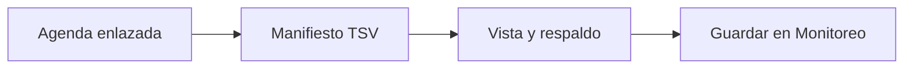

# Monitoreo

> Entrega a Monitoreo los enlaces, QR y metadatos mediante un manifiesto trazable.

**Etiqueta visible en la aplicación:** Monitoreo

## Objetivo

Cerrar el circuito documental entre la preparación de fichas y el seguimiento de aplicación.

## Antes de empezar

Completa la agenda, los enlaces y el paquete de fichas; abre un proyecto con Monitoreo disponible.

## Mapa de la pantalla

## Elementos de la pantalla

| Elemento | Para qué sirve | Qué cambia o produce |
|---|---|---|
| Agenda enlazada | Aporta cursos, horarios y enlaces. | Define las filas que deben volver al seguimiento. |
| Manifiesto TSV | Consolida metadatos y estado QR. | Produce un registro tabular de cada ficha y su URL. |
| Vista y respaldo | La tabla puede ser parcial; la copia conserva todas las filas. | Permite comparar la muestra visible con el conjunto completo. |
| Guardar en Monitoreo | Registra enlaces y metadatos para seguimiento. | Actualiza la agenda operativa sin importar respuestas de Kobo. |

## Cómo se usa

1. Revisa la vista del manifiesto y comprueba curso-horario, facultad, carrera, horario, docente, muestra, enlace, estado QR y referencias de archivo.
2. Copia o descarga el respaldo completo antes de guardar cuando necesites una evidencia independiente.
3. Envía el retorno a Monitoreo y confirma que los enlaces y metadatos aparezcan en su agenda.

## Resultado y siguiente paso

Monitoreo recibe el manifiesto de fichas y queda preparado para seguir la aplicación.

## Estados, alertas y límites

- La vista previa puede mostrar solo parte de las filas; el respaldo copiado conserva el conjunto completo.
- El retorno guarda enlaces y metadatos, pero no sincroniza respuestas de Kobo.
- Guardar el manifiesto no marca por sí solo una aplicación como completada.

## Cómo interpretar lo que ves

El manifiesto es el puente entre producción y seguimiento. Cada fila debe conservar el mismo curso-horario, metadatos y enlace ya auditados. La tabla visible puede estar truncada para lectura; el respaldo completo es la referencia para comprobar conteo. Guardar registra preparación de la ficha, no una entrevista ni una aplicación completada.

## Ejemplo guiado

**Situación inicial.** Se produjeron 25 fichas y Monitoreo aún no muestra sus enlaces.

**Acciones.** Copia el manifiesto completo, confirma 25 identificadores únicos y revisa una fila inicial y otra final. Guarda en Monitoreo y abre su agenda para localizar ambos cursos-horario.

**Resultado observable.** Monitoreo presenta 25 enlaces asociados a las unidades correctas; ninguna aparece como respondida sólo por haber recibido el manifiesto.

## Si algo no coincide

Si la vista muestra menos filas, compara el respaldo antes de concluir que faltan unidades. Si Monitoreo recibe 24, busca identificadores duplicados o vacíos y repite el retorno corregido. Si el enlace llega pero las respuestas no, recuerda que este paso no sincroniza Kobo: usa el flujo de actualización de respuestas correspondiente.

## Ubicación en la jerarquía

- Padre: [[Entrega]].
