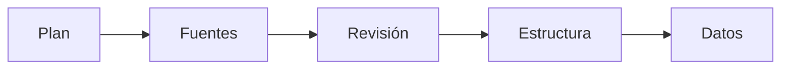

# Carga

> Organiza las bases, incorpora el instrumento y las respuestas, y comprueba que formen un par utilizable.

## Propósito de la sección

Carga decide cómo se organiza el estudio y forma cada base a partir de un instrumento y respuestas compatibles. Separa plan, incorporación, diagnóstico estructural e inspección de datos para que un archivo visible no se confunda con una base publicada.

## Antes de recorrerla

Define el grano de cada fuente y distingue bases primarias de repeats o tablas auxiliares. Reúne revisiones publicadas del instrumento y archivos o conexiones de respuestas. En multibase, asigna una identidad estable a cada entrada.

## Mapa del ingreso

## Guía de destinos

| Destino | Cuándo entrar | Qué hacer allí | Qué deja listo |
|---|---|---|---|
| [[Plan]] | Antes de incorporar o al reorganizar | Elegir topología y registrar entradas previstas | Un esquema unibase o multibase explícito |
| [[Fuentes]] | Con el plan definido | Cargar o conectar instrumento y respuestas | Pares publicados por base |
| [[Revisión]] | Tras incorporar fuentes | Resolver errores y entender advertencias | Un ingreso sin bloqueos estructurales |
| [[Estructura]] | Con el par reconocido | Revisar columnas, tipos y repeats | Un contrato de datos interpretable |
| [[Datos]] | Antes de continuar a Validación | Inspeccionar filas, valores y conteos | Evidencia básica de que llegó lo esperado |

## Recorrido recomendado

Empieza por Plan incluso si ya tienes archivos: la topología evita publicar en la entrada equivocada. Continúa en orden y vuelve a Fuentes cuando Revisión o Estructura revelen una incompatibilidad. Datos es control final del ingreso, no un editor para reparar la fuente.

## Cómo interpretar el avance

planned indica intención; materialized confirma el par; conflict señala contradicción. El conteo de bases no incluye repeats. En cada pestaña comprueba siempre la base activa y los denominadores del resumen.

## Resultado

Quedan bases con identidad, instrumento, respuestas y estructura suficientes para iniciar reglas de validación.

## Ubicación en la jerarquía

- Padre: [[Procesamiento]].
