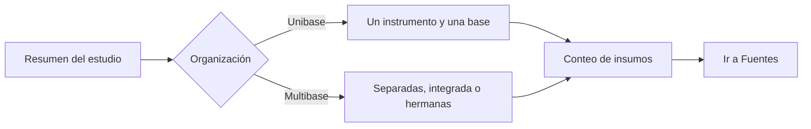

# Plan

> Define cuántas bases tendrá el estudio, cómo se relacionan y qué insumos faltan antes de comenzar la revisión.

## Objetivo

Elegir entre un estudio unibase o multibase y registrar el ingreso previsto sin crear bases incompletas. Conviene usar esta pestaña antes de importar archivos o cuando el resumen muestra un conflicto de organización.

## Antes de empezar

- Definir si los instrumentos comparten grano, variables y tratamiento metodológico.
- Tener revisiones publicadas del instrumento o saber qué archivos y conexiones se usarán.
- Distinguir bases primarias de hojas auxiliares, catálogos y grupos repetidos.

## Mapa de la pantalla

## Elementos de la pantalla

| Elemento | Para qué sirve | Qué cambia o produce |
|---|---|---|
| Tarjeta Unibase | Declara un flujo con un formulario principal y una base lógica | Fija una organización común para revisión y análisis |
| Tarjeta Multibase | Declara dos o más bases primarias | Habilita el detalle y la estrategia por base |
| Lista de bases | Muestra identidad, instrumento, respuestas, filas y columnas | Permite comprobar cobertura real `n/N` |
| Estado de ingreso | Distingue `undefined`, `planned`, `materialized` y `conflict` | Explica si falta plan, si hay intención, si ya existe la base o si hay contradicción |
| Bases relacionadas | Presenta grupos repeat como tablas hijas | Conserva el grano repetido sin aumentar el conteo de bases primarias |
| Acción continuar | Lleva a la incorporación de insumos | Abre Fuentes con la topología ya definida |

## Cómo se usa

1. Revisa el resumen y elige **Unibase** cuando todo el estudio comparte un instrumento principal, una base lógica y un flujo metodológico.
2. Elige **Multibase** cuando existen varias bases primarias y selecciona la estrategia adecuada:
   - **Bases separadas:** cada base conserva instrumento, respuestas y revisión; los reportes clásicos pueden empaquetarse juntos.
   - **Base integrada:** fuentes compatibles se consolidan con estructura común y procedencia; no se usa para unir actores o denominadores incompatibles.
   - **Hermanas independientes:** los actores comparten una familia, pero Validación, Codificación, Analítica y aprobaciones trabajan sólo sobre `active_base`.
3. Comprueba que cada entrada prevista tenga identidad estable, etiqueta visible y revisión de instrumento; el plan puede mostrar instrumento listo y datos pendientes.
4. Revisa los conteos de formularios, respuestas y bases. “Plan listo” sólo significa que la organización está definida.
5. Continúa en Fuentes para importar o conectar el par instrumento–datos.

## Resultado y siguiente paso

- Queda una topología explícita y un plan de ingreso con entradas `planned` o bases ya `materialized`.
- Cuando existen archivos, la topología queda bloqueada para proteger relaciones y derivados; un desacuerdo se muestra como `conflict`.
- El siguiente paso natural es Fuentes.

## Estados, alertas y límites

- `undefined`: todavía no existe una decisión deliberada.
- `planned`: existe el ingreso previsto, pero falta completar el par.
- `materialized`: instrumento y respuestas fueron validados juntos y publicados como base.
- `conflict`: plan, archivos o topología se contradicen y deben revisarse.
- Los repeats conservan varias filas por caso y claves padre–hijo; no convierten el estudio en multibase.
- El modo multibase clásico empaqueta salidas; hermanas independientes aíslan configuración, pesos y aprobaciones por base.

## Cómo interpretar lo que ves

Lee la topología como una decisión de organización, no como un conteo de archivos. undefined y planned indican intención; materialized confirma que instrumento y respuestas formaron una base; conflict exige resolver la contradicción. Los repeats son tablas hijas y no aumentan el número de bases primarias.

## Ejemplo guiado

**Situación inicial.** El estudio tiene formularios de estudiantes y docentes, cada uno con respuestas propias, y debe decidirse si se trabajarán como hermanas independientes.

**Acciones.** Selecciona Multibase, registra dos entradas previstas y comprueba que cada una tenga identidad y revisión de instrumento. Mantén los repeats dentro de su base de origen y continúa sólo cuando el resumen muestre dos pares previstos.

**Resultado observable.** El plan muestra dos bases planned o materialized, cada una con formulario y datos diferenciados; no cuenta los repeats como tercera base.

## Si algo no coincide

Si aparece conflict, compara plan, archivos y topología antes de importar más. No cambies a Unibase para ocultar dos granos incompatibles. Si una entrada queda planned, falta completar su par instrumento–respuestas.

## Ubicación en la jerarquía

- Padre: [[Carga]].
