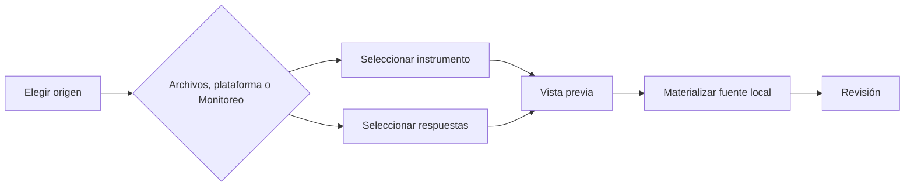

# Fuentes

> Incorpora el instrumento y las respuestas desde archivos, SurveyMonkey, Kobo o un corte oficial de Monitoreo.

## Objetivo

Materializar localmente el par previsto en Plan, conservando procedencia y sin guardar credenciales dentro del proyecto.

## Antes de empezar

- Haber definido la organización en Plan.
- Tener un XLSForm local o una revisión publicada y la base de respuestas correspondiente.
- Para conectores, disponer de un perfil autenticado fuera del `.pulso`.

## Mapa de la pantalla

## Elementos de la pantalla

| Elemento | Para qué sirve | Qué cambia o produce |
|---|---|---|
| Selector de origen | Cambia entre archivos, plataforma y Monitoreo | Muestra el flujo de ingreso aplicable |
| Archivos manuales | Carga XLSForm y XLSX, CSV o SAV | Registra copias en el file store local |
| SurveyMonkey | Lista encuestas mediante un perfil | Importa respuestas y conserva mapas de códigos publicados |
| KoboToolbox | Lista activos y versiones | Importa base principal y tablas repeat con relación padre–hijo |
| Monitoreo | Descubre cortes reconciliados | Promueve filas oficiales, conteos, pines y procedencia de forma atómica |
| Resumen de insumos | Previsualiza instrumento y respuestas | Permite confirmar que el par corresponde a la base prevista |

## Cómo se usa

1. Selecciona **Archivos** para aportar un XLSForm y una base local, **Plataforma** para SurveyMonkey/Kobo o **Monitoreo** para recibir un corte oficial.
2. En SurveyMonkey, vincula las respuestas con la revisión local y su mapa firmado `código fuente → código XLSForm`; en Kobo, confirma activo y versión.
3. En Monitoreo, revisa el `case_rollup`, los conteos y la huella del corte. Procesamiento no rehace la deduplicación ni decide qué casos fueron oficiales.
4. Comprueba la vista previa y materializa el par. En hermanas independientes, todas las bases de un lote se preparan antes del commit; un fallo deja el estudio intacto.
5. Abre Revisión para normalizar y resolver diferencias.

## Resultado y siguiente paso

- Instrumento y datos quedan registrados localmente con IDs y procedencia.
- El instrumento consumido siempre es un archivo local o una revisión publicada inmutable; editar el borrador del Editor no lo reemplaza.
- Continúa en Revisión.

## Estados, alertas y límites

- Las credenciales, cookies y tokens permanecen fuera del `.pulso`.
- Google Sheets no es una fuente disponible en Carga; los modos reales son archivos, plataforma y Monitoreo.
- Un origen remoto no sustituye la revisión local del instrumento.
- Elegir archivos o conectores no evita la comprobación de compatibilidad.

## Cómo interpretar lo que ves

Interpreta cada tarjeta por su rol: instrumento define estructura y códigos; respuestas aportan filas; conectores remotos describen procedencia, pero sólo publicar convierte el par validado en base. En multibase, confirma siempre la identidad de la entrada activa.

## Ejemplo guiado

**Situación inicial.** La base estudiantes recibirá un XLSForm publicado y un XLSX de respuestas; la base docentes seguirá pendiente.

**Acciones.** Selecciona la entrada estudiantes, carga ambos archivos y revisa compatibilidad antes de publicar. Comprueba nombre, filas y revisión; deja docentes como planned sin adjuntar sus archivos a la entrada equivocada.

**Resultado observable.** Estudiantes queda materialized con su par; docentes permanece planned y el resumen diferencia con claridad ambos estados.

## Si algo no coincide

Si el archivo se ve cargado pero la base no aparece, revisa la validación del par y la acción publicar. Si las columnas no corresponden, confirma revisión del instrumento. No muevas respuestas entre bases para cuadrar el conteo.

## Ubicación en la jerarquía

- Padre: [[Carga]].
