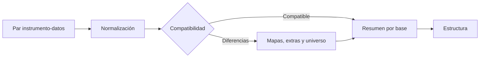

# Revisión

> Comprueba que instrumento y respuestas sean compatibles y resuelve columnas, códigos y universo antes de validar.

## Objetivo

Publicar una fuente efectiva por base con normalización y decisiones de ingreso trazables.

## Antes de empezar

- Haber incorporado el par en Fuentes.
- Seleccionar una base primaria; los repeats se revisan desde su relación con el instrumento.

## Mapa de la pantalla

## Elementos de la pantalla

| Elemento | Para qué sirve | Qué cambia o produce |
|---|---|---|
| Selector de base | Define qué base primaria se revisa | Scopea lectura y decisiones |
| Informe de normalización | Muestra aliases, tipos y códigos ajustados | Deja evidencia de la alineación con XLSForm |
| Compatibilidad | Clasifica faltantes, extras y diferencias de opciones | Bloquea pares que no pueden procesarse |
| Variables extra | Permite incluir columnas no declaradas | Guarda selección explícita y checksum por base |
| Filtro de universo | Previsualiza y confirma un subconjunto de filas | Materializa fuente original y fuente efectiva |
| Resumen multibase | Presenta cobertura `n/N` | Evita declarar listo un estudio incompleto |

## Cómo se usa

1. Selecciona la base y ejecuta la normalización contra el XLSForm.
2. Revisa aliases, tipos y códigos. Los mapas de SurveyMonkey deben coincidir con la revisión publicada; no se infieren desde los valores observados.
3. Resuelve columnas extra: se excluyen por defecto y sólo se incluyen con confirmación explícita.
4. Si el estudio necesita un universo manual, configura el filtro, previsualiza las filas y confirma la materialización.
5. Cierra las incidencias bloqueantes y verifica el resumen de todas las bases.

## Resultado y siguiente paso

- Queda una fuente efectiva compatible, con columnas y filas trazables.
- Continúa en Estructura para inspeccionar el instrumento o en Datos para revisar la tabla resultante.

## Estados, alertas y límites

- Un par incompatible no se publica como listo.
- Normalizar nombres y códigos no equivale a limpiar respuestas.
- Reemplazar la fuente obliga a reaplicar el filtro de universo y vuelve obsoletos los derivados posteriores.
- Las incidencias pertenecen a la base, no desaparecen al cambiar de pestaña.

## Cómo interpretar lo que ves

Los hallazgos se leen por severidad y por base. Un error bloquea la publicación; una advertencia pide decisión informada; una observación describe contexto. El total importa menos que saber si los hallazgos afectan estructura, identidad o grano.

## Ejemplo guiado

**Situación inicial.** La base estudiantes contiene una columna sin pregunta correspondiente y otra con tipo compatible pero etiqueta distinta.

**Acciones.** Ejecuta la revisión, abre ambos hallazgos y distingue el error estructural de la advertencia de etiqueta. Corrige la fuente del error, vuelve a cargar y deja documentada la decisión sobre la advertencia.

**Resultado observable.** El error desaparece, la advertencia queda entendida y el estado permite continuar a Estructura sin ocultar incidencias.

## Si algo no coincide

Si el hallazgo persiste tras corregir, verifica que reemplazaste el archivo de la base activa y no otra entrada. No reclasifiques un error como advertencia para avanzar. Si cambió el instrumento, revisa su versión.

## Ubicación en la jerarquía

- Padre: [[Carga]].
