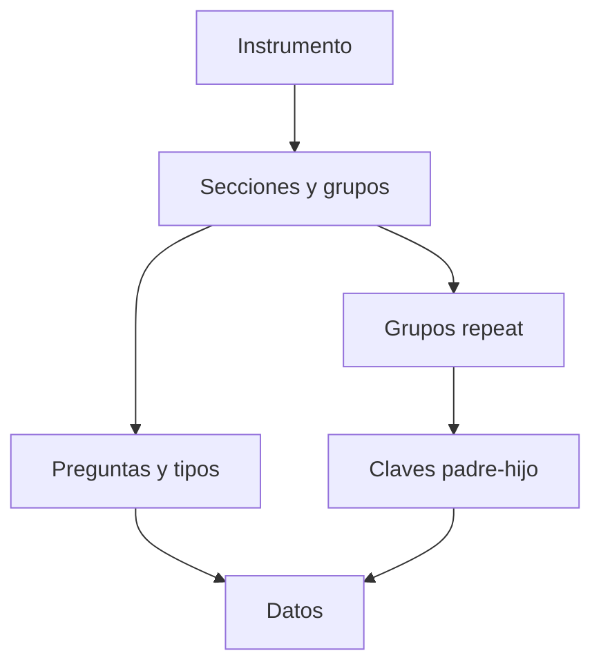

# Estructura

> Inspecciona las secciones, preguntas, listas y grupos repetidos del XLSForm cargado.

## Objetivo

Entender cómo el instrumento organiza la base antes de ejecutar reglas o análisis.

## Antes de empezar

- Tener un instrumento parseado y una base seleccionada.
- Haber resuelto incompatibilidades bloqueantes en Revisión.

## Mapa de la pantalla

## Elementos de la pantalla

| Elemento | Para qué sirve | Qué cambia o produce |
|---|---|---|
| Árbol de secciones | Recorre grupos y orden del formulario | Sitúa cada pregunta en su contexto |
| Detalle de pregunta | Muestra nombre, etiqueta, tipo, lista y reglas | Permite anticipar validaciones y reportes |
| Grupos repeat | Identifica tablas hijas y cardinalidad | Conserva el grano de eventos, miembros o servicios |
| Relaciones | Presenta claves padre–hijo | Explica cómo heredan caracterización y peso |

## Cómo se usa

1. Recorre las secciones del formulario.
2. Abre preguntas para comprobar tipos, listas y expresiones.
3. Identifica los `begin_repeat` y confirma sus tablas y claves relacionadas.
4. Continúa en Datos para contrastar la estructura con filas reales.

## Resultado y siguiente paso

- Obtienes un mapa legible del instrumento y de las tablas relacionadas.
- El siguiente paso es Datos o, si el par ya está listo, Explorar respuestas.

## Estados, alertas y límites

- Esta pestaña inspecciona; no edita ni publica una nueva revisión del XLSForm.
- Hojas auxiliares y catálogos no se convierten en bases primarias.
- Los repeats mantienen varias filas por caso y no se aplanan.

## Cómo interpretar lo que ves

Usa la estructura para comprobar el contrato de columnas: nombre, tipo, etiqueta, opciones y relación con repeats. Una tabla ancha no es necesariamente incorrecta; el problema aparece cuando la respuesta no puede vincularse de forma inequívoca con el instrumento.

## Ejemplo guiado

**Situación inicial.** La base tiene 40 preguntas principales y un repeat de integrantes del hogar con varias filas por entrevista.

**Acciones.** Revisa que las 40 columnas principales estén tipadas y que la tabla repeat conserve clave padre–hijo. Comprueba que el repeat figure como relacionado y no como una segunda base primaria.

**Resultado observable.** La vista presenta la tabla principal y la hija con su vínculo; ninguna columna indispensable queda sin definición.

## Si algo no coincide

Si el repeat aumenta el conteo de bases, vuelve al plan y a la importación. Si una columna figura desconocida, contrasta su name con el instrumento. No aplanes filas repetidas dentro del caso principal.

## Ubicación en la jerarquía

- Padre: [[Carga]].
