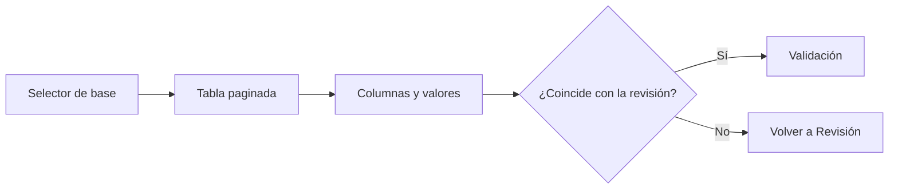

# Datos

> Explora las filas y columnas normalizadas que Carga entregará a Validación.

## Objetivo

Comprobar visualmente la fuente efectiva sin modificarla.

## Antes de empezar

- Haber materializado y revisado una base.
- Seleccionar una base primaria o repeat relacionado.

## Mapa de la pantalla

## Elementos de la pantalla

| Elemento | Para qué sirve | Qué cambia o produce |
|---|---|---|
| Selector de base | Cambia entre bases primarias y relacionadas | Define la tabla mostrada |
| Encabezados | Presentan nombres y etiquetas disponibles | Permiten contrastar el esquema normalizado |
| Filas paginadas | Muestran valores de la fuente efectiva | Facilitan una comprobación muestral |
| Estado de fuente | Indica qué archivo/versión se está leyendo | Evita confundir original y efectivo |

## Cómo se usa

1. Elige la base que quieres inspeccionar.
2. Recorre columnas y filas, buscando faltantes o valores inesperados.
3. Contrasta con el resultado de Revisión.
4. Si el insumo es correcto, continúa en Explorar respuestas.

## Resultado y siguiente paso

- Confirmación visual del insumo efectivo.
- Siguiente sección: Validación, comenzando por Explorar respuestas.

## Estados, alertas y límites

- La tabla es de lectura y no transforma valores.
- Los datos todavía no incorporan decisiones de limpieza de Validación.
- Un repeat se muestra con su propio grano; sus filas no representan automáticamente personas.

## Cómo interpretar lo que ves

La tabla permite inspeccionar filas y valores, no aprobar calidad. Lee los conteos junto con filtros y base activa; una vista filtrada puede mostrar menos casos sin cambiar el total. Los valores especiales deben conservar sus códigos.

## Ejemplo guiado

**Situación inicial.** La base estudiantes tiene 1 200 respuestas y se quiere comprobar que distrito y edad llegaron con valores plausibles.

**Acciones.** Selecciona columnas clave, filtra algunos distritos y revisa filas al inicio y al final. Limpia el filtro y confirma que el total vuelva a 1 200; comprueba que 98 y 99 sigan como códigos y no como vacíos.

**Resultado observable.** La tabla recupera 1 200 filas, los filtros sólo cambian la vista y los códigos especiales permanecen distinguibles.

## Si algo no coincide

Si el total cambia después de limpiar filtros, confirma la base activa y la carga publicada. Si aparecen etiquetas en lugar de códigos, revisa la transformación de origen. No edites celdas derivadas para corregir una fuente.

## Ubicación en la jerarquía

- Padre: [[Carga]].
