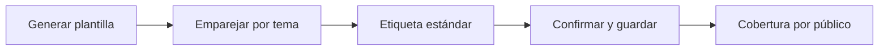

# Equivalencias

> En la UI: **Equivalencias**. Declara qué pregunta de un público es la misma que la de otro.

## Objetivo

Guardar en el estudio la tabla que dice que `p13_1` de docentes y `p11_1` de
estudiantes son la misma pregunta, para que comparar públicos deje de depender
de la memoria del analista (ADR 0062).

## Antes de empezar

- Tener más de una base cargada y materializada: la pestaña es condicional y
  sólo aparece cuando el estudio tiene varios públicos.
- Haber revisado la estructura de cada base, porque la plantilla se puebla con
  las variables y etiquetas que cada formulario declara hoy.

## Mapa de la pantalla

## Elementos de la pantalla

| Elemento | Para qué sirve | Qué cambia o produce |
|---|---|---|
| Generar plantilla | Baja un XLSX con las variables y etiquetas de cada público | Punto de partida de la declaración |
| Proponer emparejados | Sugiere pares por etiqueta, escala y orden | Nada se guarda sin confirmar |
| Subir matriz | Importa una matriz ya escrita | Reemplaza la declaración vigente |
| Por diapositiva / Lista | Dos formas de ver lo mismo | Agrupa por lámina o muestra tema a tema |
| Agrupar sin diapositiva | Junta por batería del formulario | Asigna diapositiva a los temas sueltos |
| Confirmar propuestas | Acepta en bloque lo sugerido | Convierte propuestas en declaración |
| Cobertura por público | Cuántas variables declaradas calzan por base | Señala columnas desfasadas y huérfanas |

## Cómo se usa

1. Genera la plantilla: sale poblada con lo que cada público declara.
2. Empareja las filas que son la misma pregunta y escribe su etiqueta estándar.
3. Súbela, o trabaja dentro del editor y usa las propuestas como borrador.
4. Confirma lo sugerido y guarda; el pie dice cuántas quedan sin etiqueta.
5. Revisa la cobertura por público antes de pasar a Validación.

## Resultado y siguiente paso

- Una matriz de equivalencias guardada en el estudio, disponible para Analítica
  y Gráficos al comparar públicos.
- Siguiente sección: Validación.

## Estados, alertas y límites

- **Vacío legítimo**: si el estudio todavía no declara equivalencias, la
  superficie lo dice y explica cómo llenarla; no es un error.
- **Columna desfasada**: el formulario cambió desde la importación y esa base
  necesita revisión.
- **Variables huérfanas**: la matriz nombra variables que ya no existen en el
  formulario.
- Las propuestas automáticas nunca se guardan solas: requieren confirmación.

## Cómo interpretar lo que ves

La cobertura no mide calidad del emparejamiento, mide calce: cuántas de las
variables declaradas existen hoy en cada formulario. Una base en verde con un
emparejamiento equivocado sigue produciendo una comparación falsa, y por eso la
etiqueta estándar la escribe una persona.

## Ejemplo guiado

**Señal.** Un gráfico compara «Servicio de salud» entre docentes y estudiantes
y da 90 % contra 31 %.

**Resolución.** En la matriz se ve que un lado tomó «¿Conoce…?» y el otro «¿Ha
utilizado…?»: se corrige el par y se confirma.

**Evidencia final.** Las dos columnas apuntan a la misma pregunta y la brecha
se explica por el dato.

## Si algo no coincide

Si la pestaña no aparece, el estudio tiene un solo público: su disponibilidad
es condicional. Si el chip dice menos preguntas de las que subiste, mira el pie
del editor: cuenta preguntas declaradas, no importaciones.

## Ubicación en la jerarquía

- Padre: [[Carga]].
