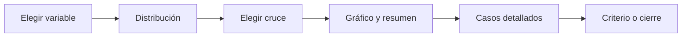

# Explorar respuestas

> Revisa distribuciones, faltantes, cruces y casos antes de decidir reglas o limpieza.

## Objetivo

Encontrar señales que merecen revisión sin cambiar todavía la fuente efectiva.

## Antes de empezar

- Tener instrumento y datos listos en Carga.
- Elegir la base activa; cambiarla invalida la exploración efímera anterior.

## Mapa de la pantalla

## Elementos de la pantalla

| Elemento | Para qué sirve | Qué cambia o produce |
|---|---|---|
| Selector de variable | Define la respuesta explorada | Actualiza distribución y resumen |
| Cruce opcional | Segmenta por otra variable | Produce comparación descriptiva |
| Gráfico | Presenta frecuencia o distribución | Hace visibles faltantes y valores atípicos |
| Tabla de casos | Baja del agregado al registro | Aporta evidencia para revisar una regla |
| Contexto repeat | Indica tabla y grano activo | Evita interpretar filas hijas como casos principales |

## Cómo se usa

1. Selecciona una variable y revisa su distribución.
2. Añade un cruce cuando necesites localizar la señal en un grupo.
3. Abre el detalle de casos y confirma que el hallazgo no sea un efecto del grano o del filtro.
4. Pasa a Reglas del formulario, Criterios de revisión o Cierre de base según el tipo de hallazgo.

## Resultado y siguiente paso

- Evidencia exploratoria acotada a una base y variable.
- Siguiente paso: ejecutar reglas existentes o formalizar un criterio adicional.

## Estados, alertas y límites

- Una anomalía visual no modifica datos ni crea una decisión de limpieza.
- Los cruces son descriptivos y no implican causalidad.
- Los repeats conservan su denominador propio.

## Cómo interpretar lo que ves

Explorar sirve para descubrir patrones de calidad antes de aplicar reglas. Lee faltantes, distribuciones y casos extremos en relación con el tipo de pregunta. Un valor raro no es automáticamente error; debe incumplir el instrumento o un criterio aprobado.

## Ejemplo guiado

**Situación inicial.** En 1 200 casos, edad presenta tres valores de 150 y distrito tiene 20 vacíos.

**Acciones.** Filtra edad mayor de 100, abre los registros y compara con la restricción del formulario. Revisa después los vacíos de distrito y separa saltos válidos de omisiones.

**Resultado observable.** Quedan dos conjuntos identificados: valores que incumplen la restricción y vacíos que requieren interpretar la ruta de respuesta.

## Si algo no coincide

Si el conteo no coincide con la tabla de Carga, limpia filtros y confirma active_base. No borres valores extremos desde la exploración. Si un vacío depende de un salto, revisa relevant antes de declararlo incidencia.

## Ubicación en la jerarquía

- Padre: [[Validación]].
