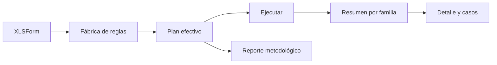

# Reglas del formulario

> Construye y ejecuta el plan de controles derivado del XLSForm, incluidos saltos, rangos, catálogos y relaciones repeat.

## Objetivo

Comprobar de forma explicable si las respuestas cumplen lo que el instrumento promete.

## Antes de empezar

- Tener una base compatible y seleccionar la base activa.
- Conservar el XLSForm vigente; el plan se vuelve a construir cuando cambia el instrumento.

## Mapa de la pantalla

## Elementos de la pantalla

| Elemento | Para qué sirve | Qué cambia o produce |
|---|---|---|
| Constructor del plan | Traduce required, relevant, constraint y listas | Genera reglas tipadas con expresión fuente |
| Controles operativos | Activa o parametriza comprobaciones adicionales | Completa el plan de la base |
| Resumen de reglas | Agrupa resultados por familia y severidad | Prioriza hallazgos |
| Detalle narrativo | Explica regla, variables y expresión | Permite entender el control sin leer código |
| Reglas relacionales | Revisa claves y cardinalidad padre–repeat | Detecta huérfanos o relaciones incoherentes |
| Exportación metodológica | Genera PDF y, cuando aplica, paquete con script | Documenta plan y resultados disponibles sin datos individuales |

## Cómo se usa

1. Construye el plan efectivo de la base.
2. Revisa los controles detectados y configura los operativos que correspondan.
3. Ejecuta el plan y abre las familias con hallazgos.
4. Usa el detalle para comprobar expresión, narrativa y casos afectados.
5. Exporta el artefacto metodológico cuando necesites explicar el plan.

## Resultado y siguiente paso

- Plan ejecutable y resultados por regla, base y contexto relacional.
- Continúa en Criterios de revisión para señales propias del estudio o en Cierre de base para resolver hallazgos.

## Estados, alertas y límites

- El motor tokeniza, parsea y evalúa una sintaxis controlada; no ejecuta código R arbitrario.
- Una construcción no soportada se reporta en lugar de adivinarse.
- El plan vigente no equivale a una certificación histórica inmutable.
- Las reglas repeat no colapsan filas hijas ni cambian su grano.

## Cómo interpretar lo que ves

Las reglas derivadas del XLSForm traducen required, constraint y relevant a comprobaciones sobre respuestas. Una regla aplica sólo en su universo efectivo; required no debe marcar como faltante una pregunta que el salto hizo irrelevante.

## Ejemplo guiado

**Situación inicial.** La pregunta distrito es obligatoria sólo para mayores de 18 años y edad admite valores de 18 a 99.

**Acciones.** Ejecuta las reglas y revisa por separado restricción de edad y obligatoriedad de distrito. Abre un menor de edad sin distrito para confirmar que no sea incidencia y un adulto vacío para comprobar que sí lo sea.

**Resultado observable.** El informe marca edades fuera de rango y adultos sin distrito, pero excluye correctamente los casos donde relevant es falso.

## Si algo no coincide

Si todos los vacíos aparecen como error, revisa la expresión relevant y la revisión del instrumento. Si ninguna regla se genera, confirma que el XLSForm publicado contiene restricciones. No sustituyas la lógica por filtros manuales.

## Ubicación en la jerarquía

- Padre: [[Validación]].
