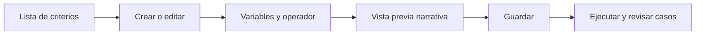

# Criterios de revisión

> Formaliza señales propias del estudio que no están expresadas en el XLSForm.

## Objetivo

Crear controles reproducibles con variables, operadores, umbrales y una explicación comprensible.

## Antes de empezar

- Haber explorado la señal y confirmado que requiere un criterio adicional.
- Seleccionar la base correcta y conocer las variables que intervienen.

## Mapa de la pantalla

## Elementos de la pantalla

| Elemento | Para qué sirve | Qué cambia o produce |
|---|---|---|
| Lista de criterios | Muestra controles guardados por base | Permite abrir, activar o editar |
| Selector de tipo | Elige la familia de comparación | Define los campos necesarios |
| Variables y umbrales | Configuran el criterio | Produce una condición reproducible |
| Narrativa | Traduce la condición a lenguaje legible | Facilita revisión antes de guardar |
| Resultado | Resume coincidencias y casos | Aporta evidencia para el cierre |

## Cómo se usa

1. Crea un criterio desde una señal confirmada en Explorar respuestas.
2. Elige tipo, variables, operador y valores.
3. Lee la narrativa y corrige cualquier ambigüedad.
4. Guarda y ejecuta el criterio.
5. Revisa los casos y lleva la resolución a Cierre de base.

## Resultado y siguiente paso

- Criterio persistido y scopeado por base, con resultados reproducibles.
- Siguiente paso: Cierre de base.

## Estados, alertas y límites

- Un criterio señala casos; no transforma datos.
- Cambiar de base limpia el contexto efímero para no editar la regla equivocada.
- Una fórmula técnica siempre conserva su narrativa y sus variables explícitas.

## Cómo interpretar lo que ves

Los criterios agregan decisiones metodológicas que el formulario no puede expresar por sí solo. Cada criterio debe identificar variable, condición, alcance y severidad. Su resultado es revisable y no debe confundirse con una recodificación.

## Ejemplo guiado

**Situación inicial.** El equipo decide revisar entrevistas con duración menor de cinco minutos, aunque el XLSForm no lo prohíbe.

**Acciones.** Crea el criterio sobre duración, limita su universo a entrevistas completas y asigna severidad de advertencia. Ejecútalo y abre algunos casos para comprobar unidades y umbral.

**Resultado observable.** La lista contiene sólo entrevistas completas menores de cinco minutos y muestra el criterio que originó cada alerta.

## Si algo no coincide

Si aparecen borradores o registros incompletos, corrige el universo. Si duración está en segundos, ajusta el umbral en la misma unidad. No cambies los datos para reducir alertas; documenta la revisión.

## Ubicación en la jerarquía

- Padre: [[Validación]].
