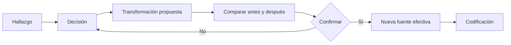

# Cierre de base

> Convierte hallazgos revisados en decisiones y transformaciones auditables antes de codificar o analizar.

## Objetivo

Publicar una nueva fuente efectiva sin perder el original ni el rastro de lo decidido.

## Antes de empezar

- Haber revisado los casos señalados por reglas o criterios.
- Contar con una decisión metodológica justificada para cada cambio.

## Mapa de la pantalla

## Elementos de la pantalla

| Elemento | Para qué sirve | Qué cambia o produce |
|---|---|---|
| Lista de hallazgos | Reúne reglas y casos pendientes | Organiza el trabajo de cierre |
| Registro de decisión | Guarda resolución, alcance y justificación | Separa criterio metodológico de ejecución |
| Constructor de transformación | Define operación y variables | Prepara un cambio reproducible |
| Comparación antes/después | Muestra fuente original y propuesta | Permite validar el efecto antes de confirmar |
| Auditoría | Relaciona hallazgo, decisión, transformación y archivo | Conserva linaje por base |

## Cómo se usa

1. Abre un hallazgo y registra la decisión metodológica.
2. Si requiere modificar datos, configura la transformación correspondiente.
3. Compara filas y valores antes y después.
4. Confirma el cierre sólo cuando el resultado coincide con la decisión.
5. Continúa en Preparar codificación o Datos analíticos.

## Resultado y siguiente paso

- Fuente efectiva limpia, versionada y auditable; la fuente original permanece disponible como linaje.
- Siguientes secciones: Codificación o Analítica.

## Estados, alertas y límites

- Decidir no significa que la transformación haya corrido; ambos pasos quedan separados.
- Toda limpieza cambia la huella e invalida codificación, analítica, gráficos y aprobaciones posteriores de esa base.
- Reemplazar una hermana invalida sólo sus derivados.
- Ninguna transformación se aplica silenciosamente o sobre una base distinta de la seleccionada.

## Cómo interpretar lo que ves

El cierre resume si reglas, criterios y decisiones dejan la base apta para el paso siguiente. Cerrada no significa perfecta: significa que incidencias bloqueantes están resueltas y las excepciones aceptadas quedan registradas.

## Ejemplo guiado

**Situación inicial.** La base tiene cero errores bloqueantes y cinco advertencias de duración revisadas por coordinación.

**Acciones.** Revisa el resumen, abre las cinco decisiones y confirma responsable y justificación. Ejecuta nuevamente la validación para descartar cambios y solicita cierre.

**Resultado observable.** El estado queda cerrado con evidencia de la corrida y las cinco advertencias aceptadas; Codificación puede usar esa versión.

## Si algo no coincide

Si el cierre se deshabilita, busca reglas pendientes o una corrida obsoleta. Si cambian datos o instrumento después de cerrar, vuelve a validar. No uses una captura de pantalla como sustituto del estado persistido.

## Ubicación en la jerarquía

- Padre: [[Validación]].
