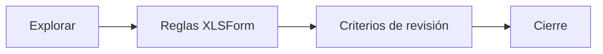

# Validación

> Explora respuestas, ejecuta reglas y registra la limpieza que cierra cada base.

## Propósito de la sección

Validación reúne evidencia sobre calidad y registra la decisión de cierre. Combina exploración, reglas derivadas del XLSForm y criterios metodológicos adicionales. Su objetivo no es borrar todo valor inusual, sino distinguir errores, excepciones justificadas y respuestas válidas.

## Antes de recorrerla

La base debe estar materializada y su instrumento identificado. Confirma active_base, conserva una referencia de la corrida y acuerda quién puede aceptar advertencias o cerrar. Los saltos del formulario definen universos efectivos que deben respetarse.

## Mapa de validación

## Guía de destinos

| Destino | Cuándo entrar | Qué hacer allí | Qué deja listo |
|---|---|---|---|
| [[Explorar respuestas]] | Al reconocer la base | Revisar faltantes, rangos y patrones | Hipótesis de calidad localizadas |
| [[Reglas del formulario]] | Con el instrumento vigente | Ejecutar required, constraint y relevant | Incidencias derivadas de la lógica |
| [[Criterios de revisión]] | Cuando hay controles adicionales | Definir condición, universo y severidad | Alertas metodológicas trazables |
| [[Cierre de base]] | Tras resolver bloqueos | Revisar decisiones y fijar estado | Una versión apta para continuar |

## Recorrido recomendado

Explora primero para entender distribuciones; después ejecuta reglas y añade sólo criterios que el formulario no expresa. Abre casos concretos antes de aceptar o corregir. Cierra cuando la última corrida siga vigente y cada excepción tenga responsable.

## Cómo interpretar el avance

Cero errores no implica cero advertencias. Una advertencia aceptada sigue siendo parte de la evidencia. Si cambian datos o instrumento, el cierre previo deja de representar la base y debe repetirse.

## Resultado

Queda una base cerrada con incidencias, decisiones y universos documentados para codificación y análisis.

## Ubicación en la jerarquía

- Padre: [[Procesamiento]].
