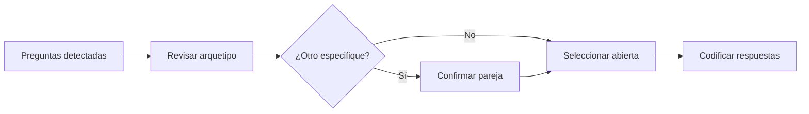

# Preparar codificación

> Selecciona las preguntas abiertas y confirma sus relaciones antes de asignar códigos.

## Objetivo

Definir un universo de codificación claro por base, incluyendo campos “Otro, especifique” y configuración portable.

## Antes de empezar

- Tener una fuente efectiva cerrada en Validación.
- Seleccionar la base activa y revisar las preguntas de texto detectadas.

## Mapa de la pantalla

## Elementos de la pantalla

| Elemento | Para qué sirve | Qué cambia o produce |
|---|---|---|
| Lista de preguntas | Presenta abiertas, comentarios y campos relacionados | Permite elegir qué se codificará |
| Detalle de pregunta | Muestra etiqueta, tipo y respuestas disponibles | Ayuda a confirmar el arquetipo |
| Diálogo de relación | Vincula opción “Otro” con su texto | Evita tratar la especificación como abierta independiente |
| Selector de base | Cambia el contexto de trabajo | Aísla preguntas, relaciones y progreso |
| Importar/exportar JSON | Transporta preguntas, grupos y relaciones | Conserva configuración sin datos ni secretos |

## Cómo se usa

1. Revisa las preguntas detectadas; el sistema propone candidatas, pero no las selecciona automáticamente.
2. Marca las abiertas que necesitan codificación.
3. Confirma cada pareja “Otro, especifique” sólo cuando la relación sea inequívoca.
4. Importa o exporta configuración si necesitas reutilizar el esquema en una fuente compatible.
5. Continúa en Codificar respuestas.

## Resultado y siguiente paso

- Selección y relaciones persistidas por base.
- Siguiente paso: Codificar respuestas.

## Estados, alertas y límites

- Cambiar `active_base` no copia ni fusiona la configuración de otra hermana.
- Una relación dudosa no se infiere sólo por nombres parecidos.
- Importar JSON no autoriza aplicar códigos a variables o casos incompatibles.

## Cómo interpretar lo que ves

Preparar identifica preguntas abiertas, catálogos disponibles y cobertura esperada. La unidad de trabajo es la respuesta que requiere código; antes de codificar conviene fijar esquema, categorías y tratamiento de vacíos.

## Ejemplo guiado

**Situación inicial.** La pregunta ocupación contiene 800 textos válidos, 30 vacíos y respuestas que aún no tienen libro de códigos.

**Acciones.** Selecciona la variable, excluye vacíos según el criterio aprobado y crea un esquema inicial con categorías y códigos únicos. Revisa el denominador que entrará a codificación.

**Resultado observable.** La pantalla muestra 800 respuestas elegibles, esquema versionado y cero colisiones entre códigos.

## Si algo no coincide

Si el universo incluye vacíos no codificables, revisa el filtro de elegibilidad. Si dos categorías comparten código, corrige el esquema antes de asignar. No uses etiquetas como claves internas.

## Ubicación en la jerarquía

- Padre: [[Codificación]].
