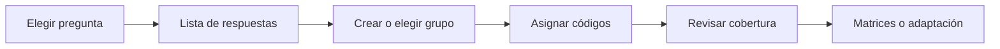

# Codificar respuestas

> Agrupa textos similares y asigna uno o más códigos conservando el caso y la respuesta original.

## Objetivo

Construir una codificación consistente pregunta por pregunta y caso por caso.

## Antes de empezar

- Haber seleccionado preguntas en Preparar codificación.
- Definir o revisar las familias y grupos de códigos aplicables.

## Mapa de la pantalla

## Elementos de la pantalla

| Elemento | Para qué sirve | Qué cambia o produce |
|---|---|---|
| Navegador de preguntas | Cambia la abierta en trabajo | Mantiene el contexto de variable |
| Lista de respuestas | Presenta texto e ID de caso | Permite asignar sin perder trazabilidad |
| Familias y grupos | Organizan códigos y etiquetas | Mantienen un catálogo consistente |
| Codificador | Asigna uno o varios códigos | Guarda relación caso–respuesta–código |
| Cobertura | Resume respuestas pendientes y codificadas | Indica qué falta antes de adaptar |

## Cómo se usa

1. Selecciona una pregunta abierta.
2. Revisa o crea familias y grupos de códigos.
3. Recorre las respuestas y asigna los códigos pertinentes.
4. Comprueba cobertura y casos sin resolver.
5. Usa Matrices de codificación para intercambio masivo o pasa a Adaptación de codificación.

## Resultado y siguiente paso

- Asignaciones trazables por base, variable y caso, conservando el texto fuente.
- Siguientes pasos: Matrices de codificación o Adaptación de codificación.

## Estados, alertas y límites

- Agrupar textos similares no autoriza reemplazar el original.
- Compartir una familia no mezcla respuestas de bases independientes.
- Las respuestas sin decisión permanecen pendientes y bloquean una adaptación completa.

## Cómo interpretar lo que ves

La respuesta original, el código asignado y el estado de revisión deben leerse juntos. Similaridad o sugerencias aceleran trabajo, pero la decisión final pertenece al codificador y debe conservar trazabilidad.

## Ejemplo guiado

**Situación inicial.** Las respuestas vendedor ambulante y venta en calle deben asignarse a una categoría de comercio informal.

**Acciones.** Busca ambos textos, aplica el código aprobado y revisa otros resultados sugeridos antes de confirmar en lote. Conserva sin modificar la respuesta original.

**Resultado observable.** Las dos respuestas muestran el mismo código, la categoría correcta y estado codificado; el texto fuente permanece visible.

## Si algo no coincide

Si el lote incluye una respuesta semánticamente distinta, deshaz esa asignación y codifícala aparte. Si un código no aparece, revisa la versión del esquema. No sobrescribas texto para forzar coincidencias.

## Ubicación en la jerarquía

- Padre: [[Codificación]].
