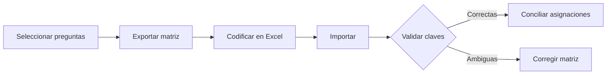

# Matrices de codificación

> Intercambia asignaciones por Excel usando claves estables de base, variable y caso.

## Objetivo

Permitir trabajo masivo fuera de la aplicación sin depender de la posición de las filas.

## Antes de empezar

- Haber preparado preguntas y un catálogo de códigos.
- Disponer de IDs de caso estables en la fuente efectiva.

## Mapa de la pantalla

## Elementos de la pantalla

| Elemento | Para qué sirve | Qué cambia o produce |
|---|---|---|
| Exportar Excel | Genera filas con base, variable, caso, texto y códigos | Produce una matriz portable |
| Selector de archivo | Recibe la matriz trabajada | Inicia validación de estructura y claves |
| Informe de validación | Señala columnas, IDs o códigos inválidos | Evita aplicar filas ambiguas |
| Conciliación | Compara matriz con asignaciones manuales | Prepara un resultado común por caso |

## Cómo se usa

1. Exporta la matriz para las preguntas seleccionadas.
2. Completa códigos sin alterar base, variable ni ID de caso.
3. Importa el archivo y revisa el informe.
4. Corrige filas que no puedan reconciliarse inequívocamente.
5. Confirma la conciliación y continúa en Adaptación de codificación.

## Resultado y siguiente paso

- Asignaciones de matriz validadas y asociadas por claves estables.
- Siguiente paso: Adaptación de codificación.

## Estados, alertas y límites

- Una fila sin ID o variable válida no se aplica por posición.
- La importación no reemplaza silenciosamente decisiones manuales en conflicto.
- La matriz pertenece a una base y una versión de fuente concretas.

## Cómo interpretar lo que ves

La matriz cruza respuestas o patrones con categorías para revisar cobertura y consistencia. Las celdas vacías señalan trabajo pendiente; una alta frecuencia en una categoría puede ser real o indicar una regla demasiado amplia.

## Ejemplo guiado

**Situación inicial.** El esquema tiene diez categorías y se quiere comprobar si respuestas frecuentes quedaron sin asignar.

**Acciones.** Ordena patrones por frecuencia, revisa filas sin código y contrasta categorías que concentran demasiados casos. Ajusta reglas sólo después de abrir ejemplos concretos.

**Resultado observable.** La matriz deja cero patrones frecuentes sin revisar y la distribución de categorías puede explicarse con casos observados.

## Si algo no coincide

Si la matriz no se actualiza, confirma que las asignaciones se aplicaron en la base activa. Si una categoría absorbe casi todo, revisa patrones y excepciones. No equilibres frecuencias artificialmente.

## Ubicación en la jerarquía

- Padre: [[Codificación]].
