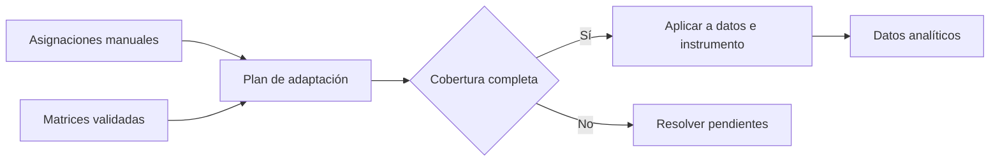

# Adaptación de codificación

> Confirma la cobertura y genera datos e instrumento adaptados para Analítica.

## Objetivo

Conciliar códigos manuales y matrices en un par nuevo, conservando el original y su linaje.

## Antes de empezar

- Resolver asignaciones ambiguas y revisar respuestas pendientes.
- Tener matrices importadas y validadas cuando formen parte del flujo.

## Mapa de la pantalla

## Elementos de la pantalla

| Elemento | Para qué sirve | Qué cambia o produce |
|---|---|---|
| Resumen de cobertura | Compara manuales, matrices y pendientes | Indica si el plan puede ejecutarse |
| Lista de conflictos | Presenta códigos incompatibles o ambiguos | Dirige la corrección necesaria |
| Plan de adaptación | Fija qué asignación se aplicará por caso | Prepara una operación reproducible |
| Acción adaptar | Ejecuta cambios en copia de datos e instrumento | Publica el par adaptado |
| Estado de fuente | Muestra original y adaptado vigentes | Permite elegir con trazabilidad en Analítica |

## Cómo se usa

1. Revisa la cobertura de asignaciones manuales y de matriz.
2. Resuelve conflictos y pendientes.
3. Confirma el plan de adaptación.
4. Ejecuta la adaptación de datos e instrumento.
5. Abre Datos analíticos y elige la fuente adaptada cuando corresponda.

## Resultado y siguiente paso

- Par adaptado con nuevos códigos y etiquetas, vinculado a su fuente original.
- Siguiente sección: Analítica, comenzando en Datos analíticos.

## Estados, alertas y límites

- Un plan incompleto no se aplica.
- El adaptado no borra ni reemplaza sin linaje el original.
- Si cambia la fuente de entrada, el adaptado anterior queda obsoleto.
- En hermanas independientes, la salida pertenece sólo a la base activa.

## Cómo interpretar lo que ves

Adaptar permite trasladar un esquema a otra base o revisión sin asumir equivalencia automática. Compara nombres, códigos, etiquetas y universo; cada incompatibilidad debe resolverse antes de aplicar.

## Ejemplo guiado

**Situación inicial.** El esquema de ocupación de estudiantes se quiere reutilizar en docentes, donde existen categorías adicionales.

**Acciones.** Selecciona origen y destino, revisa coincidencias y marca como pendientes las categorías sin equivalente. Añade códigos nuevos sin modificar los existentes y prueba sobre una muestra de respuestas.

**Resultado observable.** El destino conserva códigos comunes, incorpora categorías docentes diferenciadas y muestra las decisiones de adaptación.

## Si algo no coincide

Si una categoría se mapea sólo por etiqueta parecida, abre ejemplos antes de aceptar. Si cambia el significado de un código, crea otro; no reutilices la clave. No propagues asignaciones entre universos incompatibles.

## Ubicación en la jerarquía

- Padre: [[Codificación]].
