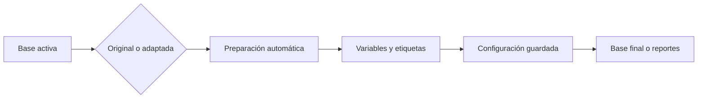

# Datos analíticos

> Confirma qué datos e instrumento alimentan los reportes y revisa sus variables y etiquetas.

## Objetivo

Elegir de forma trazable entre fuente original/limpia y adaptada, y comprobar la configuración guardada de la base activa.

## Antes de empezar

- Tener instrumento y datos listos; si existe codificación, haber generado el par adaptado.
- Seleccionar la base que se analizará.

## Mapa de la pantalla

## Elementos de la pantalla

| Elemento | Para qué sirve | Qué cambia o produce |
|---|---|---|
| Selector de fuente | Elige original/limpia o adaptada | Fija el par efectivo para Analítica |
| Estado de preparación | Indica si se alinearon datos e instrumento | Habilita las pestañas de reportes |
| Revisión de variables | Muestra nombres, etiquetas y tipos | Permite detectar metadata inesperada |
| Selector de base | Cambia el contexto | Scopea configuración y salidas por `active_base` |
| Autosave | Guarda secciones, reportes, cruces y preferencias | Versiona configuración dura; no el estado visual efímero |

## Cómo se usa

1. Confirma la base activa.
2. Elige la fuente adaptada sólo si está vigente y corresponde al instrumento adaptado; si no, usa la fuente limpia original.
3. Espera la preparación automática y revisa etiquetas, tipos y variables.
4. Comprueba que la configuración guardada pertenece a la misma base.
5. Continúa en Base final analítica o en el reporte requerido.

## Resultado y siguiente paso

- Par analítico efectivo, visible y trazable.
- Siguiente paso: Base final analítica, Libro de códigos o una pestaña de reporte.

## Estados, alertas y límites

- Un adaptado viejo no desplaza silenciosamente una fuente nueva.
- En hermanas independientes, cambiar `active_base` no copia pesos, configuración ni aprobaciones.
- Preparar datos no equivale a aprobar metodológicamente una base.

## Cómo interpretar lo que ves

Esta pestaña comprueba el insumo analítico: base activa, variables disponibles y transformaciones preparadas. Una columna visible no está lista si su tipo, código o universo efectivo son incorrectos.

## Ejemplo guiado

**Situación inicial.** Se analizarán satisfacción, facultad y peso en la base estudiantes.

**Acciones.** Revisa tipo y valores de las tres variables, identifica filtros activos y confirma que peso corresponda a la configuración vigente. Abre una muestra de filas antes de generar salidas.

**Resultado observable.** Las variables aparecen con códigos consistentes, el universo es explícito y el peso puede aplicarse sin valores inválidos.

## Si algo no coincide

Si falta una variable, vuelve a Carga o Codificación según su origen. Si peso tiene ceros o vacíos inesperados, recalcula. No conviertas labels en códigos dentro de la tabla analítica.

## Ubicación en la jerarquía

- Padre: [[Analítica]].
