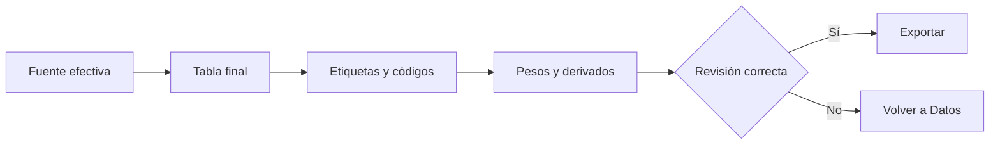

# Base final analítica

> Inspecciona la tabla efectiva lista para análisis y exportación.

## Objetivo

Verificar que los datos finales reflejen la fuente elegida, la codificación y los derivados disponibles.

## Antes de empezar

- Completar la preparación en Datos analíticos.
- Confirmar que la base y la fuente mostradas son las correctas.

## Mapa de la pantalla

## Elementos de la pantalla

| Elemento | Para qué sirve | Qué cambia o produce |
|---|---|---|
| Identidad de fuente | Indica archivo y base vigentes | Evita exportar una versión equivocada |
| Tabla | Muestra filas y columnas finales | Permite comprobar codificación y derivados |
| Resaltado de codificación | Distingue variables adaptadas | Confirma la aplicación del plan de códigos |
| Exportación | Genera la base en formato seleccionado | Produce un artefacto para análisis externo |

## Cómo se usa

1. Comprueba la identidad de fuente.
2. Recorre columnas de identificación, respuestas, códigos y pesos.
3. Verifica que los repeats no estén aplanados dentro del grano principal.
4. Exporta cuando la tabla sea coherente.

## Resultado y siguiente paso

- Base final revisada y exportable.
- Continúa en Bases e instrumentos analíticos para elegir formato o en Ponderación y reportes.

## Estados, alertas y límites

- La vista no edita valores.
- Los repeats conservan tablas y denominadores propios.
- Un archivo histórico disponible no vuelve a ser fuente vigente.

## Cómo interpretar lo que ves

La base final es una salida preparada, no una copia para edición manual. Debe conservar identificadores, variables aprobadas y transformaciones reproducibles, excluyendo campos auxiliares sólo cuando la regla lo indique.

## Ejemplo guiado

**Situación inicial.** El equipo necesita una base de 1 200 casos con variables codificadas y peso actualizado.

**Acciones.** Selecciona la configuración final, revisa columnas incluidas y genera la base. Compara filas, identificador y algunas variables con Datos analíticos.

**Resultado observable.** La salida contiene 1 200 identificadores únicos, las variables aprobadas y el peso calculado para esa corrida.

## Si algo no coincide

Si faltan filas, busca filtros o universo efectivo. Si hay duplicados, detén la entrega y revisa el grano. No corrijas el archivo final fuera del pipeline porque perderías reproducibilidad.

## Ubicación en la jerarquía

- Padre: [[Analítica]].
