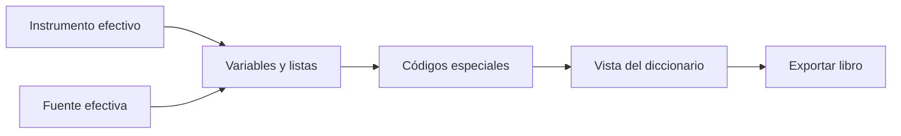

# Libro de códigos

> Produce el diccionario de variables, etiquetas, tipos, opciones y códigos especiales del estudio.

## Objetivo

Documentar la estructura analítica con el mismo instrumento y fuente que usan los reportes.

## Antes de empezar

- Confirmar la fuente en Datos analíticos.
- Revisar el tratamiento de no sabe, no responde, no aplica y otros códigos especiales.

## Mapa de la pantalla

## Elementos de la pantalla

| Elemento | Para qué sirve | Qué cambia o produce |
|---|---|---|
| Lista de variables | Presenta nombre, etiqueta y tipo | Documenta el esquema del estudio |
| Catálogo de opciones | Muestra código y etiqueta | Conserva el significado de categorías |
| Códigos especiales | Configura qué valores se muestran o tratan aparte | Alinea diccionario, frecuencias y cruces |
| Exportación | Genera el libro de códigos | Produce un entregable reproducible |

## Cómo se usa

1. Revisa variables y etiquetas.
2. Comprueba catálogos y códigos adaptados.
3. Define el tratamiento de códigos especiales de forma explícita.
4. Exporta el libro.

## Resultado y siguiente paso

- Diccionario coherente con datos e instrumento efectivos.
- Continúa en Frecuencias o Cruces.

## Estados, alertas y límites

- No se inventan categorías ausentes ni se descartan códigos silenciosamente.
- El tratamiento especial debe ser consistente en todas las salidas.
- El libro documenta; no recodifica la base.

## Cómo interpretar lo que ves

El libro explica cómo interpretar cada variable: nombre, etiqueta, tipo, categorías y valores especiales. Los códigos son la clave de análisis; las etiquetas se aplican al presentar y pueden variar sin cambiar el valor.

## Ejemplo guiado

**Situación inicial.** Se debe entregar la variable satisfacción con categorías 1 a 5 y códigos especiales 98 y 99.

**Acciones.** Busca la variable, revisa etiquetas y orden, y confirma que 98 y 99 sólo se describan cuando corresponden al instrumento. Exporta y abre el resultado.

**Resultado observable.** El libro presenta cinco categorías válidas, documenta los especiales y permite relacionar cada columna de la base con su significado.

## Si algo no coincide

Si una categoría aparece sin etiqueta, corrige el instrumento o esquema fuente. Si el libro contiene códigos inexistentes, revisa la configuración de presentación. No recodifiques la base para corregir una etiqueta.

## Ubicación en la jerarquía

- Padre: [[Analítica]].
