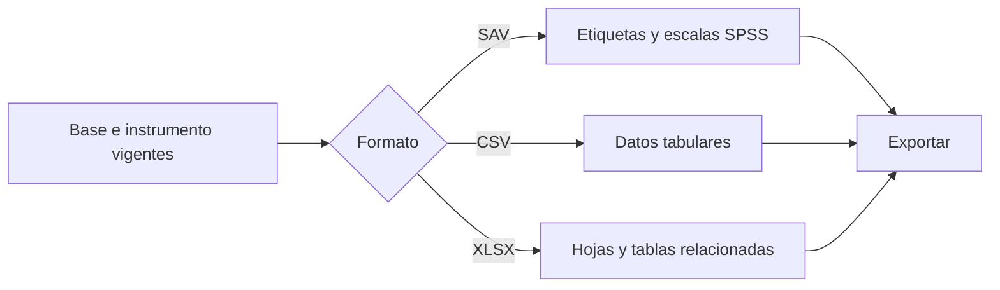

# Bases e instrumentos analíticos

> Exporta datos e instrumentos alineados en SAV, CSV o XLSX, preservando metadata y tablas relacionadas.

## Objetivo

Elegir el formato adecuado sin perder IDs, etiquetas, escalas ni grano repeat.

## Antes de empezar

- Confirmar la base final y el instrumento efectivo.
- Decidir qué capacidades requiere el análisis externo.

## Mapa de la pantalla

## Elementos de la pantalla

| Elemento | Para qué sirve | Qué cambia o produce |
|---|---|---|
| Formato SAV | Conserva etiquetas y niveles de medida | Produce archivo para SPSS |
| Escalas SPSS | Asigna nominal, ordinal o escala | Completa metadata compatible con tipo y orden confirmado |
| Formato CSV | Entrega una tabla interoperable | Produce datos y metadata según configuración |
| Formato XLSX | Organiza tablas en hojas | Preserva base principal y repeats relacionados |
| Instrumento asociado | Identifica la versión que explica la base | Mantiene el par exportado alineado |

## Cómo se usa

1. Selecciona el formato según el software y la metadata necesaria.
2. Para SAV, revisa las escalas; no conviertas una variable nominal en ordinal sin decisión metodológica.
3. Para repeats, conserva la clave padre y exporta la tabla hija con su propio grano.
4. Genera y verifica el artefacto.

## Resultado y siguiente paso

- Base e instrumento exportados con metadata y relaciones preservadas.
- Continúa con Ponderación o la pestaña de reporte necesaria.

## Estados, alertas y límites

- Las limitaciones de un formato no justifican perder IDs o aplanar repeats.
- Los repeats heredan caracterización y peso por clave padre, pero mantienen denominador propio.
- Una versión histórica no sustituye la fuente vigente.

## Cómo interpretar lo que ves

En estudios multibase, esta vista verifica qué instrumento pertenece a cada base y cuál está activa. Compartir familia no significa compartir grano, denominador ni variables.

## Ejemplo guiado

**Situación inicial.** El estudio tiene bases independientes de estudiantes y docentes, con formularios distintos.

**Acciones.** Revisa ambos pares, activa estudiantes y confirma su instrumento; después cambia a docentes y repite. Comprueba que cada revisión y conteo permanezcan separados.

**Resultado observable.** Cada base muestra su propio formulario, filas y variables; cambiar active_base no mezcla datos ni configuraciones.

## Si algo no coincide

Si una base muestra el instrumento de otra, vuelve a Carga y corrige el par. Si un reporte usa la base equivocada, confirma active_base antes de regenerar. No apiles actores sólo para analizarlos juntos.

## Ubicación en la jerarquía

- Padre: [[Analítica]].
