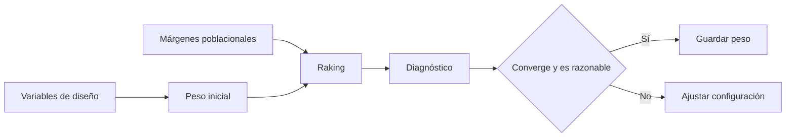

# Ponderación

> Calcula y revisa pesos de diseño y calibración para representar la población objetivo.

## Objetivo

Configurar probabilidades de selección y raking con diagnósticos de convergencia y extremos.

## Antes de empezar

- Tener variables de diseño y, para calibración, márgenes poblacionales confiables.
- Seleccionar la base que recibirá el peso.

## Mapa de la pantalla

## Elementos de la pantalla

| Elemento | Para qué sirve | Qué cambia o produce |
|---|---|---|
| Configuración de diseño | Define probabilidades o peso inicial | Produce el peso de diseño |
| Márgenes de calibración | Declara variables y totales poblacionales | Alimenta el raking |
| Acción calcular | Ejecuta el motor | Genera pesos y métricas |
| Diagnóstico | Muestra convergencia, distribución y extremos | Permite decidir si el peso es utilizable |
| Peso activo | Selecciona la variable vigente | Cambia denominadores ponderados en reportes |

## Cómo se usa

1. Configura el peso de diseño.
2. Añade márgenes de raking cuando corresponda.
3. Calcula y revisa convergencia, mínimos, máximos y casos sin peso.
4. Ajusta la configuración si los diagnósticos son problemáticos.
5. Guarda el peso vigente y genera Frecuencias o Cruces.

## Resultado y siguiente paso

- Peso vigente y trazable por base.
- Siguientes pasos: Frecuencias, Cruces o Ficha técnica.

## Estados, alertas y límites

- Los pesos no se copian ni promedian entre hermanas independientes.
- Un repeat hereda el peso del caso padre mediante la clave de relación.
- Convergencia numérica no reemplaza la revisión metodológica de los márgenes.

## Cómo interpretar lo que ves

Lee pesos junto con diagnósticos: distribución, extremos, DEFF de Kish y n efectivo. Que la suma cierre no garantiza estabilidad; pesos muy dispersos pueden reducir precisión.

## Ejemplo guiado

**Situación inicial.** La muestra de 400 casos debe ajustarse por distrito y sexo a márgenes poblacionales conocidos.

**Acciones.** Configura variables y objetivos, ejecuta el ajuste y revisa convergencia, mínimos, máximos, DEFF y n efectivo. Aplica trim sólo con criterio documentado y vuelve a calcular.

**Resultado observable.** Los márgenes ponderados se aproximan a los objetivos, el proceso converge y los diagnósticos permiten evaluar el costo en precisión.

## Si algo no coincide

Si no converge, revisa celdas vacías y objetivos incompatibles. Si aparecen pesos extremos, comprueba cruces escasos antes de recortar. El peso se recomputa; no lo edites como dato persistente.

## Ubicación en la jerarquía

- Padre: [[Analítica]].
