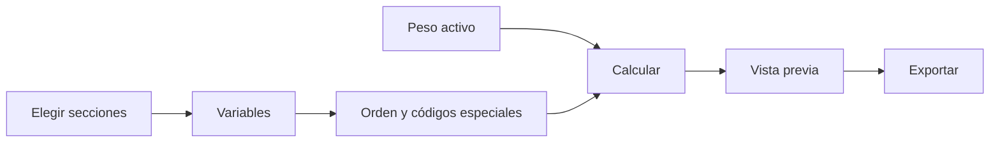

# Frecuencias

> Genera distribuciones de respuesta con etiquetas, orden, pesos y códigos especiales controlados.

## Objetivo

Producir tablas univariadas coherentes con la fuente y el denominador de cada variable.

## Antes de empezar

- Confirmar fuente, códigos especiales y peso vigente.
- Elegir secciones y variables que se incluirán.

## Mapa de la pantalla

## Elementos de la pantalla

| Elemento | Para qué sirve | Qué cambia o produce |
|---|---|---|
| Secciones activas | Acota el conjunto de variables | Define la cobertura del reporte |
| Orden | Elige original, ascendente o descendente | Cambia la presentación de categorías |
| Peso | Activa cálculo ponderado | Cambia porcentajes y denominadores efectivos |
| Vista previa | Muestra tablas antes de exportar | Permite verificar etiquetas y totales |
| Exportación | Genera el reporte | Produce tablas reproducibles |

## Cómo se usa

1. Selecciona secciones y variables.
2. Confirma orden, códigos especiales y peso.
3. Genera la vista previa.
4. Revisa bases, porcentajes y categorías.
5. Exporta o continúa en Cruces.

## Resultado y siguiente paso

- Tablas de frecuencias por variable y sección.
- Siguiente paso: Cruces o Gráficos.

## Estados, alertas y límites

- El denominador respeta filtros, faltantes y grano.
- Las filas repeat no se cuentan como personas de la base principal.
- Los códigos especiales no se excluyen sin configuración explícita.

## Cómo interpretar lo que ves

Una frecuencia debe leerse con universo, denominador, peso y tratamiento de valores especiales. Porcentajes correctos pueden responder a la pregunta equivocada si hay un filtro implícito.

## Ejemplo guiado

**Situación inicial.** Se requiere la distribución ponderada de satisfacción para los 1 200 estudiantes.

**Acciones.** Selecciona variable y peso, confirma el universo y genera la tabla. Comprueba N sin ponderar, base efectiva y presencia real de 98 o 99 antes de interpretar porcentajes.

**Resultado observable.** La tabla suma 100 % dentro del universo declarado y distingue conteos, porcentajes ponderados y valores especiales presentes.

## Si algo no coincide

Si no suma por redondeo, revisa decimales; si la diferencia es mayor, busca categorías ocultas o filtros. Si aparece 99 sin casos, revisa presentación. No elimines el código de la base.

## Ubicación en la jerarquía

- Padre: [[Analítica]].
