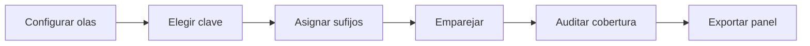

# Base panel

> Relaciona personas o unidades a través de olas declaradas y audita la cobertura del emparejamiento.

## Objetivo

Construir una base longitudinal sin emparejar por posición de fila ni asumir universos idénticos.

## Antes de empezar

- Disponer de dos o más olas con claves estables.
- Definir etiquetas, sufijos y orden temporal.

## Mapa de la pantalla

## Elementos de la pantalla

| Elemento | Para qué sirve | Qué cambia o produce |
|---|---|---|
| Lista de olas | Ordena bases y etiquetas | Define la secuencia temporal |
| Clave de panel | Identifica la misma unidad | Gobierna el emparejamiento |
| Sufijos | Distingue variables de cada ola | Evita colisiones de nombres |
| Opciones NSE | Añade variables de caracterización | Completa salidas configuradas |
| Auditoría | Muestra coincidencias y pérdidas | Permite evaluar cobertura |

## Cómo se usa

1. Añade y ordena las olas.
2. Define la clave estable y los sufijos.
3. Configura variables NSE y formatos de salida cuando correspondan.
4. Genera y revisa la auditoría de cobertura.
5. Exporta la base panel.

## Resultado y siguiente paso

- Base panel y auditoría de emparejamiento.
- Continúa en Ficha técnica para documentar el diseño o en Cruces.

## Estados, alertas y límites

- No empareja por orden de fila.
- Dos olas no se consideran comparables sólo por compartir nombres de variables.
- Casos no emparejados permanecen explícitos en la auditoría.

## Cómo interpretar lo que ves

La base panel integra observaciones repetidas cuando existe una clave y un significado temporal compatible. No es una unión genérica: debe preservar unidad, ola y procedencia.

## Ejemplo guiado

**Situación inicial.** Dos olas de estudiantes comparten id_persona y se necesita observar cambios de satisfacción.

**Acciones.** Selecciona las bases, define clave y variable temporal, y revisa coincidencias, ausencias y duplicados antes de construir. Comprueba varias personas en ambas olas.

**Resultado observable.** La salida identifica persona y ola, conserva procedencia y permite distinguir panel balanceado de casos presentes una sola vez.

## Si algo no coincide

Si la clave duplica dentro de una ola, resuelve el grano antes de integrar. Si faltan coincidencias, revisa formato del identificador. No unas por nombre o posición de fila.

## Ubicación en la jerarquía

- Padre: [[Analítica]].
