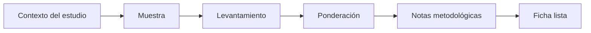

# Ficha técnica

> Consolida el contexto metodológico, la muestra, el levantamiento y la ponderación del estudio.

## Objetivo

Preparar una descripción reutilizable y verificable para informes y entregables.

## Antes de empezar

- Tener definidos diseño, fechas, población, muestra y tratamiento de pesos.
- Identificar qué datos provienen del proyecto y cuáles requieren entrada manual.

## Mapa de la pantalla

## Elementos de la pantalla

| Elemento | Para qué sirve | Qué cambia o produce |
|---|---|---|
| Contexto | Describe población, ámbito y objetivo | Sitúa el estudio |
| Muestra | Registra diseño y tamaño | Explica representatividad |
| Levantamiento | Consigna fechas y modo de recolección | Documenta trabajo de campo |
| Ponderación | Resume peso y calibración | Alinea la ficha con los reportes |
| Notas | Añade decisiones y cautelas | Completa el texto metodológico |

## Cómo se usa

1. Revisa los campos derivados automáticamente.
2. Completa sólo información respaldada por el proyecto.
3. Describe muestra, levantamiento y ponderación.
4. Verifica coherencia con la base y los reportes.

## Resultado y siguiente paso

- Ficha metodológica lista para incorporarse a entregables.
- Continúa en Gráficos para incluirla en el informe.

## Estados, alertas y límites

- Los campos faltantes no se inventan.
- La ficha describe el método; no corrige la base ni recalcula pesos.
- Debe actualizarse cuando cambian insumos metodológicos relevantes.

## Cómo interpretar lo que ves

La ficha técnica documenta universo, diseño, campo, tamaño, ponderación y limitaciones. Sus cifras deben derivar del estado vigente y cualquier texto editorial debe coincidir con ellas.

## Ejemplo guiado

**Situación inicial.** Se entregará una ficha para la base estudiantes con N 1 200 y ponderación por distrito y sexo.

**Acciones.** Revisa campos autocompletados, completa responsable y periodo, y contrasta N, universo y método con la base y configuración de pesos. Genera la vista final.

**Resultado observable.** La ficha declara 1 200 casos, población objetivo, fechas, diseño y ponderación sin contradicciones con las salidas.

## Si algo no coincide

Si N o fechas difieren, vuelve a la fuente que los alimenta; no sobrescribas el texto para ocultarlo. Si falta una limitación conocida, añádela explícitamente antes de exportar.

## Ubicación en la jerarquía

- Padre: [[Analítica]].
