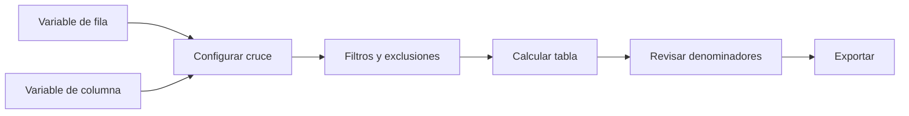

# Cruces

> Configura tablas bidimensionales con filtros, categorías excluidas y peso explícito.

## Objetivo

Comparar distribuciones entre grupos sin perder el denominador ni el contexto de cada variable.

## Antes de empezar

- Confirmar fuente, orden de categorías, códigos especiales y peso.
- Elegir variables de fila y columna compatibles.

## Mapa de la pantalla

## Elementos de la pantalla

| Elemento | Para qué sirve | Qué cambia o produce |
|---|---|---|
| Variable de fila | Define respuestas comparadas | Organiza filas de la tabla |
| Variable de columna | Define grupos | Organiza columnas |
| Categorías excluidas | Quita valores declarados del cálculo | Cambia universo y denominador explícitamente |
| Peso y filtros | Ajustan la estimación | Cambian porcentajes y base efectiva |
| Vista previa | Presenta totales y porcentajes | Permite comprobar coherencia |

## Cómo se usa

1. Selecciona variables de fila y columna.
2. Configura filtros, categorías excluidas y peso.
3. Genera la tabla.
4. Revisa denominadores, totales y orden.
5. Exporta o continúa en Gráficos.

## Resultado y siguiente paso

- Tablas cruzadas reproducibles con universo documentado.
- Siguiente paso: Gráficos.

## Estados, alertas y límites

- Excluir categorías cambia el universo y debe permanecer visible.
- Una asociación descriptiva no implica causalidad.
- No se comparan escalas o granos incompatibles.

## Cómo interpretar lo que ves

Un cruce relaciona una variable de filas con otra de columnas dentro de un universo. Interpreta cada porcentaje según su base de cálculo y revisa celdas pequeñas antes de concluir diferencias.

## Ejemplo guiado

**Situación inicial.** Se quiere cruzar satisfacción por facultad usando peso.

**Acciones.** Selecciona ambas variables, define porcentajes por columna y aplica el peso. Genera la tabla y revisa N de cada facultad y categorías especiales.

**Resultado observable.** Cada columna suma 100 %, muestra su N y permite comparar satisfacción sin mezclar denominadores.

## Si algo no coincide

Si filas y columnas parecen invertidas, revisa orientación antes de exportar. Si una celda tiene pocos casos, documenta cautela. No interpretes diferencias de porcentaje sin su denominador.

## Ubicación en la jerarquía

- Padre: [[Analítica]].
