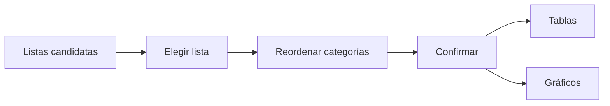

# Orden de categorías

> Confirma la secuencia de respuestas ordinales que usarán tablas y gráficos.

## Objetivo

Evitar que categorías con sentido metodológico aparezcan ordenadas alfabética o numéricamente por accidente.

## Antes de empezar

- Identificar listas realmente ordinales.
- Conocer el orden sustantivo que debe comunicarse.

## Mapa de la pantalla

## Elementos de la pantalla

| Elemento | Para qué sirve | Qué cambia o produce |
|---|---|---|
| Candidatas | Sugiere listas potencialmente ordinales | Reduce el conjunto a revisar |
| Editor de orden | Mueve categorías | Define la secuencia persistida |
| Confirmación | Guarda la decisión | Propaga orden a reportes y gráficos |
| Restablecer | Vuelve al orden del instrumento | Elimina el override manual |

## Cómo se usa

1. Revisa las listas sugeridas; no aceptes una sólo por la heurística.
2. Selecciona una lista y ordena sus categorías según el criterio metodológico.
3. Confirma y revisa el efecto en tablas.
4. Continúa en Gráficos.

## Resultado y siguiente paso

- Orden persistido y disponible para frecuencias, cruces y reportes.
- Siguiente paso: Gráficos.

## Estados, alertas y límites

- La aplicación sugiere candidatas, pero no impone un orden.
- Una lista nominal no debe convertirse en ordinal sin justificación.
- Restablecer elimina la decisión manual y recupera el orden fuente.

## Cómo interpretar lo que ves

El orden controla presentación y lectura; no cambia códigos de la base. Debe respetar secuencia conceptual, escalas y ubicación de valores especiales. Comprueba la vista previa de principio a fin: las categorías sustantivas deben formar una progresión comprensible y los valores como “No sabe” o “No responde” deben quedar fuera de esa progresión. Si sólo cambia la etiqueta pero no la posición, el orden todavía no fue confirmado.

## Ejemplo guiado

**Situación inicial.** La escala muy insatisfecho a muy satisfecho aparece ordenada alfabéticamente.

**Acciones.** Reordena las cinco categorías según la escala y coloca No sabe o No responde al final cuando estén presentes. Previsualiza una frecuencia.

**Resultado observable.** La tabla muestra progresión conceptual, mantiene códigos originales y sitúa especiales fuera de la escala sustantiva.

## Si algo no coincide

Si el orden se pierde, confirma que guardaste la configuración para la variable y base activas. Si una categoría nueva no aparece, actualiza desde el instrumento. No recodifiques números sólo para ordenar.

## Ubicación en la jerarquía

- Padre: [[Analítica]].
