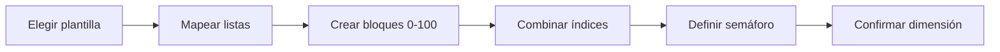

# Dimensiones analíticas

> Construye escalas, bloques e índices y define cómo se interpretan sus puntajes.

## Objetivo

Crear dimensiones reproducibles mediante una secuencia metodológica explícita, disponible luego para Gráficos y Dashboard.

## Antes de empezar

- Seleccionar variables compatibles con el constructo.
- Definir el sentido evaluativo de cada categoría y el tratamiento de faltantes.

## Mapa de la pantalla

## Elementos de la pantalla

| Elemento | Para qué sirve | Qué cambia o produce |
|---|---|---|
| Plantilla | Inicia una estructura de dimensión | Organiza el wizard |
| Listas evaluativas | Mapea categorías a valores | Fija dirección y escala de cada variable |
| Bloques 0–100 | Combina variables temáticas | Produce puntajes comparables |
| Índices | Combina bloques con pesos/reglas | Genera dimensiones compuestas |
| Semáforo | Define grupos o degradados y umbrales | Añade interpretación visual sin ocultar el valor |
| Confirmación | Versiona la configuración | Publica dimensión para consumidores posteriores |

## Cómo se usa

1. Elige una plantilla o estructura inicial.
2. Mapea explícitamente las categorías de listas evaluativas; no asumas sentido positivo/negativo.
3. Agrupa variables compatibles en bloques normalizados de 0 a 100.
4. Combina bloques en índices con pesos y reglas declaradas.
5. Define umbrales del semáforo y confirma la dimensión.

## Resultado y siguiente paso

- Puntajes e índices versionados, con composición y umbrales trazables.
- Siguiente paso: Gráficos; Dashboard también puede consumir dimensiones confirmadas desde su propia fuente.

## Estados, alertas y límites

- Normalizar a 0–100 no demuestra validez de constructo.
- La composición exige confirmación metodológica.
- El color del semáforo no reemplaza el valor ni sus cortes documentados.
- Si el wizard no se confirma, la dimensión no queda disponible.

## Cómo interpretar lo que ves

Una dimensión agrupa variables comparables bajo una definición y reglas explícitas. La pertenencia debe justificarse; agregar preguntas con escalas o universos distintos puede producir un indicador engañoso.

## Ejemplo guiado

**Situación inicial.** Se construirá una dimensión de experiencia con tres preguntas de escala 1 a 5.

**Acciones.** Selecciona las variables, revisa dirección y faltantes, invierte la pregunta formulada en sentido negativo y previsualiza cobertura por caso. Guarda la definición.

**Resultado observable.** La dimensión documenta sus tres componentes, dirección y regla de cálculo; la vista muestra cuántos casos aportan información.

## Si algo no coincide

Si una variable reduce drásticamente la cobertura, revisa su universo. Si la escala está invertida, corrige la dirección antes de calcular. No agrupes por similitud de nombre sin revisar contenido.

## Ubicación en la jerarquía

- Padre: [[Analítica]].
