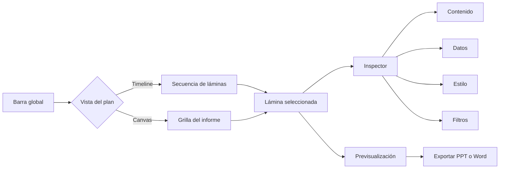

# Gráficos

> Compone láminas, configura sus datos y apariencia, y exporta informes editables en PowerPoint o Word.

## Objetivo

Transformar resultados analíticos en un plan editorial verificable. Gráficos no tiene pestañas de navegación de producto: Timeline y Canvas son dos vistas del mismo plan, mientras que Contenido, Datos, Estilo y Filtros viven dentro del inspector de la lámina seleccionada.

## Antes de empezar

- Confirmar en Analítica la fuente, los pesos, el orden de categorías y las dimensiones que se usarán.
- Para un consolidado de hermanas independientes, contar con aprobaciones metodológicas vigentes por base.
- Definir si el informe será PPTX, DOCX o un paquete compartible.

## Mapa de la pantalla

## Elementos de la pantalla

| Elemento | Para qué sirve | Qué cambia o produce |
|---|---|---|
| Timeline | Ordena láminas linealmente con drag and drop | Cambia la secuencia del plan |
| Canvas | Presenta el plan como grilla de nodos | Facilita reorganizar y revisar estructura en conjunto |
| Selector de modelo | Añade portada, texto, uno/dos gráficos u otras composiciones | Crea una lámina tipada con argumentos esperados |
| Inspector: Contenido | Edita títulos, subtítulos y narrativa | Cambia los textos de la lámina |
| Inspector: Datos | Elige variables, cruces y graficador por slot | Define qué cálculo alimenta la visualización |
| Inspector: Estilo | Aplica preset, estilo guardado y overrides | Cambia lectura, leyenda, espacio y canvas |
| Inspector: Filtros | Acota la base del slide | Cambia universo y denominador de esa lámina |
| Previsualización | Renderiza datos y diagnostica argumentos faltantes | Permite revisar antes de exportar |
| Estilo global | Gestiona identidad, paletas, iconos, defaults y perfiles PPT | Establece una base visual reutilizable |
| Plan sugerido/cobertura | Propone láminas y mide variables cubiertas | Aporta una receta revisable, no una decisión editorial automática |
| Exportación | Ejecuta jobs locales para PPTX o DOCX | Registra y entrega artefactos editables |

## Cómo se usa

1. Elige **Timeline** para trabajar lámina por lámina o **Canvas** para ver y reorganizar el informe completo; ambas vistas editan el mismo plan persistido.
2. Añade un modelo de lámina. El modelo define estructura y slots, pero no completa automáticamente variables ni textos.
3. Selecciona la lámina y usa el inspector:
   - **Contenido** para títulos y narrativa.
   - **Datos** para variable, cruce y graficador registrado.
   - **Estilo** para preset, estilo guardado y ajustes específicos.
   - **Filtros** para acotar explícitamente la base del slide.
4. Revisa la previsualización y resuelve argumentos requeridos, variables inexistentes o combinaciones no soportadas.
5. Configura identidad global, paletas, recursos, plantilla y perfil PPT cuando corresponda.
6. Revisa la cobertura del plan. La sugerencia automática ayuda a empezar, pero exige selección editorial y metodológica.
7. Exporta PPTX/DOCX o genera un paquete compartible con manifiesto; los secretos nunca se incluyen.

## Resultado y siguiente paso

- Plan de gráficos autosalvado con orden, modelos, contenido, datos, filtros y estilos.
- PPTX o DOCX editable registrado como artefacto local, o paquete portable validado.
- Para hermanas independientes puede producirse un único informe consolidado a partir de releases aprobadas y referencias `actor$variable`, sin fusionar las bases.

## Estados, alertas y límites

- Un graficador no registrado o un argumento faltante se señala; no se adivina.
- Los filtros del slide no sustituyen el universo efectivo definido en Carga.
- El consolidado carga fuentes en sólo lectura, no cambia `active_base`, no promedia denominadores y sólo compara escalas compatibles.
- El borrador global consolidado es distinto de los planes por base y no se crea copiándolos implícitamente.
- Exportar no publica externamente. La preview no sustituye la verificación estructural y visual del archivo final.
- Gráficos no alimenta directamente Dashboard: Dashboard importa y confirma su propio par XLSForm–datos, aunque puede consumir recodificaciones o dimensiones disponibles en el proyecto.

## Cómo interpretar lo que ves

El plan, la lámina seleccionada y el inspector son tres niveles distintos. Timeline y Canvas editan el mismo orden; Datos define cálculo, Estilo su presentación y Filtros el universo de esa lámina. La previsualización diagnostica, no garantiza el archivo final.

## Ejemplo guiado

**Situación inicial.** Se necesita una lámina de satisfacción por facultad dentro de un PPT de resultados.

**Acciones.** Añade un modelo con gráfico, selecciona satisfacción y facultad, aplica el peso y confirma el filtro. Escribe título, revisa leyenda en preview y coloca la lámina en el orden narrativo antes de exportar.

**Resultado observable.** La lámina muestra el cruce esperado, declara su universo, conserva estilo del informe y aparece en la posición elegida del PPT.

## Si algo no coincide

Si la preview está vacía, revisa argumentos, variable y filtro. Si el PPT difiere, inspecciona el archivo final y plantilla. No uses filtros de la lámina para cambiar silenciosamente el universo metodológico.

## Ubicación en la jerarquía

- Padre: [[Procesamiento]].
