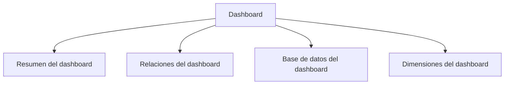

# Dashboard

> Convierte una fuente curada en vistas interactivas, relaciones, registros y dimensiones.

## Propósito del módulo

Dashboard convierte una fuente curada en una experiencia interactiva para lectura, exploración y publicación. Sus secciones separan síntesis ejecutiva, comparaciones bivariadas, inspección de registros y dimensiones calculadas. La fuente del tablero se selecciona aquí: no se hereda automáticamente de Gráficos.

## Antes de recorrerlo

Reúne el XLSForm y los datos que alimentarán el tablero. Confirma que corresponden entre sí y define qué audiencia, indicadores y cortes se necesitan. Si utilizarás dimensiones, calcúlalas en Analítica y actualiza su manifiesto. Las credenciales de publicación permanecen fuera del proyecto portátil.

## Mapa del módulo

## Guía de destinos

| Destino | Cuándo entrar | Qué hacer allí | Qué deja listo |
|---|---|---|---|
| [[Resumen del dashboard]] | Al diseñar la lectura principal | Revisar indicadores, filtros, apariencia y modo lector | Una portada interactiva y publicable |
| [[Relaciones del dashboard]] | Para explorar dos variables | Elegir ejes, controlar filtros y denominadores | Una comparación descriptiva |
| [[Base de datos del dashboard]] | Al seleccionar fuente o auditar resultados | Curar, revisar recodificación e inspeccionar filas | La fuente trazable que habilita las vistas |
| [[Dimensiones del dashboard]] | Cuando Analítica aporta dimensiones | Comprobar manifiesto, cobertura y cortes | Una lectura interactiva de indicadores compuestos |

## Recorrido recomendado

Empieza por Base de datos: una curación crítica bloqueada invalida las demás lecturas. Después configura Resumen y usa Relaciones para preguntas concretas. Abre Dimensiones sólo cuando su manifiesto esté vigente. Antes de publicar, recorre todo en modo lector y verifica filtros iniciales.

## Cómo interpretar el avance

Una vista habilitada indica que pasó la puerta de curación, no que toda interpretación sea correcta. Cada tarjeta o gráfico debe conservar universo y denominador. Una URL registrada confirma envío, pero la plataforma externa decide si la compilación terminó.

## Resultado

Queda un tablero trazable desde sus registros hasta la síntesis, preparado para consumo interno o publicación verificada sin mezclar credenciales con los datos.

## Ubicación en la jerarquía

- Padre: [[Prosecnur]].
