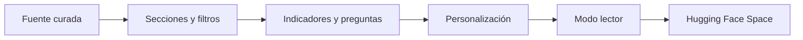

# Resumen del dashboard

> Presenta indicadores y preguntas, permite personalizar la experiencia, abrir el modo lector y publicar una copia en Hugging Face Spaces.

**Etiqueta visible en la aplicación:** Resumen

## Objetivo

Configurar una lectura ejecutiva clara y preparar su consumo o publicación.

## Antes de empezar

Selecciona y cura la fuente del dashboard; define qué indicadores y preguntas necesita la audiencia.

## Mapa de la pantalla

## Elementos de la pantalla

| Elemento | Para qué sirve | Qué cambia o produce |
|---|---|---|
| Fuente curada | Habilita las vistas del dashboard. | Fija datos, variables y universo usados por todos los indicadores. |
| Secciones y filtros | Organizan la lectura activa. | Cambian el subconjunto visible y el recorrido de la audiencia. |
| Indicadores y preguntas | Sintetizan resultados. | Calculan tarjetas y distribuciones sobre la fuente filtrada. |
| Personalización | Ajusta título, logos, vistas, tema y paletas. | Guarda identidad y opciones de lectura del tablero. |
| Modo lector | Oculta controles administrativos. | Permite comprobar la experiencia sin edición. |
| Hugging Face Space | Publica una copia externa con credencial de sesión. | Envía archivos y registra URL, fecha y estado de la publicación. |

## Cómo se usa

1. Revisa indicadores, preguntas y filtros con la fuente curada.
2. Personaliza título, logos, pestañas visibles, vistas, tema y paletas según la audiencia.
3. Abre el modo lector para comprobar la experiencia sin controles de administración; usa Escape para salir de la vista previa cuando corresponda.
4. Si publicas, completa Space y credencial de sesión, inicia el envío y verifica después el estado final en Hugging Face.

## Resultado y siguiente paso

Obtienes un resumen listo para lectura interna o una copia publicada cuya compilación externa debe confirmarse.

## Estados, alertas y límites

- Los filtros y selecciones de sesión no equivalen a una personalización persistente.
- El modo lector oculta edición y guardado automático, pero el modo público también necesita controles de servidor que bloqueen mutaciones.
- La publicación registra Space, URL y fecha, pero la plataforma externa determina el resultado final de la compilación.
- Las credenciales se usan en la sesión y no deben incorporarse al proyecto portátil.

## Cómo interpretar lo que ves

Lee cada indicador junto con filtros y fuente activa. Una tarjeta puede cambiar porque cambió la selección, no porque se modificaron los datos. Personalización persistente y filtros de sesión son estados distintos. Modo lector sirve para revisar la experiencia, mientras que la URL de Hugging Face confirma destino del envío, no que la compilación externa haya terminado correctamente.

## Ejemplo guiado

**Situación inicial.** El resumen debe mostrar N, satisfacción y participación para estudiantes de una facultad, con identidad institucional.

**Acciones.** Selecciona la facultad, comprueba denominadores de las tarjetas y personaliza título, logo y paleta. Abre modo lector y recorre las secciones. Si se publica, inicia el envío y consulta su estado final.

**Resultado observable.** Las tarjetas responden al mismo filtro, el modo lector no expone controles administrativos y la publicación sólo se considera lista cuando el Space informa compilación exitosa.

## Si algo no coincide

Si una tarjeta usa otro N, revisa filtros y universo de la pregunta. Si la personalización desaparece al recargar, confirma que la guardaste y no era una selección temporal. Si existe URL pero el Space falla, abre el estado externo y corrige el error; no compartas el enlace como entrega terminada.

## Ubicación en la jerarquía

- Padre: [[Dashboard]].
