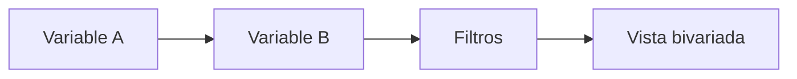

# Relaciones del dashboard

> Explora asociaciones bivariadas entre variables de la fuente curada.

**Etiqueta visible en la aplicación:** Relaciones

## Objetivo

Comparar dos variables y reconocer patrones descriptivos relevantes.

## Antes de empezar

Cura la fuente y elige variables compatibles con la comparación que deseas realizar.

## Mapa de la pantalla

## Elementos de la pantalla

| Elemento | Para qué sirve | Qué cambia o produce |
|---|---|---|
| Variable A | Define el primer eje o agrupación. | Establece las categorías que organizan la comparación. |
| Variable B | Define el segundo eje o respuesta. | Calcula la distribución o medida dentro de cada grupo. |
| Filtros | Acotan los registros analizados. | Modifican universo y denominadores de la vista. |
| Vista bivariada | Resume la asociación observada. | Presenta el patrón conjunto con sus categorías y bases. |

## Cómo se usa

1. Selecciona la primera y la segunda variable.
2. Aplica filtros solo si responden a una comparación definida de antemano.
3. Revisa denominadores, categorías y valores ausentes antes de interpretar el patrón.

## Resultado y siguiente paso

Obtienes una lectura descriptiva de la relación; usa Base de datos para inspeccionar los registros subyacentes.

## Estados, alertas y límites

- Una asociación bivariada no demuestra causalidad.
- Los filtros cambian la población analizada y pueden reducir demasiado la base.
- Categorías pequeñas o valores ausentes pueden producir patrones inestables.

## Cómo interpretar lo que ves

Comprueba orientación y denominador antes de comparar. Variable A suele organizar grupos y Variable B la respuesta, pero la lectura depende del tipo de cada una. Los filtros redefinen la población y una categoría pequeña puede producir porcentajes extremos. Una diferencia descriptiva es un patrón observado; esta vista no establece dirección causal ni controla otras variables.

## Ejemplo guiado

**Situación inicial.** Se desea comparar satisfacción por facultad entre estudiantes con respuesta válida.

**Acciones.** Coloca facultad como A y satisfacción como B. Excluye sólo los casos definidos fuera del universo y revisa N por facultad antes de observar porcentajes.

**Resultado observable.** Cada facultad presenta su distribución de satisfacción y su denominador; los porcentajes se interpretan dentro de la misma orientación.

## Si algo no coincide

Si el gráfico parece invertido, intercambia A y B y verifica el significado antes de concluir. Si una facultad desaparece, limpia filtros y revisa valores ausentes. Si un patrón depende de muy pocos casos, conserva el N visible y evita presentarlo como diferencia estable.

## Ubicación en la jerarquía

- Padre: [[Dashboard]].
