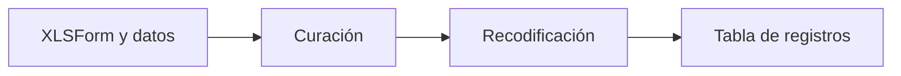

# Base de datos del dashboard

> Expone la fuente del dashboard, su curación, recodificación detectada y registros disponibles.

**Etiqueta visible en la aplicación:** Base de datos

## Objetivo

Verificar la base que sustenta todas las vistas antes de interpretar o publicar resultados.

## Antes de empezar

Selecciona explícitamente el XLSForm y los datos del dashboard; esta fuente es independiente de la usada en Gráficos.

## Mapa de la pantalla

## Elementos de la pantalla

| Elemento | Para qué sirve | Qué cambia o produce |
|---|---|---|
| XLSForm y datos | Definen la fuente explícita del dashboard. | Publican el par que alimentará todas las vistas del tablero. |
| Curación | Valida estructura y bloquea vistas hasta resolver problemas críticos. | Habilita o mantiene cerradas las pestañas según los hallazgos. |
| Recodificación | Distingue valores originales de códigos ya detectados. | Aplica correspondencias conocidas sin inventar categorías. |
| Tabla de registros | Permite inspeccionar filas y variables. | Expone la evidencia subyacente a indicadores y relaciones. |

## Cómo se usa

1. Selecciona el XLSForm y el archivo de datos correctos.
2. Resuelve el control de curación y documenta cualquier exclusión o ajuste.
3. Revisa la recodificación detectada y compárala con los valores originales.
4. Inspecciona variables y registros antes de usar Resumen, Relaciones o publicar.

## Resultado y siguiente paso

La base queda trazable y habilita las demás vistas del dashboard.

## Estados, alertas y límites

- El dashboard no hereda automáticamente la fuente de Gráficos.
- La curación es una puerta de entrada: los problemas críticos mantienen bloqueadas las pestañas.
- La recodificación muestra o aplica correspondencias detectadas; no inventa códigos que no existan en la fuente o configuración.
- Cambiar XLSForm o datos obliga a repetir la revisión.

## Cómo interpretar lo que ves

El par XLSForm–datos de esta pantalla es la fuente explícita del Dashboard; no se hereda de Gráficos. La curación es una puerta: los errores críticos impiden abrir vistas para evitar resultados sobre una estructura desconocida. La recodificación debe poder compararse con el valor original. La tabla muestra registros, pero un filtro visible no altera la fuente publicada.

## Ejemplo guiado

**Situación inicial.** Se carga un XLSForm de estudiantes y una base de 1 200 respuestas; distrito contiene códigos ya definidos.

**Acciones.** Selecciona ambos archivos, ejecuta curación y abre los hallazgos. Confirma que distrito se reconozca con sus códigos, revisa algunas filas y resuelve cualquier error crítico.

**Resultado observable.** La curación queda aprobada, la tabla contiene 1 200 registros y las demás vistas se habilitan sobre ese par identificado.

## Si algo no coincide

Si las pestañas siguen bloqueadas, abre el hallazgo crítico en vez de recargar. Si una etiqueta se interpreta como código nuevo, contrasta instrumento y valor original. Si el conteo difiere de la fuente prevista, comprueba filtros y archivo seleccionado; cambiar de archivo obliga a repetir toda la curación.

## Ubicación en la jerarquía

- Padre: [[Dashboard]].
