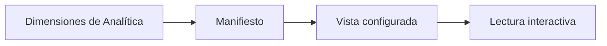

# Dimensiones del dashboard

> Presenta las dimensiones definidas previamente en Analítica dentro de una vista interactiva.

**Etiqueta visible en la aplicación:** Dimensiones

## Objetivo

Consultar resultados por dimensiones sin perder la trazabilidad de su definición metodológica.

## Antes de empezar

Configura y calcula las dimensiones en Analítica y completa la curación de la fuente del dashboard.

## Mapa de la pantalla

## Elementos de la pantalla

| Elemento | Para qué sirve | Qué cambia o produce |
|---|---|---|
| Dimensiones de Analítica | Aportan definiciones y resultados. | Entregan componentes, dirección, regla y cobertura calculadas. |
| Manifiesto | Describe qué dimensiones están disponibles. | Determina cuáles pueden mostrarse y con qué metadatos. |
| Vista configurada | Organiza indicadores y cortes. | Define la composición que verá la audiencia. |
| Lectura interactiva | Permite explorar los resultados. | Recalcula la presentación según los cortes disponibles. |

## Cómo se usa

1. Comprueba que el manifiesto contenga las dimensiones esperadas.
2. Selecciona una dimensión y revisa su definición, cobertura y cortes.
3. Contrasta los resultados con la configuración metodológica de Analítica.

## Resultado y siguiente paso

Obtienes una lectura interactiva de las dimensiones ya calculadas.

## Estados, alertas y límites

- El dashboard consume definiciones de Analítica; no las crea ni reemplaza.
- Si faltan insumos, la pestaña debe mostrarse no disponible con su razón.
- Una dimensión modificada requiere recalcular o actualizar su manifiesto antes de interpretarla aquí.

## Cómo interpretar lo que ves

Dashboard consume una dimensión ya definida; no decide aquí qué variables la componen. El manifiesto enlaza nombre, definición y resultado disponible. Lee el valor junto con cobertura y cortes, porque una dimensión puede excluir casos sin suficientes componentes. Una vista ausente puede indicar falta de manifiesto o cálculo, no un resultado de cero.

## Ejemplo guiado

**Situación inicial.** Analítica publicó una dimensión de experiencia con tres preguntas y cobertura para 1 050 de 1 200 casos.

**Acciones.** Confirma la dimensión en el manifiesto, abre su definición y selecciona facultad como corte. Compara cobertura total y por facultad antes de interpretar promedios.

**Resultado observable.** La vista muestra los tres componentes declarados, 1 050 casos válidos y resultados por facultad sin presentar 150 faltantes como puntuación cero.

## Si algo no coincide

Si la dimensión no aparece, vuelve a Analítica y comprueba cálculo y manifiesto. Si muestra una versión anterior, actualiza después de recalcular. Si la cobertura cambia drásticamente por corte, revisa universos y faltantes; no redefinas componentes desde Dashboard para forzar el resultado.

## Ubicación en la jerarquía

- Padre: [[Dashboard]].
