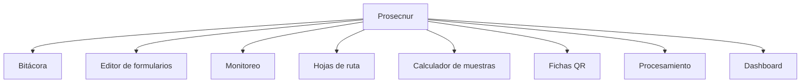
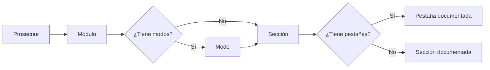

# Prosecnur

> Mapa funcional de la aplicación y punto de entrada a sus ocho módulos.

## Para qué sirve este mapa

Esta página ayuda a ubicar una tarea antes de abrir un módulo. No representa una secuencia obligatoria: cada estudio activa necesidades distintas. La pregunta útil no es “¿qué módulo sigue?”, sino “¿qué decisión, insumo o resultado necesito trabajar ahora?”.

## Antes de elegir un módulo

- Identifica si estás preparando el estudio, acompañando el trabajo de campo o procesando información ya recogida.
- Comprueba qué insumos existen: plan, instrumento, marco, muestra, respuestas o base preparada.
- Distingue una tarea de configuración de una tarea de revisión o producción de entregables.

## Dónde aterrizas: el inicio del proyecto

Ningún módulo se abre en el vacío. Prosecnur exige un proyecto `.pulso` abierto, y al abrirlo aterrizas siempre en el **inicio del proyecto** (`/`), nunca en una ruta heredada del proyecto anterior. Esa pantalla no es un módulo y por eso no tiene rama propia en esta documentación: es el tablero desde el que se elige una.

Qué encuentras allí:

| Elemento | Para qué sirve | Qué cambia o produce |
|---|---|---|
| Nombre del proyecto y estado | Confirma qué `.pulso` está abierto antes de tocar nada | Evita trabajar sobre el estudio equivocado |
| Tarjetas de módulo | Resumen el avance de cada módulo con el dato que ese módulo considera significativo: fases cumplidas, una cifra, una fecha o una barra | Deciden a qué módulo entrar, no lo ejecutan |
| Selector de módulos | Abre el catálogo completo y permite curar qué módulos ves | Ajusta el tablero al tipo de estudio |
| Configuración global | Ajustes que no pertenecen a un módulo concreto | Cambian el comportamiento de toda la aplicación |
| Novedades | Lista los cambios de la versión instalada | Explica por qué una pantalla cambió desde la última vez |

Las tarjetas resumen, no certifican. Una tarjeta con cifra indica que ese módulo tiene estado guardado; no garantiza que ese estado sea el vigente ni que corresponda al corte que necesitas. La comprobación siempre ocurre dentro del módulo, en la pantalla que produce el dato.

## Enciclopedia metodológica

La **Enciclopedia metodológica** (`/enciclopedia`) acompaña a los ocho módulos sin ser uno de ellos: está disponible de forma permanente y no depende del estudio abierto. Documenta el método, no el proyecto.

Contiene un catálogo de metodologías con ficha propia —definición, supuestos formales, cuándo usarla, cuándo **no** usarla, expresiones técnicas, rangos de parámetros recomendados, decisiones, ventajas y limitaciones, bibliografía y estudios internos donde se aplicó—, un glosario canónico, una comparación de hasta tres metodologías lado a lado y una tabla maestra de aplicaciones.

Conviene abrirla antes de decidir en Calculador de muestras o de defender un resultado en Procesamiento: responde *"¿esta técnica es la adecuada y qué supone?"*, mientras los módulos responden *"¿qué obtengo con los datos de este estudio?"*. Una advertencia que la propia enciclopedia hace explícita: no todo estudio calcula muestra.

## Mapa de los módulos

## Guía para elegir

| Destino | Cuándo entrar | Qué hacer allí | Qué deja listo |
|---|---|---|---|
| [[Bitácora]] | Cuando necesitas ordenar decisiones, hitos, riesgos o fechas del estudio | Registrar el trabajo acordado y revisar cronograma y calendario | Una referencia operativa común para el equipo |
| [[Editor de formularios]] | Cuando vas a crear, revisar, simular o exportar el instrumento | Trabajar la estructura XLSForm y comprobar cómo responderá una persona | Una revisión de instrumento utilizable por los demás módulos |
| [[Monitoreo]] | Cuando el campo ya tiene fuentes, metas o actividad que observar | Elegir el modo del estudio y revisar avance, calidad, incidencias y consultas | Un diagnóstico operativo del trabajo de campo |
| [[Hojas de ruta]] | Cuando el equipo necesita convertir territorio y muestra en asignaciones de campo | Preparar población, manzanas, UMP y paquetes de entrega | Una distribución territorial accionable |
| [[Calculador de muestras]] | Cuando falta definir tamaño, método, selección o sustento muestral | Elegir el modo adecuado, cargar el marco y evaluar resultados | Una muestra documentada y lista para su uso operativo |
| [[Recopiladores]] | Cuando un levantamiento por cursos-horario requiere accesos individuales o impresos | Preparar enlaces, revisar fichas y producir el paquete QR | Material de acceso verificable para la aplicación |
| [[Procesamiento]] | Cuando ya existen instrumento y respuestas que deben convertirse en resultados | Cargar, validar, codificar, preparar análisis y construir gráficos | Bases revisadas y entregables analíticos |
| [[Dashboard]] | Cuando necesitas explorar o comunicar resultados en un tablero | Seleccionar fuentes, revisar relaciones, configurar dimensiones y publicar | Una experiencia interactiva de consulta |

## Recorrido recomendado

1. Empieza por el resultado que necesitas obtener y localiza el módulo que lo produce.
2. Abre su guía y revisa qué información debe existir antes de comenzar.
3. Recorre únicamente las secciones habilitadas para el estudio; un modo puede cambiar ese conjunto.
4. Antes de salir del módulo, comprueba el resultado y los límites documentados en su última tarea.

## Cómo interpretar el avance

Un módulo visible no implica que esté listo para usarse. Algunos requieren archivos, una revisión publicada, un marco o decisiones previas. Los estados informativos describen lo que existe; las advertencias señalan algo que conviene revisar; los bloqueos indican que falta una condición necesaria. La guía de cada pantalla explica esa diferencia con el vocabulario que aparece en la aplicación.

## Cómo está organizada la documentación

- **Módulo:** familia principal de trabajo.
- **Modo:** variante que cambia las secciones disponibles, como los cuatro modos de Monitoreo.
- **Sección:** área principal dentro de un módulo o modo.
- **Pestaña:** superficie dinámica dentro de una sección.

La navegación siempre sigue `Prosecnur → Módulo → Modo (cuando existe) → Sección → Pestaña`. Los conceptos técnicos se explican en la pestaña o sección donde el usuario los encuentra; no forman ramas separadas.

## Criterio de lectura

Cada pestaña —o cada sección cuando no tiene pestañas— explica su objetivo, requisitos, elementos visibles, interpretación, uso, ejemplo, resultado, estados, límites y acciones de revisión con una plantilla común.

Los enlaces reproducen únicamente la jerarquía del frontend. Los flujos de trabajo se explican dentro de cada página sin crear conexiones que salten niveles en el grafo.

## Cuánto puedes confiar en cada guía

El campo `documentacion` del encabezado declara el estado real de la nota y debe leerse antes de usarla como referencia:

| Valor | Qué significa | Cómo usarla |
|---|---|---|
| `completa` | Describe elementos que existen en esa pantalla, con un ejemplo propio y límites verificados contra el código | Es utilizable como referencia |
| `parcial` | La ubicación, la dirección y las fuentes son correctas, pero la explicación es genérica y no distingue esta pantalla de otra | Sirve para ubicarte; no para interpretar un resultado |
| `pendiente` | Sin contenido propio todavía | Abre la aplicación |

Marcar `completa` una nota genérica es peor que dejarla `pendiente`: convierte una laguna conocida en una laguna invisible. Una nota deja de ser `parcial` sólo cuando su tabla de elementos nombra controles que existen y su ejemplo no podría copiarse a otra pantalla sin quedar falso.

## Direcciones enlazables

La aplicación nombra cada vista con una dirección: la ruta indica el módulo y la consulta indica el resto (`/monitoreo?modo=territorial&seccion=avance&pestana=ump`). Los parámetros canónicos son `modo`, `seccion`, `pestana`, `panel` y `foco`. El campo `ruta_app` de cada nota reproduce esa dirección, de modo que puede pegarse en la aplicación para llegar a la pantalla descrita.

Tres advertencias de lectura:

- El **modo** aparece en la dirección pero no se elige con un click: lo determina el estudio del proyecto. Verlo escrito confirma dónde estás; cambiarlo a mano no reconfigura el estudio.
- La **pestaña por defecto de una sección no lleva parámetro**. Por eso la nota de Analítica y la de su pestaña Datos comparten `/analitica`: es exactamente lo que la aplicación escribe.
- **No todos los módulos publican su ubicación.** Monitoreo, Procesamiento —en Carga, Codificación y Analítica—, y Hojas de ruta sí lo hacen. Cálculo de muestra, Dashboard, Editor de formularios, Fichas QR y Validación no: su barra muestra siempre la misma dirección, así que sus notas declaran sólo la ruta y la ubicación exacta la da su lugar en esta jerarquía. La única excepción parcial es el modo universitario de Cálculo de muestra, alcanzable con `/calc-muestra?modo=aulas`, que la aplicación aplica al abrir y luego retira de la barra.

## Resultado de este recorrido

Después de elegir un módulo debes poder explicar tres cosas: qué tarea resolverás, qué insumos necesita y qué resultado observable dejará. Si alguna de ellas sigue ambigua, vuelve a la tabla y compara el propósito de los módulos cercanos antes de modificar datos o producir una salida.
