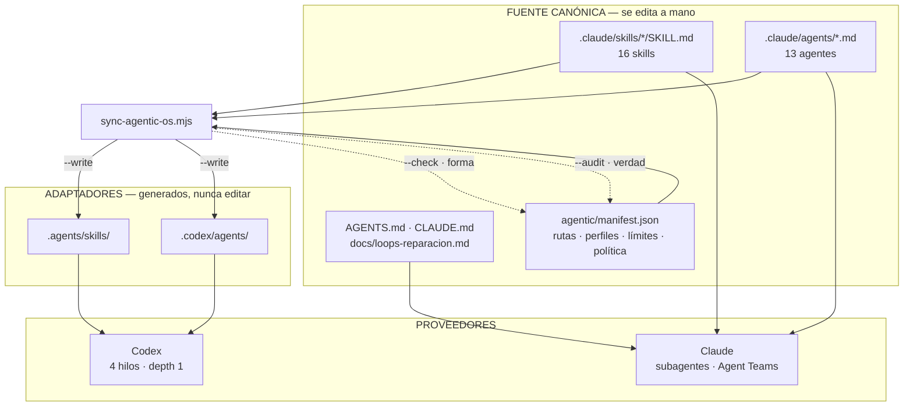
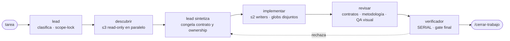

# Agentic OS de Prosecnur

El agente raíz es el orquestador. Conserva el contexto del usuario, carga los
skills, fija alcance y ownership, delega, une resultados y controla cualquier
acción externa. Ningún especialista puede crear otros agentes.

## Mapa mental

Tres ideas sostienen todo el sistema:

1. **Una sola fuente canónica**, y todo lo demás se genera. Editar un adaptador
   es siempre un error.
2. **Toda tarea entra por una ruta**, y toda ruta que toca código sale por
   `verificador`. No hay atajo.
3. **Lo declarado se comprueba contra la realidad.** `--check` valida forma;
   `--audit` valida verdad. Verde por conformidad, nunca por ausencia.

### Capas: qué se edita y qué se genera



### Anatomía de una tarea



Límites duros: **lead + 3 workers · máximo 2 writers · profundidad 1 · 1
reintento**. Solo el lead delega. Un resultado incompleto nunca se sintetiza
como aprobado.

### Las 8 ramas

| Rama | Código | Skills propios | Implementan | Gate |
|---|:--:|---|---|---|
| **construir** | sí | `scope-lock` `orquestar-trabajo` `dominio-prosecnur` `nucleo-metodologico` `contrato-superficie` `cerrar-trabajo` | `autor-regresiones` `backend-r` `frontend-react` | `verificador` |
| **disenar** | sí | `scope-lock` `orquestar-trabajo` `revamp-visual` `contrato-superficie` `ver-ui` `cerrar-trabajo` | `autor-regresiones` `frontend-react` | `verificador` |
| **entregables** | sí | `scope-lock` `orquestar-trabajo` `entregables-oficina` `jobs-asincronos` `cerrar-trabajo` | `autor-regresiones` `especialista-entregables` | `verificador` |
| **integraciones** | sí | `scope-lock` `orquestar-trabajo` `dominio-prosecnur` `integraciones-datos` `jobs-asincronos` `cerrar-trabajo` | `autor-regresiones` `especialista-integraciones` `frontend-react` | `verificador` |
| **desktop_release** | sí | `scope-lock` `orquestar-trabajo` `cerrar-trabajo` | `autor-regresiones` `desktop-packaging` | `verificador` |
| **operar_repo** | sí | `orquestar-trabajo` `cerrar-trabajo` `publicar` `preparar-release` `notas-parche` `auditoria-deuda` | `curador-commits` | `verificador` |
| **estudios_reales** | no | `orquestar-trabajo` `estudio-real` `dominio-prosecnur` | — | — |
| **gobernar** | no | `orquestar-trabajo` `dominio-prosecnur` | — | — |

Las dos rutas sin gate son las que no cambian código. Toda ruta con
`code_change: true` termina en `verificador`; el sincronizador lo exige.

### Los dos comprobadores

| | `--check` | `--audit` |
|---|---|---|
| **Qué valida** | Forma | Verdad |
| **Pregunta** | ¿está todo bien conectado? | ¿sigue siendo cierto lo que afirma? |
| **Detecta** | adaptadores desincronizados, inventario, colisiones, rutas sin gate, límites, sandbox | archivos congelados que crecieron, monolitos nuevos sin gobierno, skills/agentes huérfanos, rutas y `make` targets citados que ya no existen |
| **Historia** | — | `MonitoreoPage.tsx` siguió congelado tras borrarse mientras dos monolitos de ~20.000 líneas crecían con el CI en verde |

Ambos corren en el job `Agentic OS` de `quality.yml`.

### Dónde vive cada decisión

| Pregunta | Fuente |
|---|---|
| ¿Qué rama es esta tarea? | `CLAUDE.md` |
| ¿Qué carga y quién implementa? | `agentic/manifest.json` → `routes` |
| ¿Qué puede editar este agente? | `manifest.json` → `agent_profiles` + `profiles` |
| ¿Cómo se reparan bugs? | `docs/loops-reparacion.md` |
| ¿Cómo debe verse una superficie? | `docs/ui-layout-grammar.md` → Contrato de Superficie |
| ¿Qué archivos no pueden crecer? | `manifest.json` → `policy.frozen_growth_files` |
| ¿Por qué se decidió así? | `docs/adrs/` |

## Fuente única y adaptadores

- `AGENTS.md` da a Codex la autorización y los límites durables.
- `CLAUDE.md` enruta capacidades y reglas de casa para Claude.
- `.claude/skills/*/SKILL.md` y `.claude/agents/*.md` son las únicas fuentes
  canónicas editables.
- `.agents/skills/` y `.codex/agents/` son adaptadores generados para Codex.
- `agentic/manifest.json` (schema v2) declara perfiles, proveedores, límites,
  pools por ruta, condiciones seriales, gate final y el contrato semántico que
  debe seguir siendo cierto aunque el schema del archivo no cambie.
- `agentic/orchestration-policy.mjs` selecciona una oleada y conserva las líneas
  pendientes; sus smokes deterministas no reemplazan el juicio del lead.

Los adaptadores llevan una marca generada. El sincronizador nunca sobrescribe
una colisión manual ni borra un archivo sin esa marca, protege `.claude/` y
escribe cada salida mediante archivo temporal + rename atómico.

El Agentic OS local no es reemplazado por el catálogo global definido en el
[ADR 0039](adrs/0039-agentic-os-multirepo-provider-neutral.md). El núcleo
provider-neutral vive en un checkout independiente y aporta disponibilidad.
Las instrucciones y overlays de producto permanecen locales: 16 skills en
`.claude/skills/` y 13 agentes en `.claude/agents/`, materializados para Codex
solo mediante adaptadores generados. Los únicos skills externos permitidos son
`emil-design-eng` y `govern-visual-harmony`, métodos transversales de diseño;
ninguna dependencia externa sustituye arquitectura, dominio, entregables, QA o
proyectos de referencia propios. El alcance y los pilotos auditados se
registran en el
[informe de rollout](qa/agentic-os-rollout-2026-07-19.md).

### Contrato semántico ejecutable

`policy.semantic_contract` evita que el inventario esté formalmente sincronizado
pero describa un producto antiguo:

- **Navegación v3:** el manifiesto vive en
  `frontend/src/lib/modules.ts`; la dirección canónica, en
  `frontend/src/lib/navegacion/direccion.ts`. Sus cinco dimensiones ordenadas
  son módulo, modo, sección, pestaña y panel.
- **API frontend modular:** las funciones y tipos viven por dominio en
  `frontend/src/api/`; `frontend/src/api/client.ts` es únicamente el barrel de
  compatibilidad para imports existentes.
- **Overlays locales:** las instrucciones gobernadas son `CLAUDE.md`,
  `.claude/skills/` y `.claude/agents/`. El auditor rechaza afirmaciones
  obsoletas sobre navegación, API, integraciones o dependencias externas
  retiradas.

El contrato semántico usa la versión del producto que declara cada fuente; no
cambia `schema_version: 2` del manifiesto.

## Contrato de orquestación

Toda tarea no trivial carga `orquestar-trabajo`; los cambios y reparaciones de
producto empiezan además con `scope-lock`. El lead publica un
`ORCHESTRATION CONTRACT` con ruta, oleadas, objetivo por línea,
perfil, evidencia, archivos permitidos, exclusiones, dependencias, condición de
unión y stopping rule.

La secuencia normal es:

1. El lead carga instrucciones, clasifica y bloquea el scope.
2. Hasta tres agentes read-only/reviewer investigan en paralelo.
3. El lead sintetiza y congela contratos y ownership.
4. Hasta dos writers trabajan en archivos disjuntos; el tercer worker puede
   revisar. Antes del spawn, los globs se materializan en `ownedFiles`. El
   formato preferido declara `{ path, kind: "file" | "tree" }`; los strings
   legacy son archivos salvo cuando terminan en `/`. No se normalizan casing,
   `.` ni `..`, y una identidad inválida, glob, path ambiguo o colisión exacta o
   tree/descendiente detiene la oleada.
5. Contratos, metodología y QA visual revisan en paralelo cuando aplican.
6. `verificador` ejecuta el gate integrado de manera serial.

Se paralelizan investigación independiente, hipótesis competidoras, frontend y
backend ya contratados, autoría separada de regresiones y checks por capa. Se
serializan cambios triviales de un archivo, contratos indefinidos, ownership
solapado, migraciones `.pulso`, credenciales, acciones destructivas,
publicación y servicios externos. Si no hay subagentes, se mantienen las mismas
líneas en orden secuencial y se informa el fallback.

Límites de política: lead + tres workers, máximo dos writers, profundidad uno,
un reintento o reasignación. Codex aplica técnicamente hilos/profundidad; en
Claude el lead impone el cap por contrato. Un resultado incompleto nunca se
sintetiza como aprobado.

El selector carga agentes y perfiles desde `agentic/manifest.json` y falla si
el principal, perfil o provider no está declarado. El workflow de auditoría de
deuda exige tres resultados válidos y exactamente los ejes únicos 1–8 antes de
abrir la fase de síntesis; no descarta parciales silenciosamente.

## Perfiles y especialistas

Los perfiles `read-only`, `reviewer`, `writer` y `gate` se convierten en el
sandbox Codex declarado por el manifiesto cuando el proveedor lo soporta. Los
no-writer prohíben `Write`, `Edit` y `NotebookEdit`; QA y gate pueden producir
evidencia temporal, pero no editar producto. Agent Teams hereda permisos del
lead: una oleada read-only requiere al lead en plan y nunca se combina con
bypass, accept-edits ni auto-approval. Donde no exista un sandbox granular, la
restricción de evidencia temporal es contractual y se verifica después.

Los 13 agentes son cinco capacidades generales y ocho especialistas:

- Generales: `backend-r`, `frontend-react`, `auditor-deuda`,
  `curador-commits`, `verificador`.
- Especialistas: `diagnosticador-regresiones`, `autor-regresiones`,
  `guardian-contratos`, `qa-visual-desktop`, `revisor-metodologico`,
  `especialista-entregables`, `especialista-integraciones`,
  `desktop-packaging`.

Cuando coinciden, el especialista prevalece sobre el generalista. El autor de
regresiones posee exclusivamente tests/fixtures asignados; el implementador
posee producto. `verificador` nunca comparte la oleada de escritura.

## Claude y Codex

Claude solicita subagentes background cuando la versión los ofrece.
`.claude/settings.json`
habilita `CLAUDE_CODE_EXPERIMENTAL_AGENT_TEAMS=1` y modo `in-process`; Agent
Teams queda reservado para hipótesis que deban debatirse o features cross-layer
que necesiten comunicación directa. La cascada es Teams → subagentes background
→ subagentes foreground → ejecución serial con razón registrada.

Codex usa `features.multi_agent=true`, cuatro hilos, profundidad uno e
interrupciones habilitadas. El skill y `AGENTS.md` autorizan al lead a delegar;
los TOML generados prohíben fan-out y no fijan modelos.

## Sincronización y CI

Comprobación local, sin depender de skills globales:

```bash
node agentic/sync-agentic-os.mjs --check --platform=none
```

Comprobación de capacidades instaladas en esta máquina (ausencias externas son
warnings; `--strict-external` las vuelve error):

```bash
node agentic/sync-agentic-os.mjs --check --platform=all
```

Con `--platform=all`, cada skill externo se comprueba por separado para Claude
y Codex. Que exista en un proveedor no satisface ni oculta la ausencia en el
otro.

Después de editar una fuente canónica o el manifiesto:

```bash
node agentic/sync-agentic-os.mjs --write --platform=none
node agentic/sync-agentic-os.mjs --check --platform=none
node --test agentic/tests/*.test.mjs
```

Auditoría sustantiva, complementaria al check estructural:

```bash
node agentic/sync-agentic-os.mjs --audit --platform=none
```

Comprueba lo que `--check` nunca miró: que los archivos congelados existan y no
hayan crecido sobre su línea base, que ningún archivo sobre
`policy.frozen_growth_threshold` quede sin gobierno, que no haya skills ni
agentes declarados sin ruta, y que toda ruta de archivo o `make` target citado
en los documentos de gobierno exista. Informa además la carga por ruta y avisa
cuando una duplica la mediana. Crecer un congelado exige subir su línea base en
`policy.frozen_growth_baseline` de forma deliberada; exentarlo exige razón en
`policy.frozen_growth_exempt`.

El job `Agentic OS` del workflow de calidad ejecuta tests, smokes de política,
el check reproducible y la auditoría de gobierno. Cubre altas/bajas, inventario
exacto, deriva, colisiones, referencias inexistentes, rutas sin gate, límites,
sandbox read-only, settings híbridos de Claude, crecimiento de archivos
congelados y huérfanos de ruta.

Los smokes offline comprueban la política, no el runtime del proveedor. Los
smokes live son opt-in, parten de un árbol sin cambios y registran IDs, inicio,
fin y resultado de cada worker. La auditoría frontend/backend/tests debe mostrar
tres workers simultáneos, esperar los tres, producir una sola síntesis y dejar
idéntico el snapshot `git status --porcelain` anterior/posterior. En Claude se
repite con subagentes y con tres hipótesis comunicantes mediante Agent Teams.
Además se comprueba una tarea trivial sin spawn. El smoke de dos writers con
globs disjuntos y rechazo previo de un solape se ejecuta únicamente en una
fixture o worktree temporal desechable; el repositorio principal queda intacto.
Si el binario, versión o capacidad no están disponibles, se registra el
fallback; CI no depende de credenciales ni de servicios externos.

La escritura atómica es por adaptador, no una transacción global del lote.

Referencias: [subagentes de Codex](https://learn.chatgpt.com/docs/agent-configuration/subagents)
y [Agent Teams de Claude](https://code.claude.com/docs/en/agent-teams).
