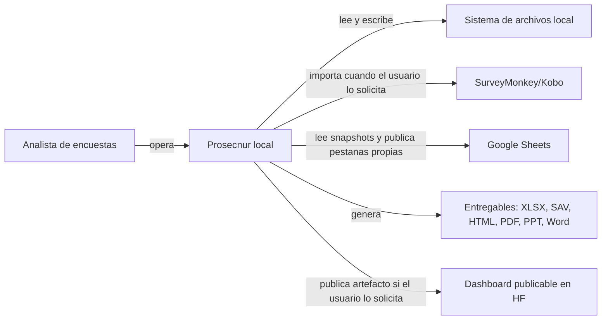
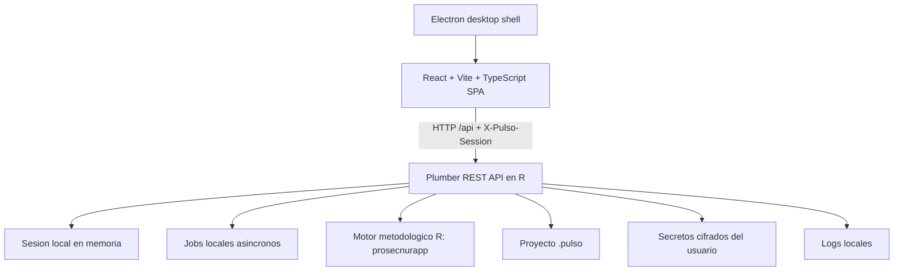
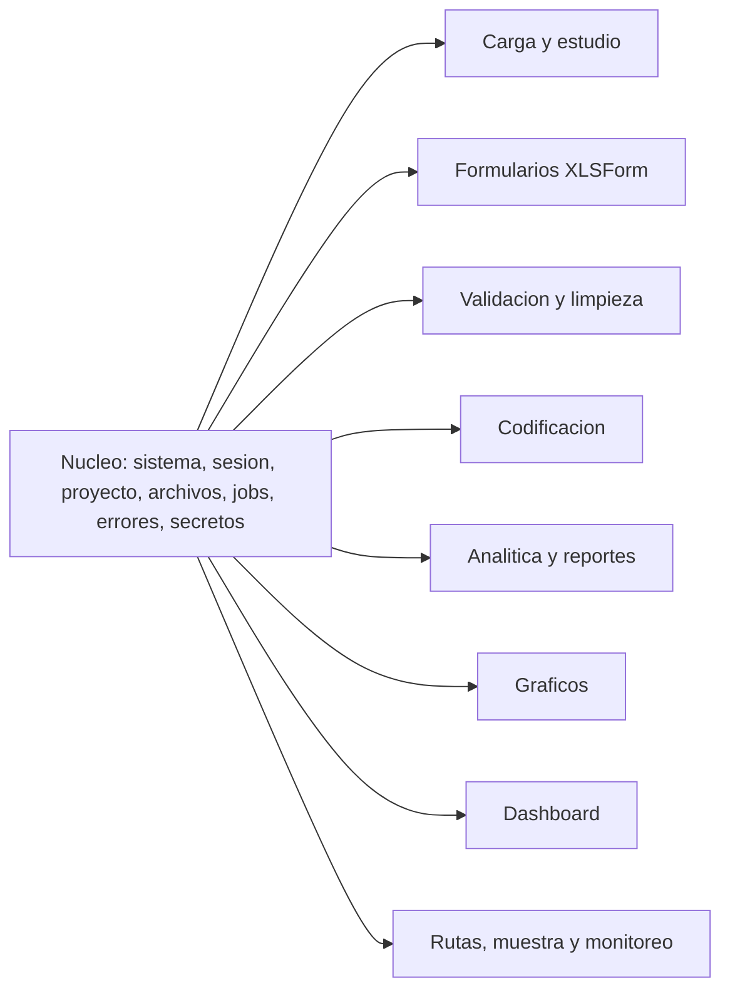

# Arquitectura de Prosecnur

Actualizado: 2026-06-06

## Proposito

Esta guia es la referencia canonica para decidir y evaluar la arquitectura de
Prosecnur. Usa como marco conceptual *Fundamentals of Software Architecture*:
la arquitectura se entiende como la combinacion de estructura, caracteristicas
arquitectonicas, decisiones y principios de diseno.

La consecuencia practica es doble. Primero, no se busca una arquitectura
"perfecta", sino decisiones explicitas con sus ganancias y costos. Segundo, el
"por que" de cada decision debe quedar documentado antes de que el "como" se
vuelva una costumbre dificil de cambiar.

Prosecnur debe leerse como una aplicacion local todo-en-uno para analistas:
Electron abre la experiencia de escritorio, React/Vite renderiza la interfaz,
Plumber/R expone una API en `127.0.0.1:8787`, el paquete R `prosecnurapp`
contiene el motor metodologico y los proyectos `.pulso` guardan el estado
portable del trabajo.

"Local" no significa aislado de internet. Prosecnur puede hacer conexiones
salientes cuando el usuario las configura y las dispara: importar desde
SurveyMonkey/Kobo con tokens del usuario, leer o publicar pestanas controladas
en Google Sheets, o publicar un dashboard en Hugging Face. Lo que permanece
local es la aplicacion principal, el control del proyecto y la sesion de
trabajo.

## Decision Arquitectonica Principal

Prosecnur es un **monolito modular local con orientacion microkernel**.

El despliegue de la aplicacion principal es uno solo y local: no hay servicios
distribuidos para operar el flujo de trabajo del analista. Dentro de ese
monolito, el nucleo debe permanecer estable y pequeno: sesion, proyecto
`.pulso`, archivos, jobs, secretos, logs, errores, API base, frontend shell y
ejecucion del motor R. Encima del nucleo viven modulos de dominio para carga,
formularios, SurveyMonkey/Kobo, validacion, limpieza, codificacion, analitica,
reportes, graficos, dashboards, rutas, muestra y monitoreo.

Las integraciones web son bordes del sistema, no el centro de ejecucion:
SurveyMonkey/Kobo entran como conectores salientes, Google Sheets opera como
superficie externa controlada para Monitoreo, y Hugging Face queda como destino
opcional de artefactos de Dashboard. Monitoreo no publica Spaces ni artefactos
HF.

La orientacion microkernel no significa que cada modulo sea instalable por
separado hoy. Significa que el nucleo no debe absorber logica metodologica y
que cada modulo debe tener un contrato visible: responsabilidad, estado propio,
endpoints, dependencias permitidas y dependencias prohibidas.

## Mapa C4 Ligero

### Contexto



### Contenedores



### Componentes Principales



## Nucleo Estable

| Area | Responsabilidad | Estado propio | Endpoints o archivos | Dependencias permitidas | Dependencias prohibidas |
|---|---|---|---|---|---|
| Sistema y API | Arranque de Plumber, healthcheck, demos, shutdown, filtro para superficies exportadas, serializacion de errores | Configuracion de runtime, bootstrap y ejecucion local | [`api/R/plumber_app.R`](../api/R/plumber_app.R), [`api/R/router_sistema.R`](../api/R/router_sistema.R), `/api/system/*`, `/api/session*`, `/api/files/*` | `plumber`, `later`, helpers de error, session store | Reglas metodologicas especificas, transformaciones de encuestas |
| Sesion local | Crear, recuperar y marcar cambios de la sesion activa | Entorno en memoria por `sid`, encabezado `X-Pulso-Session`, eventos de frontend | [`api/R/session_store.R`](../api/R/session_store.R), [`frontend/src/api/client.ts`](../frontend/src/api/client.ts) | Helpers de estado, routers que reciben `sid` | Persistencia permanente fuera de `.pulso`, estado global compartido entre proyectos |
| Proyecto `.pulso` | Guardar y abrir proyectos portables | `manifest.json`, `state.rds` filtrado, `files/` con inputs | [`api/R/project_pulso.R`](../api/R/project_pulso.R), [`api/R/router_proyecto.R`](../api/R/router_proyecto.R), `/api/project/*`, `/api/fs/*` | `zip`, `jsonlite`, `saveRDS/readRDS`, helpers de archivos | Secretos, entregables finales, caches regenerables grandes |
| Archivos y entregables | Subir inputs, descargar outputs y guardar entregables junto al proyecto | Metadatos de archivos en sesion, rutas temporales o elegidas por el usuario | `/api/files/upload`, `/api/files/<file_id>/download`, `/api/fs/save-to-project` | IO local, validacion de nombres, estado de sesion | Escribir fuera de rutas solicitadas sin confirmacion del usuario |
| Jobs | Ejecutar trabajos largos sin bloquear la interfaz | Registro de jobs, estado, resultado, cancelacion | [`api/R/jobs.R`](../api/R/jobs.R), [`api/R/router_jobs.R`](../api/R/router_jobs.R), `/api/jobs/*` | `callr`, `later`, `ps`, funciones del modulo que encola | Mutar estado de otros modulos sin contrato de resultado |
| Secretos | Guardar tokens fuera del proyecto | Archivos cifrados en `~/.prosecnurapp/secrets/` y secretos efimeros por `sid` en memoria | [`api/R/secrets.R`](../api/R/secrets.R) | `openssl`, permisos de usuario local, session store | Guardar tokens en `.pulso`, logs, fixtures o exports |
| Configuracion y conexiones | Administrar autorizaciones globales que trascienden proyectos `.pulso` | Estado enmascarado de SurveyMonkey, Kobo, Google Sheets y futuros conectores; secretos fuera del proyecto | `/api/connections/*`; [`api/R/router_connections.R`](../api/R/router_connections.R); UI de Configuracion global | Secretos, clientes HTTP de conectores, OAuth local | Pedir credenciales desde modulos de dominio, devolver tokens completos al frontend |
| Errores y contratos API | Respuestas consistentes para la SPA | Codigos de error, mensajes, status HTTP | [`api/R/errors.R`](../api/R/errors.R), `wrap_endpoint()` | Routers Plumber, tipos simples serializables | Errores crudos no normalizados en rutas de usuario |

## Modulos De Dominio

Cada modulo debe declarar y mantener su frontera. La tabla no pretende listar
cada funcion interna, sino fijar el contrato arquitectonico que debe respetar
la evolucion del codigo.

| Modulo | Responsabilidad | Estado propio | Endpoints actuales | Dependencias permitidas | Dependencias prohibidas |
|---|---|---|---|---|---|
| Carga | Ingresar XLSForm y data, normalizar inputs y preparar el estudio inicial | `s$files`, `s$rp_inst`, `s$rp_data`, metadatos de base | `/api/carga/*`, `/api/files/upload`; frontend [`frontend/src/features/carga`](../frontend/src/features/carga) | Nucleo de archivos/sesion, lectores XLSX/CSV/SAV, normalizador | Generar reportes finales, decidir reglas de limpieza |
| Estudio multi-base | Modelar un estudio con 1..16 bases y sus fuentes | `s$estudio`, `s$rp_data_sources`, `s$rp_inst_sources`, `active_base` comun | `/api/estudio/*`; [`api/R/router_estudio.R`](../api/R/router_estudio.R) | Carga, helpers multi-base, session store | Reimplementar motores de analitica o codificacion |
| Formularios XLSForm | Editar, importar, validar y exportar instrumentos | Estado del editor XLSForm, catalogs, diagnosticos, versiones de formulario | `/api/xlsform-editor/*`; [`frontend/src/features/xlsformEditor`](../frontend/src/features/xlsformEditor) | Lectores XLSForm, SurveyMonkey cuando importa, archivos del nucleo | Mutar data de respuestas, ejecutar analitica |
| SurveyMonkey/Kobo | Traducir instrumentos externos a formatos de trabajo de Prosecnur | Token de SurveyMonkey fuera del proyecto, persistente cifrado o efimero por sesion; metadata de surveys importados; workbook offline multibase como input y snapshot `surveymonkey_workbook_snapshot/1` sin secretos | `/api/xlsform-editor/sm-*`, `/api/xlsform-editor/import-surveymonkey*`, `/api/surveymonkey/multibase/*`; helpers [`api/R/surveymonkey_api.R`](../api/R/surveymonkey_api.R), [`api/R/surveymonkey_multibase.R`](../api/R/surveymonkey_multibase.R) y [`api/R/kobo_api.R`](../api/R/kobo_api.R) | Secretos, clientes HTTP, editor de formularios, carga | Guardar tokens en `.pulso`, devolver tokens completos al frontend, mezclar credenciales entre proyectos, crear bases desde workbook sin plantilla XLSForm |
| Validacion | Construir planes, auditar instrumento/data, explorar variables y reglas custom | Planes, resultados, reglas activas, caches regenerables por base | `/api/validacion/v2/*`; [`frontend/src/features/validacion`](../frontend/src/features/validacion) | Carga/estudio como fuente, AST de validacion, session store | Codificar respuestas abiertas, exportar reportes finales fuera de su contrato |
| Limpieza | Registrar decisiones, previsualizar transformaciones y finalizar data limpia | Decisiones de limpieza, preview, data transformada derivada | `/api/validacion/v2/limpieza*`; [`api/R/limpieza_*`](../api/R) | Validacion, transform engine, trazabilidad en sesion | Cambiar datos sin decision registrada, ocultar reglas aplicadas |
| Codificacion | Agrupar, revisar y aplicar codigos a preguntas abiertas | `s$codif_por_base`, plantillas, grupos, marcas, codigos aplicados | `/api/codificacion/*`; [`frontend/src/features/codificacion`](../frontend/src/features/codificacion) | Estudio, carga, archivos, helpers de codificacion | Modificar reglas de validacion, decidir estructura de reportes |
| Analitica | Preparar codebook, frecuencias, cruces, bases, dimensiones y bases panel wide en paquete XLSX y formatos analiticos XLSX/CSV/SAV | Config analitica incluyendo `panel`, metadata, resultados derivables, fuentes multi-base | `/api/analitica/*`; [`frontend/src/features/analitica`](../frontend/src/features/analitica) | Estudio, codificacion aplicada, motor R de reportes, jobs | Editar instrumentos, credenciales externas o mapeos geograficos que pertenecen a Hojas de Ruta |
| Reportes | Producir entregables metodologicos en XLSX, SAV, HTML, PDF, PPT y Word | Artefactos temporales y `file_id` descargables | Funciones `reporte_*` en [`api/R`](../api/R), endpoints de analitica/graficos/calc-muestra/hojas-ruta | Motor R, jobs, archivos, configuracion del modulo que solicita | Guardar entregables dentro de `.pulso` por defecto |
| Graficos | Configurar plan visual, validar slides y exportar PPT/Word | Plan de graficos, presets, overrides, iconos, configuracion visual | `/api/graficos/*`; [`frontend/src/features/graficos`](../frontend/src/features/graficos) | Analitica como fuente, motor de graficadores, renderer PPTX si existe | Cambiar data cruda o planes de limpieza |
| Dashboards | Crear visualizaciones interactivas y, cuando aplique, publicar un artefacto hospedado separado | Fuente dashboard, curacion, configuracion, tema, metadata de publicacion | `/api/dashboard/*`; [`frontend/src/features/dashboard`](../frontend/src/features/dashboard) | Carga/analitica como fuente, Hugging Face como destino opcional, filtros de superficie publicada | Convertir Prosecnur en app web mutable o exponer endpoints mutables fuera del flujo local |
| Rutas | Preparar hojas de ruta, mapas, cuotas y reportes decisionales | Configuracion territorial, previews, entregables de campo | `/api/hojas-ruta/*`; [`frontend/src/features/hojasRuta`](../frontend/src/features/hojasRuta) | Archivos, datos cartograficos locales, jobs, reportes | Depender de analitica salvo contrato explicito de fuente |
| Enciclopedia metodologica | Exponer catalogos, glosario, tipos de estudio y comparadores metodologicos de consulta | Catalogos read-only versionados con la app; sin estado mutable de proyecto | `/api/enciclopedia/*`; [`frontend/src/features/enciclopedia`](../frontend/src/features/enciclopedia) | Nucleo API, catalogos metodologicos locales, modulo de muestra como consumidor | Mutar proyectos `.pulso`, guardar decisiones de limpieza o depender de credenciales externas |
| Muestra | Calcular componentes muestrales, construir marcos de aulas, seleccionar titulares/reemplazos y exportar reporte | Estudio muestral, componentes, resultados, modo de trabajo, `calc_muestra_aulas_config`, `calc_muestra_aulas_frame`, `calc_muestra_aulas_selection` | `/api/calc-muestra/*`; [`frontend/src/features/calcMuestra`](../frontend/src/features/calcMuestra) | Motor de calculo, enciclopedia metodologica, jobs, Monitoreo cuando exporta seleccion de aulas | Mutar bases de encuesta, ejecutar campo o cerrar brechas operativas |
| Monitoreo | Centro de control operativo local: fuentes, snapshots, casos, cruces, metas, alertas, auditoria, perfiles, exportaciones y publicaciones Sheets por audiencia y familia | `monitoreo_sources`, `monitoreo_config`, `monitoreo_profile`, `monitoreo_snapshot`, `monitoreo_publication`, eventos de sincronizacion; `monitoreo_territorial_map_cache` persiste mapas territoriales compactos por fase; `monitoreo_aulas_plan`, `monitoreo_aulas_snapshot` y `monitoreo_aulas_publication` persisten agenda/snapshots compactos; persiste en `.pulso` sin credenciales | `/api/monitoreo/*`, `/api/monitoreo/sheets/*`; [`frontend/src/features/monitoreo`](../frontend/src/features/monitoreo) | Carga, calc-muestra cuando importa, archivos, reportes, conexiones globales SurveyMonkey/Kobo/Google Sheets, hojas de ruta segun perfil | Reemplazar el estado del estudio sin accion explicita, pedir o guardar credenciales, usar Sheets como backend canonico, modificar pestanas vivas de campo, publicar Monitoreo en Hugging Face o Spaces |

## Caracteristicas Arquitectonicas Criticas

| Caracteristica | Significado en Prosecnur | Tactica actual | Gobernanza |
|---|---|---|---|
| Mantenibilidad | El equipo puede cambiar un modulo sin comprender toda la app | Routers `router_*.R`, features de React por dominio, helpers compartidos | Revisar que nuevas rutas caigan en el modulo correcto y tengan tests proporcionales |
| Extensibilidad | Nuevos flujos metodologicos se agregan como modulos, no como parches al nucleo | Monolito modular con prefijos `/api/<dominio>` y carpetas `frontend/src/features/<dominio>` | Nuevo modulo requiere contrato, estado, endpoints, dependencias y ADR si cambia la estructura |
| Reproducibilidad | Un proyecto puede reabrirse y regenerar entregables desde inputs y decisiones | `.pulso` guarda estado e inputs; caches grandes se regeneran | Cambios al formato `.pulso` requieren compatibilidad, migracion o ADR |
| Trazabilidad | Se puede explicar de donde salio una decision o resultado | Decisiones de limpieza/codificacion/configuracion viven en sesion y proyecto | Las transformaciones deben guardar regla, autor implicito de sesion, fecha cuando aplique y version de estructura |
| Auditabilidad | Un tercero tecnico puede reconstruir decisiones arquitectonicas y metodologicas | ADRs en `docs/adrs`, logs locales, errores normalizados | Toda decision arquitectonicamente significativa debe tener ADR |
| Confiabilidad | La app responde de forma predecible aunque haya trabajos largos o errores de usuario | Jobs asincronos, `wrap_endpoint()`, codigos de error, sesiones separadas | Rutas nuevas deben fallar con codigos claros y no dejar estado parcial silencioso |
| Escalabilidad local y operacional | La app puede crecer en volumen de datos, modulos, bases, entregables y dashboards publicados sin volverse inmanejable | Jobs para procesos pesados, caches regenerables, `.pulso` filtrado, modulos por dominio, previews y contratos API acotados | No escalar hacia microservicios por defecto; exigir limites, paginacion/lazy loading o jobs cuando una ruta pueda bloquear la sesion local |
| Usabilidad | Analistas no programadores pueden completar flujos sin terminal | Electron, SPA guiada, descargas/guardado desde UI, modo efimero | Cambios tecnicos no deben filtrar jerga de implementacion al usuario final |
| Interoperabilidad | Prosecnur entra y sale del ecosistema de encuestas | XLSForm, XLSX, CSV, SAV, SurveyMonkey API, SurveyMonkey workbook offline, Kobo, PPT, Word, HTML, PDF, dashboard HF | Formatos externos deben estar aislados detras de traductores o helpers |
| Seguridad de datos | Bases y credenciales sensibles no se exponen accidentalmente | Localhost estricto, secretos cifrados o efimeros fuera de `.pulso`, conexiones salientes explicitas, filtros para artefactos publicados | Prohibido persistir tokens en proyecto, logs o entregables; revisar cualquier superficie publicada |
| Portabilidad | El trabajo viaja entre maquinas y modos de ejecucion | `.pulso` como zip portable, paths reescritos al cargar, package local | Evitar rutas absolutas persistidas salvo metadata regenerable |

## Trade-offs Explicitos

| Decision | Se gana | Se sacrifica | Como se gobierna |
|---|---|---|---|
| App local en vez de plataforma colaborativa | Privacidad, control de datos, ejecucion offline, menor costo operacional | Colaboracion en tiempo real, gestion centralizada de usuarios, analitica de uso remota | ADR 0001, localhost por defecto, logs locales |
| Monolito modular en vez de microservicios | Instalacion simple, menor latencia, depuracion directa, cohesion metodologica | Despliegue independiente por modulo, escalado horizontal por servicio | ADR 0004, contratos de modulo y revision de dependencias |
| Escalabilidad local en vez de escalado cloud de la app principal | Manejo realista de proyectos grandes sin introducir infraestructura remota ni multiusuario | La capacidad queda limitada por la maquina local y requiere diseno cuidadoso de jobs, memoria y archivos | Procesos pesados por jobs, caches excluidos de `.pulso`, previews acotados, limites documentados |
| Motor R integrado en `prosecnurapp` en vez de paquete externo activo | Reproducibilidad del release, un solo repo, menos friccion para escritorio | Paquete mas grande, menor reutilizacion independiente, riesgo de mezclar UI/API/motor | ADR 0003, separacion por archivos `reporte_*`, `graficador_*`, `validacion_*` |
| `.pulso` portable en vez de base de datos persistente | Archivo unico, facil de compartir, inspeccionable como zip, compatible con trabajo local | Menos concurrencia, migraciones manuales, riesgo de crecimiento si se guardan caches | ADR 0002, caches excluidos, entregables fuera del proyecto |
| Estado de sesion en memoria en vez de backend persistente | Flujo rapido, menos infraestructura, aislamiento por proceso local | Reinicio pierde sesiones efimeras, necesita `.pulso` para continuidad | Banners de sesion perdida, autoguardado del proyecto |
| Dashboard publicable desde una app siempre local | Permite compartir resultados en HF sin convertir Prosecnur en SaaS | Superficie de seguridad adicional del artefacto hospedado, dependencia de proveedor externo | Rutas read-only controladas para el artefacto; Prosecnur sigue ejecutandose localmente |
| Google Sheets como superficie de Monitoreo | Supervisores y campo pueden seguir trabajando en hojas vivas mientras Prosecnur audita y reporta | Permisos OAuth globales, cambios de encabezado y latencia de red deben manejarse explicitamente | ADR 0010; autorizacion en Configuracion; lectura como snapshot local; escritura solo en pestanas propias Prosecnur |

## Reglas De Modularidad

1. El nucleo no contiene logica metodologica especifica. Si una regla solo
   tiene sentido para validacion, codificacion, analitica, graficos, rutas,
   muestra o monitoreo, pertenece al modulo correspondiente.
2. Un modulo nuevo debe declarar responsabilidad, estado, endpoints, frontend,
   dependencias permitidas, dependencias prohibidas, exports y pruebas minimas.
3. Los modulos no se llaman entre si por variables globales informales. La
   comunicacion pasa por contratos claros: helpers compartidos, estado de
   sesion delimitado, `file_id`, `sid`, endpoints o estructuras documentadas.
4. Las dependencias entre modulos deben apuntar hacia fuentes estables. Por
   ejemplo, graficos puede leer variables de analitica o estudio; no debe
   modificar carga ni limpieza.
5. Los helpers compartidos deben ser realmente transversales. Si empiezan a
   acumular reglas de negocio de un dominio, deben moverse al modulo dueno.
6. Todo endpoint que muta estado debe marcar el proyecto como sucio cuando el
   cambio deba persistirse en `.pulso`.
7. Los trabajos largos deben usar jobs y producir resultados descargables o
   estados consultables, no bloquear el hilo de Plumber.
8. Las rutas expuestas por un artefacto publicado deben ser read-only o tener
   una justificacion documentada. Cuando el artefacto contenga datos internos
   completos, debe ser privado y requerir confirmacion manual de publicacion.
9. Los flujos que puedan crecer por filas, columnas, bases, slides o archivos
   deben declarar su estrategia de escala local: limites, previews, paginacion,
   lazy loading, jobs, chunking o caches regenerables.

## Practicas Arquitectonicas Aplicables

El libro no se interpreta como una lista generica de "best practices". En
Prosecnur, una practica es correcta cuando refuerza la app local, la
trazabilidad metodologica y la reproducibilidad. Las practicas canonicas son:

- hacer explicitos los trade-offs antes de normalizar una decision;
- registrar decisiones estructurales como ADRs;
- mantener C4 liviano para explicar contexto, contenedores y componentes;
- definir caracteristicas arquitectonicas verificables, incluida la
  escalabilidad local;
- proteger fronteras de modulo mediante contratos de estado, endpoints y
  dependencias permitidas/prohibidas;
- validar en backend todo cambio que afecte datos, archivos, secretos o
  entregables;
- usar jobs para tareas largas y previews para tareas exploratorias;
- separar estado persistente, caches regenerables, entregables y secretos;
- agregar pruebas o checks proporcionales al riesgo y al radio de impacto;
- revisar superficies publicadas como artefactos read-only, no como extension
  mutable de la app principal.

## Gobernanza De Decisiones

Una decision requiere ADR cuando afecta al menos una de estas dimensiones:

- estructura del sistema o fronteras de modulo;
- caracteristicas criticas como seguridad, reproducibilidad o portabilidad;
- formato `.pulso`, contratos API, dependencias entre dominios o persistencia;
- integraciones externas;
- modelo de despliegue, empaquetado o publicacion.

Cada ADR debe registrar contexto, decision, consecuencias, cumplimiento y
fecha. Las consecuencias deben incluir beneficios y costos. El cumplimiento
debe describir como se verificara que el codigo sigue obedeciendo la decision.

Los ADRs viven en [`docs/adrs`](adrs/README.md). Si una decision queda
superada, no se borra: se marca como supersedida y se enlaza el ADR nuevo.

## Riesgos Arquitectonicos

| Riesgo | Impacto | Probabilidad | Mitigacion |
|---|---:|---:|---|
| Gran bola de barro entre modulos | Alto | Media | Contratos por modulo, revisiones de dependencias, ADR para cambios de frontera |
| `.pulso` crece por caches o entregables | Alto | Media | Lista explicita de caches excluidos, entregables fuera del zip, pruebas de carga/apertura |
| Secretos terminan en proyectos o logs | Alto | Baja | Helper unico de secretos, revisiones de diffs, tests o checks de patrones sensibles |
| Artefacto dashboard publicado expone rutas mutables | Alto | Baja | Whitelist de `apply_public_mode_filter()`, pruebas de superficie publicada |
| Proyectos grandes bloquean la sesion local | Alto | Media | Jobs, paginacion/lazy loading, limites explicitos, previews acotados y caches regenerables |
| Motor R y API se acoplan demasiado | Medio | Media | Mantener funciones de motor puras cuando sea posible y wrappers en routers |
| Multi-base rompe modulos single-base | Medio | Media | Helpers `estudio_*`, compat legacy documentada, tests por base |
| UI duplica reglas del backend | Medio | Media | UI valida para orientar; backend valida para decidir |

Para cambios grandes, el equipo debe hacer una sesion corta de riesgo: listar
escenarios, estimar impacto/probabilidad, acordar mitigaciones y convertir las
decisiones estructurales en ADRs.

## Checks De Cumplimiento

Estos checks no sustituyen pruebas funcionales, pero ayudan a mantener la
arquitectura visible:

```bash
rg -n "mount_.*\\(" api/R/plumber_app.R
rg -n "pr_(get|post|delete|handle)" api/R/router_*.R
rg --files frontend/src/features
rg -n "prosecnur_secret|\\.prosecnurapp/secrets" api/R
rg -n "state\\.rds|manifest\\.json|files/" api/R/project_pulso.R
```

Antes de introducir un modulo o una dependencia transversal, revisar:

- el modulo tiene prefijo API y carpeta frontend propios o una justificacion;
- el estado persistente entra en `.pulso` solo si es parte del proyecto;
- los secretos quedan fuera del proyecto;
- las rutas largas usan jobs;
- hay un ADR cuando cambia una decision estructural;
- el README o esta guia enlazan la documentacion nueva.

## ADRs Iniciales

- [ADR 0001: Aplicacion local de escritorio](adrs/0001-app-local.md)
- [ADR 0002: Formato de proyecto `.pulso`](adrs/0002-formato-pulso.md)
- [ADR 0003: Motor R integrado en `prosecnurapp`](adrs/0003-motor-r-integrado.md)
- [ADR 0004: Monolito modular con orientacion microkernel](adrs/0004-monolito-modular-microkernel.md)
- [ADR 0005: Secretos fuera del proyecto](adrs/0005-secretos-fuera-del-proyecto.md)
- [ADR 0006: Modulos por dominio](adrs/0006-modulos-por-dominio.md)
- [ADR 0007: Integraciones salientes y dashboard publicable](adrs/0007-integraciones-salientes-dashboard-publicable.md)
- [ADR 0014: Publicacion dual de Monitoreo](adrs/0014-publicacion-dual-monitoreo.md)
- [ADR 0015: Monitoreo publica Space cliente y Sheets separados](adrs/0015-monitoreo-space-cliente-sheets-interno.md)
- [ADR 0016: Monitoreo publica solo Google Sheets](adrs/0016-monitoreo-solo-google-sheets.md)
- [ADR 0019: Monitoreo de aulas universitarias](adrs/0019-monitoreo-aulas-universitarias.md)

## Evolucion Esperada

La arquitectura debe evolucionar de forma incremental. Prosecnur puede agregar
modulos, mejorar contratos y mover responsabilidades, pero cada cambio debe
preservar las caracteristicas criticas: mantenibilidad, extensibilidad,
reproducibilidad, trazabilidad, auditabilidad, confiabilidad, escalabilidad
local y operacional, usabilidad, interoperabilidad, seguridad de datos y
portabilidad.

Cuando aparezca una tension nueva, la respuesta no debe ser esconderla en el
codigo. Debe convertirse en una decision explicita, con trade-offs visibles y
un mecanismo de cumplimiento que el repo pueda sostener.
