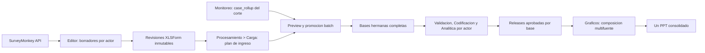

# Plan end-to-end: Editor, Monitoreo, Procesamiento y PPT de acreditacion

Fecha: 2026-07-20

Decision controladora: [ADR 0040](../../adrs/0040-flujo-acreditacion-formularios-monitoreo-procesamiento-ppt.md).

## Objetivo

Permitir que un estudio de acreditacion mantenga tres o cuatro instrumentos
SurveyMonkey con logica revisada, use cada uno como instrumento de una base de
Procesamiento, promueva desde Monitoreo solo las respuestas efectivas que
cuentan en el informe de avance, procese cada actor de manera independiente y
genere un unico PPT con graficos multifuente.



## Invariantes globales

1. El XLSForm es la fuente de verdad; la data se normaliza contra el
   instrumento y no al reves.
2. El Editor conserva borradores mutables; Procesamiento consume revisiones
   locales inmutables y comprobadas por hash.
3. Una base de `s$estudio` siempre tiene instrumento y data completos. Los
   instrumentos sin data viven en `processing_intake`, no como bases parciales.
4. Para acreditacion, efectivo significa el resultado reconciliado del
   `case_rollup`; no equivale a `response_status == completed` aislado.
5. El handoff batch valida todas las bases antes de mutar cualquiera.
6. Validacion, limpieza, codificacion, ponderacion y analitica permanecen
   aisladas por base.
7. El PPT consolidado compone fuentes aprobadas; no fusiona filas ni convierte
   el estudio a base integrada.
8. Secretos y entregables permanecen fuera de `.pulso`.

## Baseline comprobado

| Capacidad | Estado inicial | Decision |
|---|---|---|
| Biblioteca de hasta seis formularios | Existe en `xlsform_forms` | Reutilizar |
| API SurveyMonkey a XLSForm | Existe para estructura, choices, matrices, required y constraints | Reutilizar |
| Logica SurveyMonkey | Existe por reglas globales o por encuesta y por plantilla canonica | Reutilizar y exigir auditoria |
| Publicacion/versionado de formulario | No existe | Construir |
| Plan de instrumentos antes de tener data | No existe | Construir |
| Bases `independent_siblings` | Existe | Reutilizar |
| Normalizacion y compatibilidad | Existe | Reutilizar sin alterar su orden canonico |
| Handoff general Monitoreo | Existe para fuentes Kobo individuales | Extender con camino batch de acreditacion |
| Seleccion oficial de acreditacion | Existe en `case_rollup` | Consumir, no recalcular por fuente |
| Procesamiento independiente | Existe por base activa | Reutilizar y agregar aprobacion versionada |
| Motor PPT multifuente | Existe | Reutilizar mediante adaptador consolidado |
| `ppt-all` | Genera varios PPTX dentro de ZIP | Mantener; no usar para el consolidado |

## Contratos congelados

### Revision de instrumento

Schema `instrument_revision/v1`. Identidad minima:

- `revision_id`, `form_id`, `revision_no`;
- `content_sha256`, `xlsform_file_id`;
- origen SurveyMonkey y surveys/campanas asociados, sin token;
- resumen de validacion y auditoria de logica;
- `published_at`.

Una revision no se modifica. Un nuevo cambio crea otra revision. Un formulario
publicado se archiva o conserva; no puede borrarse dejando referencias
colgantes.

### Plan de ingreso

Schema `processing_intake/v1`. Cada entrada vincula `entry_id`, `base` tecnica,
`base_label`, `actor_key`, `actor` visible e `instrument_revision_id`. Los
nombres visibles no son identidad. Estados derivados permitidos:

- `instrument_ready`;
- `data_preview_ready`;
- `blocked`;
- `materialized`;
- `stale`.

El plan usa revision optimista para evitar que dos pantallas sobrescriban
selecciones diferentes.

`status` se recalcula en el servidor y no se acepta como fuente de verdad del
cliente. Publicar una revision posterior marca el binding historico como
`stale`, pero conserva su `instrument_revision_id` hasta una decision explicita.

### Preview de handoff

La respuesta debe incluir:

- corte y `pins.cache_token`;
- actor, base destino y revision de instrumento;
- universo, efectivos y excluidos por motivo;
- filas originales encontradas/faltantes;
- duplicados ya resueltos y checksum de IDs seleccionados;
- resultado de normalizacion, compatibilidad y columnas extra;
- `variables_extra_incluidas` por base, excluidas por defecto, y checksum de la
  decision explicita conforme al ADR 0033;
- bases que se crearian o reemplazarian;
- bloqueantes y advertencias;
- `pins.intake_revision`, `pins.family_id` y `pins.preview_fingerprint` para
  confirmar exactamente ese preview y sus dependencias.

### Commit batch

El commit recibe `expected_cache_token`, `expected_family_id`,
`expected_intake_revision` y `preview_fingerprint`. Repite todas las guardas y
crea/reemplaza las bases en una sola mutacion. Si falla una base, no cambia
ninguna.

### Revision aprobada de Procesamiento

Schema `processing_release/v1`. Fija hashes de data, instrumento, Validacion,
limpieza, Codificacion, ponderacion y configuracion analitica; los combina en
un `input_fingerprint`; la release tambien conserva el conteo dentro de
`pins.sample` y la fecha de aprobacion.
Cualquier cambio upstream la vuelve `stale`.

### Receta de Graficos consolidada

Schema `graficos_consolidado/v1`. Fija bases, `processing_release_id`, labels,
orden, plan, presets, plantilla e `input_fingerprint`. Solo persiste la receta;
el snapshot RDS del job y el PPT quedan fuera de `.pulso`.

## Plan de implementacion por fases

### Fase 0 — Contratos, fixtures y baseline

Estado: **documentada**.

Trabajo:

- aceptar ADR 0040 y este roadmap;
- congelar schemas y errores API;
- crear fixtures sinteticos de tres actores y un fixture compacto del corte
  ACRDCONTA;
- registrar baseline de pruebas focales y hash del `.pulso` real antes de QA.

Baseline objetivo para materializar en el fixture ACRDCONTA del corte
2026-07-20:

| Actor | Universo | Efectivas |
|---|---:|---:|
| Administrativos | 16 | 15 |
| Docentes | 53 | 52 |
| Egresados | 270 | 178 |
| Estudiantes | 180 | 165 |
| **Total** | **519** | **410** |

Exclusiones esperadas del corte: 8 parciales, 3 rechazos y 98 pendientes. Estos
valores provienen de la auditoria independiente del proyecto real; la Fase 0
debe convertirlos en fixture compacto con ruta, generador y checksum. Nunca son
constantes de producto.

Gate:

- schemas sin campos ambiguos;
- fixtures sin PII ni tokens;
- baseline reproducible y `.pulso` sin mutacion.

### Fase 1 — Publicar revisiones desde el Editor

Responsabilidad: Editor XLSForm y file store.

Reutilizar:

- `xlsform_forms` y su espejo activo;
- importacion SurveyMonkey y aplicacion de reglas;
- validador XLSForm/AST y escritor XLSX;
- contrato del file store y marcado dirty, con staging atomico propio para no
  registrar un archivo antes que su revision.

Construir:

- helper de canonicalizacion y hash del workbook;
- `instrument_revision/v1` y retencion de sus `file_id` en `.pulso`;
- endpoint de preview/publicacion por `form_id`, nunca por formulario activo;
- estados UI `Borrador`, `Publicado`, `Cambios sin publicar`, `Bloqueado`;
- proteccion frente a hash obsoleto y borrado de formularios publicados.

Superficies probables:

- `api/R/xlsform_forms.R`;
- un helper nuevo de revisiones, evitando engordar routers;
- `api/R/router_xlsform_editor.R`;
- `api/R/project_pulso.R`;
- `frontend/src/api/client.ts`;
- `frontend/src/features/xlsformEditor/`;
- tests nuevos de revisiones y round-trip `.pulso`.

Gate:

- publicar tres o cuatro formularios crea revisiones y hashes distintos;
- editar el borrador no cambia la revision publicada;
- hash obsoleto o XLSForm invalido no deja archivos/revisiones parciales;
- guardar y reabrir `.pulso` conserva la revision exacta;
- un proyecto legacy abre sin migracion destructiva.

Stopping rule: no avanzar si un consumidor puede leer accidentalmente
`xlsform_state` en lugar del `form_id` solicitado.

#### Registro de ejecucion — Iteracion F1 (2026-07-20)

Scope lock aplicado:

- modulo: Editor XLSForm y persistencia `.pulso` de revisiones;
- riesgo principal: que el borrador/formulario activo reemplazara en silencio
  un instrumento ya publicado;
- exclusiones: `session_store.R`, Monitoreo, Carga/Procesamiento, ACRDCONTA,
  red SurveyMonkey, handoff y PPT;
- validacion minima: tests focales R, Vitest del cliente/estado, `tsc -b`,
  `git diff --check` y recorrido real de `/editor-xlsform`.

Resultado implementado:

- engine aislado `xlsform_revisions.R` con hash canonico, materializacion XLSX,
  staging atomico, idempotencia y saneamiento de origen;
- endpoint por `form_id`, nunca por formulario activo;
- estados remotos `draft`, `published`, `changes_pending` y `blocked`;
- retencion de todos los XLSX publicados en `.pulso` y proteccion de borrado;
- UI por tarjeta con publicacion, refresco ante hash stale y borrado
  backend-first.

Evidencia del loop:

- baseline R: 46 aserciones en formularios y 130 en proyecto `.pulso`;
- gate R final: 83 aserciones en formularios y 139 en proyecto `.pulso`, sin
  fallos, warnings ni skips;
- gate frontend: 86 tests en cliente, helper de publicacion y persistencia;
- `pnpm --dir frontend typecheck`: `tsc -b` sin errores;
- QA real con el proyecto canonico en 1440x1000 y un viewport DOM compacto de
  1280x800, sin overflow horizontal; el compacto conserva scroll interno. La
  captura compacta exportada por el navegador quedo recortada a 1280x720 y se
  registra como pendiente de evidencia, no como defecto funcional;
- secuencia observada contra backend actualizado: `Borrador -> Publicado rev. 1
  -> Cambios sin publicar -> Publicado rev. 2`;
- un formulario publicado mostro `Publicado: no eliminable` y el control quedo
  deshabilitado.

Pendiente no bloqueante del gate independiente: repetir la captura compacta con
un artefacto fisico de 1280x800 y guardar visualmente el estado final
`Publicado · rev. 2`. La transicion a revision 2 si fue observada en el DOM real
y esta cubierta por las regresiones; el pendiente es solo de evidencia visual.

Reparaciones surgidas de la verificacion visual:

- se elimino una colision de modulos que diferenciaba archivos solo por
  mayusculas/minusculas y fallaba en Vite aunque `tsc` pasara;
- renombrar un formulario desde la biblioteca ahora espera una sincronizacion
  verificable y refresca el hash remoto, mostrando `Cambios sin publicar` sin
  recargar el proyecto.

Stopping rule de F1 satisfecha: la publicacion y sus regresiones seleccionan el
`form_id` explicito; cambiar `active_form_id` no altera la revision objetivo.

### Fase 2 — Preparar las bases desde Procesamiento > Carga

Responsabilidad: Carga/Estudio.

Construir:

- `processing_intake/v1` y endpoints de listar/guardar/validar;
- selector de revisiones publicadas por actor;
- deep-link al formulario correcto en Editor;
- vista de readiness: instrumento listo, data pendiente, revision stale o
  bloqueante;
- compatibilidad aditiva de `.pulso`.

No construir bases reales todavia. El plan de ingreso es el limite entre
instrumentos listos y pares procesables.

Gate:

- tres o cuatro bindings persisten tras reabrir el proyecto;
- cambiar el formulario activo no cambia ningun binding;
- una nueva revision marca el binding previo como stale, sin reemplazarlo en
  silencio;
- no aparecen entradas incompletas en `s$estudio$bases`.

Stopping rule: no avanzar si la identidad depende del nombre visible del
formulario o de la base.

Ejecucion 2026-07-20:

- scope lock: `processing_intake`; se excluyeron la creacion de bases, el
  handoff de Monitoreo y cualquier mutacion de `session_store.R`,
  `router_carga.R` o `router_estudio.R`;
- se implemento `processing_intake/v1` con identidad estable por `entry_id`,
  `base` y `actor_key`, revision optimista, `family_id` inmutable y estados
  derivados por el servidor;
- el catalogo verifica que la revision exista, que su XLSX sea legible y que
  el hash canonico fisico coincida antes de declararla disponible;
- el guardado es atomico, un payload identico es no-op y ninguna operacion de
  esta fase crea o completa entradas en `s$estudio$bases`;
- el panel de Carga permite vincular actores sugeridos o manuales, conserva el
  borrador ante conflictos y abre el `form_id` exacto en el Editor XLSForm;
- gate R: 51 expectativas nuevas de intake, mas las suites focales de
  revisiones, proyecto `.pulso` y hermanas independientes, todas verdes;
- gate frontend: 4 archivos y 109 pruebas focales verdes; `tsc -b` sin errores.

Stopping rule de F2 satisfecha: las identidades tecnicas no se derivan de las
etiquetas visibles; cuatro bindings sobreviven el round-trip `.pulso`, una V2
marca V1 como `stale` sin sustituirla y `s$estudio$bases` permanece vacio.

### Fase 3 — Handoff batch de efectivos Monitoreo→Procesamiento

Responsabilidad: Carga con un helper nuevo de acreditacion; Monitoreo solo
expone su contrato de lectura persistido.

Scope lock aplicado 2026-07-20:

- modulo: `carga_acreditacion_batch`, con endpoints nuevos de preview y
  promocion batch bajo Carga;
- archivos previstos: helper y prueba R nuevos, dos mounts delgados en
  `router_carga.R`, panel/modelo/pruebas frontend, cliente y estilos de Carga;
- excluidos: `router_monitoreo.R`, los handoffs territorial/general vigentes,
  `session_store.R`, persistencia `.pulso`, Editor XLSForm y los modulos de
  Validacion, Codificacion, Analitica y Graficos;
- riesgo principal: crear una parte de las bases o perder trazabilidad si el
  intake/cache/snapshot cambia durante la preparacion;
- validacion minima: suites `test-carga-monitoreo-handoff.R`,
  `test-processing-intake.R`, `test-estudio-processing-suggestions.R`, la nueva
  suite batch, tests focales del cliente/modelo y `tsc -b`;
- baseline previo: las tres suites R focales y
  `test-acreditacion-multi-actor-processing.R` quedaron verdes; el `.pulso`
  original se mantuvo intacto con SHA-256
  `24d97e7dc355565d8bc190a419de1470df01d1e4611a513c7025526a36a226c0`.

Contrato congelado: se selecciona exclusivamente el `case_rollup` persistido
con `counts_in_advance = TRUE`, `platform_state = Completa` y
`advancement = effective`; `response_row`, `response_id` y actor deben coincidir
con el snapshot. Preview no muta. Promote revalida los pins de intake, familia,
cache y fingerprint, prepara todos los archivos y hace una sola asignacion de
estado. Las variables extra se conservan en la data pero quedan excluidas por
defecto de los entregables hasta una decision explicita.

Reutilizar:

- `case_rollup` y token del cache `queries_summary`;
- snapshot local y `response_row`;
- `normalize_data_for_xlsform()`;
- `validate_data_xlsform_compatibility()` y reconciliacion de extras;
- `estudio_add_base()` / `estudio_replace_base_files()` e invalidacion por base.

Construir:

- preview batch de acreditacion;
- extractor puro `case_rollup -> filas por actor` con guardas completas;
- preparacion temporal de todas las bases;
- commit atomico con control de snapshot, intake y plan;
- metadata de procedencia y reporte de filtro por base;
- persistencia de `variables_extra_incluidas` y su checksum por base, con
  exclusion por defecto y confirmacion explicita;
- UI en Procesamiento > Carga para revisar conteos y confirmar.

Endpoints objetivo:

- `GET /api/carga/monitoreo-handoff/status` extendido con modo multi-actor;
- `POST /api/carga/monitoreo-handoff/preview-batch`;
- `POST /api/carga/monitoreo-handoff/promote-batch`.

Gate:

- el fixture ACRDCONTA produce 15 + 52 + 178 + 165 = 410 filas;
- parciales, rechazos y pendientes quedan excluidos y explicados;
- las filas son unicas por actor+caso, respuesta y posicion original;
- cada data normalizada calza con su revision XLSForm;
- un actor incompatible hace rollback total;
- reejecutar el mismo plan es idempotente o produce un reemplazo explicitamente
  confirmado;
- no hay red, tokens ni mutacion de Monitoreo durante el commit.

Stopping rule: no avanzar mientras exista una fila seleccionada sin trazabilidad
al rollup y a la fila original.

Ejecucion 2026-07-20:

- el preview batch es de solo lectura e inocuo para proyectos no acreditacion;
  en acreditacion exige cache `queries_summary` vigente, `case_rollup` oficial,
  intake completo y revisiones publicadas fisicamente saludables;
- cada efectiva conserva una traza unica por actor, `response_id`,
  `response_row` y `case_key`; la fila apuntada debe coincidir con actor, ID y
  rol de respuesta en el snapshot;
- cada subset se normaliza, sanea y ordena contra su propio XLSForm; las
  variables extra se conservan en la base y se registran con checksum, pero
  `variables_extra_incluidas` nace vacio;
- la promocion fija intake, familia, cache y fingerprint, prepara todos los
  XLSX antes de comprometer y asigna el estado de sesion una sola vez; un fallo
  elimina archivos preparados y deja el proyecto intacto;
- un segundo promote del mismo fingerprint es no-op; un fingerprint distinto
  exige confirmacion explicita para reemplazar todas las bases juntas;
- fixture focal: 15 Administrativos + 52 Docentes + 178 Egresados + 165
  Estudiantes = 410 efectivas, con 109 casos excluidos de 519 en el rollup;
- prueba contra la copia cargada en memoria de `ACRDCONTA.pulso`: mismos conteos,
  bloqueo esperado `E_ACREDITACION_BATCH_INTAKE` por faltar aun los formularios
  publicados, y SHA-256 del archivo original identico antes/despues;
- gate R: nueva suite batch y regresiones de handoff, intake, sugerencias y
  procesamiento multi-actor, todas `DONE`; router Plumber construido con los
  dos endpoints nuevos;
- gate frontend: 4 archivos y 110 pruebas focales verdes, `tsc -b` limpio y
  build Vite exitoso (con una advertencia CSS preexistente fuera del scope).

Stopping rule de F3 satisfecha en fixtures y en la lectura real: las 410 filas
seleccionadas tienen `response_row` valido y unico, `response_id` unico y llave
actor+caso unica. La materializacion real queda deliberadamente bloqueada hasta
publicar y vincular los XLSForm exactos del proyecto.

### Fase 4 — Procesamiento independiente y aprobacion por base

Responsabilidad: Validacion, Codificacion y Analitica, conservando ownership
actual por base.

Scope lock aplicado 2026-07-20:

- modulo: `processing_release`, como capa aditiva de lectura y aprobacion sobre
  los estados por base ya autoritativos;
- archivos previstos: helper/router/tests R nuevos, mount en `plumber_app.R`,
  panel/modelo/tests frontend en Analitica y extensiones acotadas del cliente;
- excluidos: engines AST y reportes metodologicos en cambio concurrente,
  `session_store.R`, motores de Validacion/Limpieza/Codificacion/Analitica,
  Carga, Monitoreo, Graficos/PPT, migraciones `.pulso` y el proyecto real;
- riesgo principal: aprobar por presencia de archivos o flags visuales sin
  fijar los insumos metodologicos efectivos, o volver stale a una hermana que
  no cambio;
- validacion minima: suites de hermanas independientes, procesamiento
  multi-actor, limpieza/codificacion/analitica focales, nueva suite de releases,
  tests del cliente/modelo/panel, `tsc -b` y `git diff --check`.

Contrato congelado para la iteracion:

- `GET /api/processing/releases` deriva readiness para todas las bases sin
  cambiar `active_base` ni la sesion;
- `POST /api/processing/releases/approve` recibe `base` y
  `expected_input_fingerprint`, rederiva el estado y guarda una sola release;
- la identidad persistida es `processing_intake_entry_id`; el nombre de base es
  contexto, no clave primaria;
- readiness exige auditoria de Validacion, Limpieza finalizada, Codificacion
  aplicada con par adaptado y Analitica preparada con frecuencias y cruces;
- ponderacion puede estar explicitamente desactivada, pero su configuracion
  siempre forma parte del fingerprint;
- el fingerprint combina hashes fisicos de data e instrumento, decision de
  extras, estados/configuraciones de Validacion-Limpieza-Codificacion y la
  configuracion/estado analitico de esa base;
- una release almacenada se proyecta como `approved` solo si coincide el
  fingerprint actual; si cambia un insumo de esa base se proyecta `stale`; las
  hermanas intactas conservan `approved`.

Construir solo lo que falta:

- resumen de readiness de las tres o cuatro bases;
- accion explicita `Aprobar para informe`;
- `processing_release/v1` con hashes y diagnosticos;
- `input_fingerprint` que cubra data, instrumento, Validacion,
  limpieza, Codificacion, ponderacion y configuracion analitica;
- invalidacion automatica de la aprobacion ante cambios upstream.

Gate:

- cada base puede completar el pipeline sin leer estados de sus hermanas;
- aprobar una base no aprueba las otras;
- cambiar data, instrumento, limpieza, codificacion, pesos o configuracion
  analitica marca solo esa release como stale;
- la UI distingue con claridad `pendiente`, `aprobada` y `desactualizada`.

Stopping rule: Graficos no puede afirmar readiness consolidado usando solo
flags de render o presencia de archivos.

Ejecucion 2026-07-20:

- `processing_release/v1` fija la identidad del intake, hashes fisicos de data
  e instrumento, decisiones de extras, Validacion, Limpieza, Codificacion,
  configuracion analitica y ponderacion;
- readiness exige auditoria, limpieza final, par codificado adaptado y los
  hitos de preparacion, frecuencias y cruces; ponderacion desactivada sigue
  formando parte del fingerprint;
- aprobar es optimista, atomico e idempotente; una configuracion de ponderacion
  modificada vuelve stale solo la base afectada y un output opcional posterior
  no invalida una release;
- el panel de Analitica muestra Pendiente, Lista, Aprobada y Desactualizada por
  base activa, con resumen de hermanas y bloqueantes explicitos;
- gate independiente: seis suites R `DONE`, 79 pruebas frontend focales,
  `tsc -b`, build Vite, OpenAPI y `git diff --check` verdes; sin hallazgos.

Stopping rule de F4 satisfecha: la aprobacion deriva el pipeline metodologico y
su fingerprint, no flags de Graficos ni mera presencia de archivos.

### Fase 5 — Un PPT consolidado multifuente

Responsabilidad: Graficos/Reportes.

Scope lock aplicado 2026-07-20:

- modulo: `graficos_consolidado`, como adaptador global de solo lectura sobre
  releases aprobadas y fuentes hermanas;
- archivos previstos: helper/router/tests R nuevos, mount en `plumber_app.R`,
  endpoints de cliente y accion acotada junto al visor de bases de Graficos;
- excluidos: `reporte_plan_ppt.R` congelado, OOXML, `session_store.R`, motores
  metodologicos, `ppt-all`, ZIP, Monitoreo/Carga, migraciones y `.pulso` real;
- riesgo principal: renderizar una fuente stale, depender de `active_base`,
  mezclar escalas/denominadores o dejar un PPT sin manifest registrado;
- validacion minima: cobertura sugerida multifuente, motor `var_cruce`, nueva
  suite de preflight/receta/job/artefactos, cliente/UI, `tsc -b`, inspeccion con
  `officer::read_pptx()`, render PNG disponible y `git diff --check`.

Contrato congelado para la iteracion:

- preflight exige todas las `processing_release/v1` aprobadas y vigentes;
- la receta `graficos_consolidado/v1` fija plan, presets, configuracion, orden de
  fuentes y `release_id + input_fingerprint` de cada actor;
- referencias sustantivas con varias fuentes usan `actor$variable`; preguntas
  comunes solo comparten slide cuando coincide su firma codigo=etiqueta;
- el adaptador toma todas las fuentes por nombre sin leer ni cambiar
  `active_base` y encola una sola vez `graficos.ppt_consolidado`;
- el resultado es un PPTX unico, nunca ZIP, mas exactamente un manifest
  registrado con hashes, releases, receta, corte y numero de slides;
- cualquier release stale bloquea antes de crear el job.

Reutilizar:

- inventario de cobertura no scopeado;
- plan sugerido de acreditacion;
- referencias `actor$variable`;
- `p_barras_multiapiladas(modo = "var_cruce")`;
- `reporte_ppt_plan()` y validacion del DSL;
- jobs y registro de artefactos.

Construir:

- helper nuevo `graficos_consolidado` fuera del motor PPT congelado;
- receta global y pins a `processing_release/v1`;
- adaptador de solo lectura que no cambia `active_base`;
- preflight de referencias, escalas, denominadores, hashes y readiness;
- job `graficos.ppt_consolidado` que llama una vez al motor;
- un PPTX registrado y un manifest unico de procedencia.

Reglas:

- toda referencia multifuente usa `actor$variable`;
- las firmas de escala deben coincidir; no hay recodificacion implicita;
- cada barra conserva su denominador y ponderacion;
- el orden de actores viene de la receta;
- el pie identifica actores/bases y el corte de datos;
- bases con escalas incompatibles usan slides separados.

Gate:

- tres y cuatro fuentes renderizan un unico PPTX, nunca ZIP;
- modificar `active_base` no cambia las fuentes del job;
- una release stale bloquea antes de encolar;
- `officer::read_pptx()` confirma slides, actores y estructura;
- render PNG confirma leyendas, etiquetas, barras y pies sin clipping;
- el manifest registra hashes, releases, corte y plan usados.

Stopping rule: no entregar si el PPT mezcla denominadores, usa una fuente no
aprobada o requiere unir las bases.

Ejecucion 2026-07-20:

- `graficos_consolidado/v1` deriva un plan global desde todas las fuentes
  aprobadas, fija orden, releases, fingerprints, configuracion y hash del plan,
  y restaura el snapshot completo de sesion despues del preflight;
- el preflight rechaza releases pendientes o stale antes de encolar, exige
  referencias `actor$variable` y no depende ni cambia `active_base`;
- el job top-level `graficos.ppt_consolidado` carga el codigo vigente en el
  worker, llama una sola vez a `reporte_ppt_plan()` y registra un PPTX mas un
  unico manifest con SHA-256, releases, muestras, pesos y receta;
- fixtures de tres y cuatro actores renderizan un unico PPTX legible; la suite
  focal suma 44 expectativas, incluido un job `callr` real con `on_complete` y
  los pins explicitos del corte de Monitoreo;
- el render PNG de QA produjo dos laminas, incluida una barra multiapilada con
  Docentes, Estudiantes y Administrativos, sin overflow ni clipping detectado;
- el exportador de Graficos queda scopeado a la base activa (PPT/Word); dentro
  del visor segmentado de bases, `Conjunto` separa `Informe compartido` de
  `Archivos por base` (ZIP), esta disponible en todas las fases de
  Procesamiento y desaparece en base unica o bases combinadas;
- QA visual del visor en 1440x1000 y 1280x800 termino con cero issues, scroll
  jails, overflows, errores de pagina/API o recursos;
- regresiones de F2-F5: 631 expectativas R, 95 pruebas frontend focales,
  `tsc -b` y build Vite de 1084 modulos verdes; permanece una advertencia CSS
  preexistente fuera del scope.

Stopping rule de F5 satisfecha en fixtures y job real: el entregable es un solo
PPTX multifuente y un solo manifest; no fusiona bases ni reutiliza `ppt-all`.

### Fase 6 — Certificacion ACRDCONTA end-to-end

Ejecucion sobre una copia controlada del proyecto real:

1. importar/revisar los cuatro formularios;
2. publicar sus revisiones;
3. crear el plan de ingreso;
4. previsualizar y promover el corte efectivo;
5. procesar y aprobar cada actor;
6. construir un plan con preguntas comunes y escalas compatibles;
7. generar y revisar el PPT unico;
8. guardar, cerrar y reabrir `.pulso`;
9. regenerar el entregable desde los mismos pins.

Certificacion read-only iniciada 2026-07-20:

- proyecto auditado:
  `/Users/gonzaloalmendariz/Documents/Pulso/pruebas-monitoreo/ACRDCONTA.pulso`;
- SHA-256 antes y despues:
  `24d97e7dc355565d8bc190a419de1470df01d1e4611a513c7025526a36a226c0`;
- snapshot persistido: 1270 filas y 450 columnas; el `case_rollup` oficial
  contiene 519 casos, de los cuales 410 cruzan simultaneamente
  `counts_in_advance`, `Completa` y `effective`: 15 Administrativos, 52
  Docentes, 178 Egresados y 165 Estudiantes; quedan 109 excluidos;
- Monitoreo conserva siete fuentes SurveyMonkey: una de Estudiantes, una de
  Administrativos, dos de Docentes y tres de Egresados, distribuidas entre web,
  telefonico y personalizado;
- el `.pulso` no contiene aun `xlsform_forms`, revisiones publicadas, plan de
  intake, bases procesables, releases metodologicas ni receta consolidada;
- por tanto, los datos efectivos si pueden extraerse directamente del corte
  reconciliado de Monitoreo, pero no se puede reconstruir ni escoger en forma
  segura la logica exacta de los instrumentos desde las columnas observadas;
- la conexion local cifrada permitio recuperar en solo lectura las siete
  definiciones oficiales por sus `survey_id`; el token no se mostro ni se
  incorporo al proyecto;
- la API confirma cuatro instrumentos canonicos por actor y tres variantes de
  canal: Docentes personalizado alinea 37 de 38 preguntas con Docentes web;
  Egresados web alinea 33 de 33 con Egresados telefonico; Egresados
  personalizado alinea 33 de 34. En ambas variantes personalizadas la unica
  pregunta sin par es `Indique su codigo PUCP`; el resto tiene un mapa unico
  por heading normalizado, incluido el desplazamiento posicional;
- los hashes de procedencia se calculan sobre la traduccion semantica
  `survey + choices + settings`, excluyendo los valores generados de `form_id`
  y `version`; el hash del payload HTTP crudo queda solo como observacion y no
  como identidad estable;
- se creo la copia controlada
  `/Users/gonzaloalmendariz/Documents/Pulso/pruebas-monitoreo/ACRDCONTA-instrumentos-borrador.pulso`
  (SHA-256
  `12b1d0ab99193eeb67b83a3ceae88f8a395e1673667e22d3c289671c1a5af0ad`)
  con cuatro formularios editables: Administrativos, Estudiantes, Docentes y
  Egresados;
- cada borrador conserva `survey_id`, titulo, actor, hash de definicion,
  variantes, mapas propuestos, preguntas sin correspondencia y estado
  `pending_manual_confirmation`;
- la auditoria local de fuentes auxiliares no encontro un cuestionario
  completo que permita levantar ese estado sin revision humana:
  - los dos DOCX `Preguntas_Estudio de Contabilidad*.docx` son identicos
    (SHA-256
    `e75dc56290bd4c9c9dcc855ec23e766c5b3704b759aeccc32aa08d4b703b4fdb`),
    contienen solo cuatro preguntas cualitativas abiertas y dicen
    explicitamente "Algunas preguntas"; no identifican actor, opciones,
    codigos, saltos, cierres ni validaciones;
  - `Acreditación Contabilidad PUCP Estudiantes.xlsx` (SHA-256
    `846cf4dbf5def2ac1d073a33b41590f5195c806d1ee9376f1669fa0aa0933a0c`)
    es una exportacion de 52 respuestas, no un instrumento; aporta textos y
    opciones observadas, pero no logica;
  - `Capacitación Contabilidad.pptx` (SHA-256
    `9ab67ffccc6b0eeb3bd5d33493bab35e9a1a6d250671edee9d2d5f2738ec408f`)
    y `Contabilidad.pptx` (SHA-256
    `85b2379ba2353077c3446681c818cc27716ab3a34df2544dbcb72ced380a0d10`)
    son guias parciales de Egresados telefonico. Acreditan reglas puntuales de
    año de egreso/titulo, funciones laborales y saltos de empleabilidad, pero
    discrepan sobre el tratamiento del ingreso rechazado y no cubren los otros
    tres actores;
- ninguna regla parcial de esas fuentes se propaga automaticamente a las
  variantes web/personalizada ni a otro actor; se conserva como evidencia para
  la revision manual del formulario Egresados telefonico;
- se detecto una brecha de seguridad metodologica previa a abrir el borrador:
  el cliente reducia `source` a `kind + original_name` durante el autosave y el
  gate de revision ignoraba `logic_status`. La reparacion exige round-trip de
  procedencia saneada, bloqueo autoritativo y confirmacion manual ligada al hash
  antes de continuar con la publicacion;
- el round-trip `build_pulso -> load_pulso` confirma cuatro formularios, cero
  revisiones, cero bases, cero intake y fuentes sin campos de secretos;
- `settings.form_id` queda vacio deliberadamente en los cuatro formularios:
  el Editor los proyecta como `blocked` y no permite publicar una revision
  antes de que el analista confirme la logica y asigne su identificador final.

Preparacion controlada previa a la revision humana:

- checklist operativo:
  [ACRDCONTA: revision de logica](acrdconta_revision_logica_checklist.md);
- preflight reproducible:
  [ACRDCONTA: auditoria de logica](acrdconta_preflight_logica.md);
- el borrador anterior se preservo sin cambios y se genero una segunda copia,
  `/Users/gonzaloalmendariz/Documents/Pulso/pruebas-monitoreo/ACRDCONTA-listo-revision-logica.pulso`
  (SHA-256
  `312a86e991d84a8e40d26d2cadb919e5f617a206335073c32fc18820d48c4432`),
  destinada exclusivamente a revisar y confirmar la logica;
- se asignaron identificadores tecnicos estables sin confirmar ni publicar:
  `acrconta-administrativos -> acrdconta_administrativos`,
  `acrconta-estudiantes -> acrdconta_estudiantes`,
  `acrconta-docentes -> acrdconta_docentes` y
  `acrconta-egresados -> acrdconta_egresados`;
- el round-trip de la nueva copia conserva cuatro formularios, cero revisiones,
  cero bases y cero intake, sin nombres de claves sensibles en `source`;
- los cuatro formularios quedan en estado `blocked` con un unico motivo:
  `logic_pending_manual_confirmation`. La ausencia de `form_id` ya no es un
  bloqueo tecnico, pero la confirmacion metodologica sigue siendo obligatoria;
- la seleccion de Monitoreo es bit a bit equivalente a la del borrador previo:
  checksum de IDs
  `6815b98da07c5d5da80f5f774efbf2bf685a1834cf571a2b3b534fa9faa2a9b3`,
  519 casos en el rollup, 410 efectivos y 109 excluidos. Por actor conserva 15
  Administrativos, 52 Docentes, 178 Egresados y 165 Estudiantes;
- no se ejecuto `Confirmar logica revisada`, no se publico ninguna revision y
  no se promovio informacion a Procesamiento.
- QA visual independiente de la nueva copia en 1440x1000 y 1024x600 confirmo
  los cuatro `form_id`, `can_publish=false`, registro de revisiones vacio y un
  unico blocker por formulario: `logic_pending_manual_confirmation`;
- la inspeccion termino con `dirty=false`, SHA-256 identico, cero overflows,
  scroll jails, errores de pagina, consola, API o recursos. Evidencia temporal:
  `/tmp/acrdconta-editor-ready-qa/`.

Preflight metodologico posterior:

- se demostro que las siete fuentes contienen 12 respuestas completas con
  rechazo de consentimiento y solo una o dos preguntas respondidas, mientras
  la traduccion XLSForm no conservaba esa salida temprana;
- se creo, sin sobrescribir copias previas,
  `/Users/gonzaloalmendariz/Documents/Pulso/pruebas-monitoreo/ACRDCONTA-preflight-logica.pulso`
  (SHA-256
  `474524ea2719836a2a8a5aa4972a9e0edc3f77faf92f660b037abf0b315d7261`);
- la copia incorpora `${p1} = '1'` al correo posterior y a los grupos
  siguientes de los cuatro actores. Conserva cero revisiones, bases e intake,
  `dirty=false`, cero warnings y bloqueo metodologico en los cuatro;
- la seleccion y el cache de Monitoreo son identicos a la copia anterior:
  519/410/109 y 15 Administrativos, 52 Docentes, 178 Egresados y 165
  Estudiantes;
- una reparacion del gate ahora sella tambien cada variante con hashes de
  workbook/definicion, vuelve stale ante cambios y se activa para cualquier
  fuente con `logic_status` explicito, incluido el schema de acreditacion;
- gate final de la reparacion: 103 expectativas XLSForm, 139 de portabilidad,
  1304 frontend y typecheck verdes; `git diff --check` limpio.

Propuesta metodologica v3:

- se genero
  `/Users/gonzaloalmendariz/Documents/Pulso/pruebas-monitoreo/ACRDCONTA-reglas-propuestas-v3.pulso`
  (SHA-256
  `5ef298077892ba624bbb8ad86e0996015e56be557916b0d3fc6ac37173799e64`);
- incorpora codigo PUCP como texto/trace-only, titulacion y empleo
  condicionales, `99 = Prefiero no responder`, telefono opcional y campos
  telefonicos operativos fuera de indicadores;
- el contrato de denominador de ingreso queda machine-readable y probado con
  `99`, vacio, no trabajador y cero elegibles; el DSL PPT excluye la no
  respuesta y recalcula la base valida;
- las resoluciones de variantes quedan ancladas a survey, hash, nombre interno
  y posicion; las fuentes auxiliares quedan fijadas por ruta y SHA-256;
- la v3 sigue bloqueada, sin publicar, y conserva exactamente la seleccion y el
  cache de Monitoreo.

Propuesta metodologica v4:

- se genero, sin sobrescribir ninguna copia previa,
  `/Users/gonzaloalmendariz/Documents/Pulso/pruebas-monitoreo/ACRDCONTA-reglas-propuestas-v4.pulso`
  (SHA-256
  `a8ee9739e101926d3c8a3ee473ff7d9e0eba314d51f808c7910931fa2fe26d05`);
- conserva bit a bit el contenido procesable de los cuatro workbooks de la v3
  y agrega las dos copias DOCX recibidas como evidencia duplicada, ambas con
  SHA-256
  `e75dc56290bd4c9c9dcc855ec23e766c5b3704b759aeccc32aa08d4b703b4fdb`;
- fija la v3 como padre, registra las decisiones metodologicas aun abiertas y
  documenta el contrato consumidor implementado para release, Analitica y PPT;
- el round-trip deja cuatro formularios bloqueados solo por
  `logic_pending_manual_confirmation`, cero warnings, revisiones, bases e
  intake, `project_dirty=false` y ningun nombre de secreto;
- snapshot, cache y seleccion siguen identicos: 519 casos, 410 efectivos, 109
  excluidos y 15/52/178/165 por actor. No se confirmo ni publico ningun
  instrumento.

#### Scope lock — propagacion de reglas a release y PPT (2026-07-20)

- modulo: puente inmutable `instrument_revision -> processing_release ->
  graficos_consolidado`;
- archivos previstos: `api/R/processing_release.R`,
  `api/R/graficos_consolidado.R`, sus dos pruebas focales y este registro;
- excluidos expresamente: el motor congelado `api/R/reporte_plan_ppt.R`, la
  confirmacion/publicacion de los cuatro formularios, la materializacion de
  bases reales y cualquier sobrescritura de un `.pulso` existente;
- riesgo principal: que el informe compartido omita una exclusion metodologica
  persistida o que una aprobacion permanezca vigente cuando cambia su politica;
- baseline focal: `test-processing-release.R` pasa 26 expectativas. El archivo
  `test-graficos-consolidado.R` pasa 14, omite 3 por paquete no instalado y su
  prueba `callr` ya falla en 3 aserciones porque la plantilla del subprocess no
  contiene el layout `1_Grafico_narrativo`; esa falla ambiental queda fuera del
  cambio focal;
- validacion minima: ambas suites focales sin nuevas regresiones, una prueba que
  fije la politica y su hash en la release, otra que inyecte `99` y su etiqueta
  en la receta PPT, y advertencia reproducible cuando el denominador valido sea
  cero.

Resultado de la iteracion:

- `processing_release/v1` fija ahora un pin compacto y hasheado de la politica
  metodologica de su revision; cambiar ese contrato invalida la aprobacion;
- el consolidado aplica defaults por `base$variable`, agrega filtros de
  elegibilidad simples, expone `n_comparison_slides` y advierte cuando una regla
  no puede aplicarse o su denominador valido queda en cero;
- el renderer `var_cruce` tiene regresion permanente para excluir `99`, mantener
  las bases validas 2 y 1, y omitir la fuente sin casos validos;
- se preservo `reporte_plan_ppt.R`; el cambio quedo en el puente aditivo y sus
  pruebas.

#### Scope lock — preflight en el visor segmentado (2026-07-20)

- modulo: menu `Conjunto` del visor de bases de Procesamiento;
- archivos previstos: `MultibaseReportMenu.tsx`, un modelo/prueba focal,
  tipos del cliente y estilos acotados en `theme.css`;
- excluidos expresamente: exportador de Graficos, selector de base, rutas de
  navegacion y motores de generacion;
- riesgo principal: habilitar el PPT conjunto cuando hay releases bloqueadas o
  iniciar dos jobs por doble clic;
- baseline: modelo de alcance y cliente, 87 pruebas frontend verdes en la
  verificacion independiente;
- validacion minima: estados loading/ready/blocked/starting, ZIP independiente
  disponible cuando solo el PPT esta bloqueado, copy condicional a comparaciones
  compatibles, pruebas focales y typecheck.

Resultado de la iteracion UI:

- el popover consulta el preflight al abrir, distingue comprobando/listo/bloqueado,
  muestra hasta tres causas y evita iniciar dos jobs mientras prepara el request;
- un bloqueo deshabilita solo `Informe compartido`; `Archivos por base` permanece
  disponible porque conserva entregables analiticos independientes;
- el copy ya no promete comparaciones inexistentes: el backend expone
  `n_comparison_slides` y la UI aclara que compara actores solo cuando etiqueta
  y escala son compatibles;
- QA real con una copia sintetica de cuatro siblings comprobo el estado bloqueado
  en 1280x720 y 1024x600: popover dentro del viewport, `scrollWidth ==
  clientWidth`, PPT deshabilitado, ZIP habilitado y sin errores de consola. La
  propuesta ACRDCONTA v3, que aun tiene cero bases, oculta correctamente selector
  y menu compartido en ambos viewports.

#### Scope lock — contrato en entregables analiticos (2026-07-20)

- modulo: rehidratacion por `instrument_revision_id` al construir fuentes de
  Analitica;
- archivos previstos: un resolver puro nuevo `instrument_analysis_contract.R`,
  el punto de carga de fuentes en `router_analitica.R`, el pin de release y una
  prueba focal nueva;
- excluidos expresamente: data materializada, XLSForm publicado, motores XLSX
  de frecuencias/cruces, reglas globales para codigo `99` y cualquier uso de
  `eval(parse())`;
- riesgo principal: excluir `99` en otra variable/base donde sea una categoria
  ordinaria, o filtrar filas completas y contaminar otros indicadores;
- baseline: las suites focales de release, consolidado y renderer estan verdes;
- validacion minima: contrato exacto por revision/base/variable, elegibilidad
  simple `${campo} = 'valor'`, reemplazo a `NA` solo en la celda analitica,
  conteos auditables de excluidos/no elegibles/validos y advertencia de
  denominador cero.

Resultado de la iteracion analitica:

- `instrument_analysis_contract/v1` proyecta solo reglas ejecutables, identidad
  de revision y hashes; no copia rutas/evidencia completa a los reportes;
- `.load_rp_sources()` rehidrata el contrato despues de normalizar cada fuente y
  modifica una copia runtime: en Egresados `p12=99` y valores fuera de
  elegibilidad se vuelven `NA` solo para `p12`; ninguna fila ni indicador ajeno
  se elimina;
- el orden de categorias por variable se deriva sin los codigos excluidos, de
  modo que Frecuencias y Cruces comparten el mismo denominador y no vuelven a
  mostrar `99` como tramo de ingreso; otra base legacy con `p12=99` queda intacta;
- la auditoria conserva `n_eligible`, `n_excluded_codes`,
  `n_ineligible_nonempty`, `n_empty`, `n_valid` y la advertencia de cero
  denominador;
- validacion focal: 25 expectativas del contrato, suites de paridad analitica,
  release, consolidado y renderer verdes; frontend 91 pruebas y typecheck verde.

Gate independiente de la unidad Editor -> Procesamiento -> Analitica/PPT:

- veredicto `APPROVED` del verificador serial, sin editar producto;
- R: 25 expectativas del contrato analitico, 34 de release, 51 del consolidado,
  303 del renderer multiapilado y 44 de paridad analitica, todas verdes;
- frontend: 93 pruebas focales y `pnpm --dir frontend typecheck` verdes;
- `git diff --check` limpio y revision contractual sin borrado de filas,
  conversiones globales de `99`, secretos ni contaminacion entre bases;
- el menu `Conjunto` permanece en el visor segmentado: se oculta en modo de una
  sola base y, con bases hermanas, diferencia `Informe compartido` de
  `Archivos por base`, respetando el preflight metodologico de cada opcion.

#### Scope lock — normalizacion por variante en el handoff real (2026-07-21)

- modulo: adaptacion Monitoreo SurveyMonkey hacia el XLSForm publicado;
- archivos previstos: helper aislado `carga_acreditacion_mapping.R`, integracion
  minima en `carga_acreditacion_batch.R` y regresion focal;
- excluidos: motores congelados de Monitoreo, normalizador generico, UI,
  archivos `.pulso` existentes y servicios externos;
- riesgo principal: que una pregunta desplazada de una variante personalizada
  se promueva como otra variable canonica, particularmente el codigo PUCP como
  `p3` edad;
- baseline: suites de formularios, intake, batch, releases y consolidado verdes;
  regresion nueva roja exclusivamente por ausencia del helper source-aware;
- stopping rule: no confirmar ni publicar hasta obtener un preview real de la
  v5.1 con 519/410/109, cuatro entradas compatibles y cero mutaciones.

Diagnostico causal:

- el batch agrupaba todas las filas de un actor y ejecutaba el alias posicional
  `qN -> pN` sin consultar `.source_id`, `survey_id` ni el mapa sellado;
- los siete orígenes SurveyMonkey conservan mapas de etiquetas por fuente y
  las revisiones guardan un canonico, tres variantes y sus hashes;
- el contrato reparado separa por fuente, exige confirmacion vigente, mapea
  preguntas/matrices de manera determinista, mantiene trace-only fuera del
  instrumento analitico y falla cerrado ante cualquier ambiguedad.

Preparacion metodologica v5.1:

- copia: `/Users/gonzaloalmendariz/Documents/Pulso/pruebas-monitoreo/ACRDCONTA-reglas-resueltas-v5-1.pulso`;
- SHA-256: `eaea064910ce7e339edf87a8eee03fa42130270b1d747d6a60ebc3567ec27f9e`;
- cuatro formularios, cero revisiones/bases/intake, cero warnings y un blocker
  de confirmacion manual por actor;
- hashes de workbook: Administrativos `cfc82a...f9d9b`, Estudiantes
  `6a23ee...b8aa`, Docentes `46d39d...62e8a`, Egresados `c24414...4592`;
- corte revalidado sin cambios: 519 casos, 410 efectivos, 109 excluidos y
  15/52/178/165 por actor;
- el original sigue intacto con SHA-256 `24d97e...226c0`.

El original no fue modificado ni guardado y conserva SHA-256
`24d97e7dc355565d8bc190a419de1470df01d1e4611a513c7025526a36a226c0`.
La API publica de SurveyMonkey sigue sin entregar de manera completa la logica
display/skip, por lo que los pasos 2-9 no deben ejecutarse hasta que una persona
revise los cuatro borradores. El Editor ya protege ese punto de control:

- `source` conserva actor, `survey_id`, hashes, variantes y estado de logica a
  traves de API, localStorage, autosave y `.pulso`, con saneado recursivo de
  claves sensibles;
- un autosave parcial fusiona la procedencia previa y no puede borrarla;
- `pending_manual_confirmation` bloquea publicacion en backend; la accion
  `Confirmar logica revisada` registra timestamp y metodo en servidor, ligada al
  hash actual del workbook, pero no publica automaticamente;
- cualquier cambio posterior invalida la confirmacion y vuelve a bloquear;
- fuentes legacy sin schema/estado conservan compatibilidad;
- QA real en 1440x1000 y 1024x600 mostro cuatro tarjetas bloqueadas, cuatro
  acciones de confirmacion y ninguna opcion `Publicar`; termino con cero
  overflows, scroll jails, errores de consola, API o recursos;
- la copia mantuvo SHA-256
  `12b1d0ab99193eeb67b83a3ceae88f8a395e1673667e22d3c289671c1a5af0ad`
  y `dirty=false` durante la inspeccion.

Contrato de iteracion de esta reparacion:

- falla inicial: el cliente reducia `source` a dos campos y el gate ignoraba
  la logica pendiente;
- cambio focal: round-trip saneado + merge defensivo + confirmacion hash-bound
  + doble revalidacion antes del commit;
- validacion: 103 pruebas frontend focales, typecheck, build Vite de 1085
  modulos, 91 expectativas R de formularios/revisiones, 139 de portabilidad y
  QA visual real;
- resultado: mejor; la procedencia ya no se pierde y publicar sin confirmar
  queda impedido tanto en UI como en servidor;
- siguiente accion: abrir la copia `ACRDCONTA-reglas-propuestas-v4.pulso`,
  revisar cada instrumento y los tres mapas de variante, confirmar
  explicitamente la logica ligada a su hash y recien entonces publicar las
  cuatro revisiones y promover las 410 efectivas.

Gate final:

- conteos y checksums de seleccion reproducibles;
- ninguna diferencia no explicada frente al informe de avance;
- cuatro pipelines independientes completos;
- PPT unico estructural y visualmente aprobado;
- `.pulso` portable, sin secretos ni outputs;
- working tree y proyecto real preservados fuera de la copia de QA.

## Matriz de pruebas minima

| Riesgo | Prueba requerida |
|---|---|
| Borrador cambia un analisis publicado | Revision inmutable + hash stale |
| Se vincula el formulario activo equivocado | Test con cuatro `form_id` y cambios de activo |
| Se crean bases parciales | Test de ausencia en `s$estudio$bases` antes del commit |
| Se filtra por canal en vez de persona reconciliada | Fixture con duplicados multicanal y actor+case_key |
| Se escoge otra respuesta empatada | Pin y verificacion de `response_row` persistido |
| Normalizacion silenciosa | Auditoria `xlsform_normalized` y compatibilidad por base |
| Falla una de cuatro bases | Rollback total de sesion y file bindings |
| Una base contamina estados hermanos | Tests de validacion/codificacion/analitica por base |
| PPT usa solo la base activa | Test que cambia `active_base` durante preflight/job |
| Escalas visualmente parecidas pero distintas | Firma codigo=etiqueta y fallo bloqueante |
| Resultado no reproducible | `input_fingerprint` y manifest con todos los pins |

## Orden de entrega y dependencia

```text
Fase 1 -> Fase 2 -> Fase 3 -> Fase 4 -> Fase 5 -> Fase 6
              \__________________/      \__________/
                pares procesables        informe unico
```

No se abren dos fases escritoras que compartan `session_store.R`,
`project_pulso.R`, `frontend/src/api/client.ts` o routers de contrato. Cada fase
tendra su propio scope lock, baseline, cambio focal, verificacion y cierre.

## Definicion de terminado

El objetivo completo termina cuando un proyecto de acreditacion puede:

- conservar tres o cuatro formularios SurveyMonkey con logica independiente;
- publicar y fijar una revision local de cada instrumento;
- mostrar esos instrumentos como plan de ingreso de Procesamiento;
- materializar atomicamente las bases con solo efectivos reconciliados de
  Monitoreo;
- ejecutar y aprobar el pipeline metodologico por actor;
- generar un unico PPT multifuente con barras multiapiladas trazables;
- guardar y reabrir todo el estado necesario en `.pulso` y regenerar el informe
  sin consultar la red.

## Ejecucion real ACRDCONTA v7 — 2026-07-21

La secuencia completa se ejecuto sobre una copia, sin escribir en SurveyMonkey
ni sobrescribir `ACRDCONTA.pulso`:

- proyecto procesado:
  `/Users/gonzaloalmendariz/Documents/Pulso/pruebas-monitoreo/ACRDCONTA-procesado-v7.pulso`;
- SHA-256 final de v7:
  `1b217a33beb4fcf3e7f9296cb803a3018df48111d9f3c9a92c9fbb53e27d0bfe`;
- original preservado:
  `24d97e7dc355565d8bc190a419de1470df01d1e4611a513c7025526a36a226c0`;
- corte materializado: 410 efectivas de 519 casos reconciliados; 109
  excluidos; 15 Administrativos, 52 Docentes, 178 Egresados y 165
  Estudiantes;
- validacion post-codificacion: 105/298/232/261 reglas, cero reglas no
  soportadas y cero inconsistencias en las cuatro bases;
- codificacion: cuatro adaptaciones independientes de identidad, sin grupos
  artificiales porque no habia respuestas abiertas sustantivas;
- Analitica: fuente `adaptados`, sin ponderacion inferida, exclusiones PII por
  actor y cruces de genero `p4/p4/p4/p5`;
- releases: cuatro aprobaciones independientes ligadas a revision, datos,
  limpieza, codificacion, configuracion analitica y corte de Monitoreo.

Entregable compartido:

- PPT:
  `/Users/gonzaloalmendariz/Documents/Pulso/pruebas-monitoreo/ACRDCONTA-informe-consolidado-v7.pptx`;
- SHA-256:
  `0319d59c1dc41057f2f50a6d954d577701c6f918f5963b66e131bd3cda991e9e`;
- manifiesto:
  `/Users/gonzaloalmendariz/Documents/Pulso/pruebas-monitoreo/ACRDCONTA-informe-consolidado-v7-manifest.json`;
- SHA-256 del manifiesto:
  `85e8427bbee6df0cc96ac9765c5e7052fb20d26dc3a27be323b9805b17378227`;
- 94 laminas y 4 comparaciones por actor con barras multiapiladas;
- orden de fuentes: Administrativos, Docentes, Egresados, Estudiantes;
- verificacion OOXML y PDF: 94/94 paginas, sin errores de compresion y con
  inspeccion visual de portada, cuatro comparaciones y muestras de cada actor.

Reparaciones descubiertas por la ejecucion real:

1. el mapeo de Monitoreo ahora resuelve cada `.source_id -> survey_id` y su
   variante sellada antes de promover `qN` al canonico;
2. la regla tipada de titulacion se rehidrata desde la revision publicada en
   Validacion;
3. el HTML residual proyecta primero sus campos escalares y el Excel serializa
   list-columns solo en el borde de exportacion;
4. `excluir_opciones` llega al renderer del PPT como `character`, no como
   `list`, conservando `99` y `Prefiero no responder` fuera del denominador.

El orden operativo estable queda fijado como: publicar revisiones ->
materializar efectivos -> codificar -> preparar/generar Analitica -> construir
plan y auditar la fuente ya codificada -> finalizar Limpieza -> aprobar release
-> ejecutar el PPT. Dos preflights consecutivos sobre el estado final
preservaron las cuatro releases aprobadas y devolvieron 94 laminas sin
bloqueantes.
